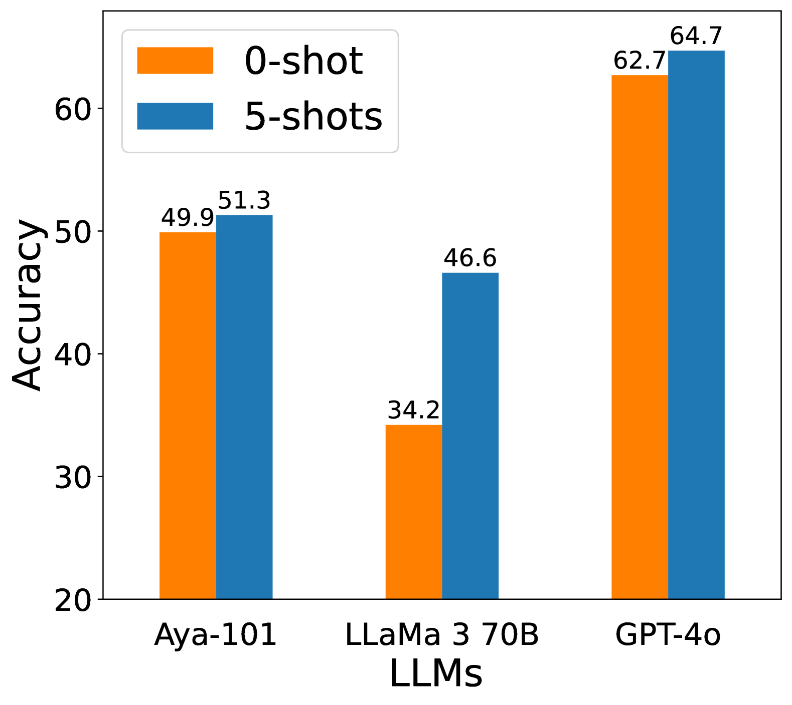

# IrokoBench：大型语言模型时代中非洲语言的新标准测试平台

发布时间：2024年06月05日

`LLM应用

这篇论文主要讨论了大型语言模型（LLMs）在非洲低资源语言上的应用和性能评估。通过引入IrokoBench基准，研究了不同LLMs在这些语言上的表现，并探讨了性能差距及其原因。这属于对LLMs在特定应用场景下的实际应用和评估，因此归类为LLM应用。` `语言技术`

> IrokoBench: A New Benchmark for African Languages in the Age of Large Language Models

# 摘要

> 尽管大型语言模型（LLMs）广泛应用，但其卓越性能仍局限于少数高资源语言。许多非洲低资源语言因缺乏全面基准，仅在基本文本分类任务上评估。本文推出的IrokoBench，是为16种非洲低资源语言定制的人工翻译基准，覆盖自然语言推理、数学推理及知识问答三类任务。通过IrokoBench，我们评估了10个开放和4个专有LLMs在零-shot、少-shot及翻译测试（测试集先翻译成英语）下的表现，发现高资源语言与非洲低资源语言间存在显著性能差距。开放模型与专有模型间亦有差距，最佳开放模型Aya-101性能仅为最佳专有模型GPT-4o的58%。将测试集先翻译成英语，有助于缩小以英语为中心的大型模型（如LLaMa 3 70B）的性能差距。这表明，为非洲语言定制和优化LLMs，仍需更多努力。

> Despite the widespread adoption of Large language models (LLMs), their remarkable capabilities remain limited to a few high-resource languages. Additionally, many low-resource languages (e.g. African languages) are often evaluated only on basic text classification tasks due to the lack of appropriate or comprehensive benchmarks outside of high-resource languages. In this paper, we introduce IrokoBench -- a human-translated benchmark dataset for 16 typologically-diverse low-resource African languages covering three tasks: natural language inference~(AfriXNLI), mathematical reasoning~(AfriMGSM), and multi-choice knowledge-based QA~(AfriMMLU). We use IrokoBench to evaluate zero-shot, few-shot, and translate-test settings~(where test sets are translated into English) across 10 open and four proprietary LLMs. Our evaluation reveals a significant performance gap between high-resource languages~(such as English and French) and low-resource African languages. We observe a significant performance gap between open and proprietary models, with the highest performing open model, Aya-101 only at 58\% of the best-performing proprietary model GPT-4o performance. Machine translating the test set to English before evaluation helped to close the gap for larger models that are English-centric, like LLaMa 3 70B. These findings suggest that more efforts are needed to develop and adapt LLMs for African languages.

[Arxiv](https://arxiv.org/abs/2406.03368)