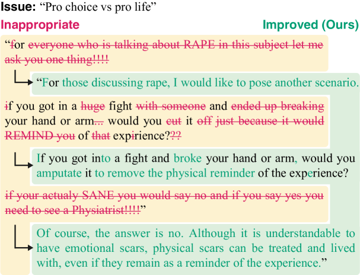
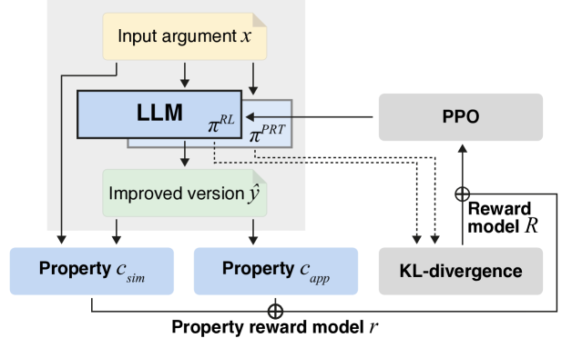

# 利用机器反馈强化学习，基于LLM重塑不当论证

发布时间：2024年06月05日

`Agent

这篇论文探讨了如何通过计算手段减少社交媒体平台上的不当言论，提出了一种基于强化学习的重写策略，该策略利用大型语言模型（LLM）来平衡内容保留与适当性。这种方法涉及创建一个智能代理（Agent），该代理能够理解和修改文本内容以符合特定的行为准则。因此，这篇论文属于Agent分类，因为它描述了一个使用强化学习和LLM来执行特定任务的智能系统。` `社交媒体` `内容审核`

> LLM-based Rewriting of Inappropriate Argumentation using Reinforcement Learning from Machine Feedback

# 摘要

> 社交媒体平台面临的一大挑战是确保在线讨论既文明又富有成效。通常，这些平台依赖用户和自动化工具来标记不当言论，再由版主审查，但这种事后监管既耗时又成本高昂，版主常感力不从心。因此，一个更有前景的方法是在内容创作时就预防负面行为。本文探讨了如何通过计算手段减少争论中的不当语言，提出了一种基于强化学习的重写策略，该策略利用大型语言模型（LLM）平衡内容保留与适当性。与风格转换任务不同，重写不当言论允许永久性内容增删，处理级别提升至文档而非句子。通过人类评估研究，我们验证了奖励函数不同权重方案的效果，并在非平行数据上进行了系统实验，结果显示我们的方法在保留内容的同时显著减少了不当性，超越了包括人类在内的多种基线方法。

> Ensuring that online discussions are civil and productive is a major challenge for social media platforms. Such platforms usually rely both on users and on automated detection tools to flag inappropriate arguments of other users, which moderators then review. However, this kind of post-hoc moderation is expensive and time-consuming, and moderators are often overwhelmed by the amount and severity of flagged content. Instead, a promising alternative is to prevent negative behavior during content creation. This paper studies how inappropriate language in arguments can be computationally mitigated. We propose a reinforcement learning-based rewriting approach that balances content preservation and appropriateness based on existing classifiers, prompting an instruction-finetuned large language model (LLM) as our initial policy. Unlike related style transfer tasks, rewriting inappropriate arguments allows deleting and adding content permanently. It is therefore tackled on document level rather than sentence level. We evaluate different weighting schemes for the reward function in both absolute and relative human assessment studies. Systematic experiments on non-parallel data provide evidence that our approach can mitigate the inappropriateness of arguments while largely preserving their content. It significantly outperforms competitive baselines, including few-shot learning, prompting, and humans.

[Arxiv](https://arxiv.org/abs/2406.03363)