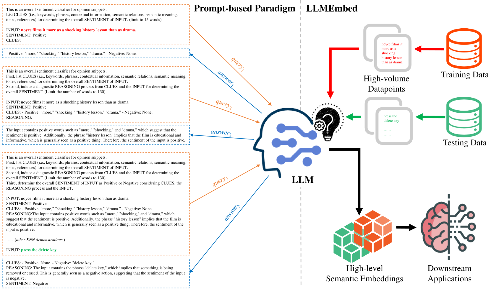
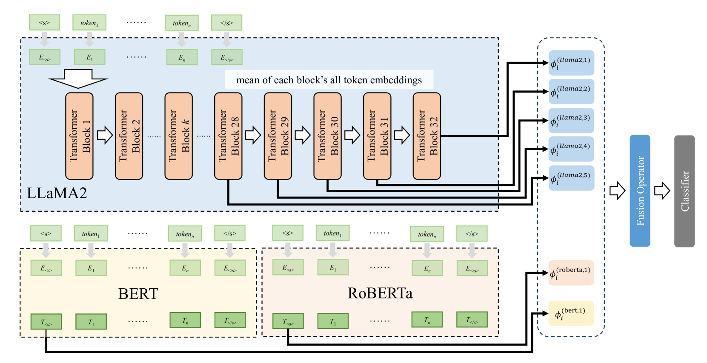
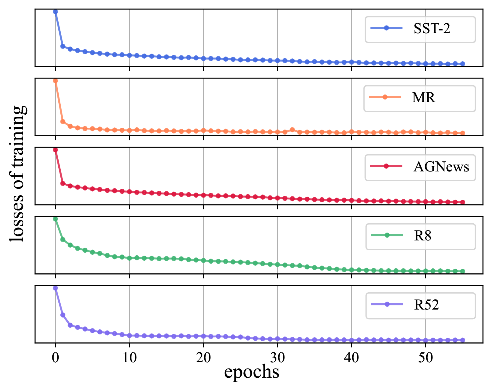

# LLMEmbed：探索轻量级LLM在文本分类中的核心价值

发布时间：2024年06月05日

`LLM应用

这篇论文介绍了一种名为LLMEmbed的新型迁移学习策略，用于优化文本分类任务。它利用轻量级LLMs在不同网络深度提取和融合文本嵌入，以增强鲁棒性和区分力，并训练分类器。该方法在公开数据集上展示了优异的性能，同时显著降低了训练成本和资源消耗。这与LLM的应用相关，特别是在提高文本分类效率和效果方面，因此归类为LLM应用。` `文本分类` `迁移学习`

> LLMEmbed: Rethinking Lightweight LLM's Genuine Function in Text Classification

# 摘要

> 大型语言模型（LLMs）的繁荣带动了提示学习的研究热潮，成为提升文本分类性能的有力工具。尽管如此，当前基于启发式思维链（CoT）的方法虽复杂却效率低下。本文提出了一种名为LLMEmbed的简洁高效迁移学习策略，旨在优化这一挑战性任务。我们通过轻量级LLMs在不同网络深度提取和融合文本嵌入，增强其鲁棒性与区分力，进而训练分类器。实验结果表明，LLMEmbed在公开数据集上表现出色，相比基于GPT-3等大型模型和复杂提示策略的方法，不仅性能强劲，且训练成本大幅降低。无需微调，LLMEmbed仅用4%的模型参数、1.8%的电力和1.5%的时间，便在公开基准上取得了优异成绩。代码已公开：https://github.com/ChunLiu-cs/LLMEmbed-ACL2024。

> With the booming of Large Language Models (LLMs), prompt-learning has become a promising method mainly researched in various research areas. Recently, many attempts based on prompt-learning have been made to improve the performance of text classification. However, most of these methods are based on heuristic Chain-of-Thought (CoT), and tend to be more complex but less efficient. In this paper, we rethink the LLM-based text classification methodology, propose a simple and effective transfer learning strategy, namely LLMEmbed, to address this classical but challenging task. To illustrate, we first study how to properly extract and fuse the text embeddings via various lightweight LLMs at different network depths to improve their robustness and discrimination, then adapt such embeddings to train the classifier. We perform extensive experiments on publicly available datasets, and the results show that LLMEmbed achieves strong performance while enjoys low training overhead using lightweight LLM backbones compared to recent methods based on larger LLMs, i.e. GPT-3, and sophisticated prompt-based strategies. Our LLMEmbed achieves adequate accuracy on publicly available benchmarks without any fine-tuning while merely use 4% model parameters, 1.8% electricity consumption and 1.5% runtime compared to its counterparts. Code is available at: https://github.com/ChunLiu-cs/LLMEmbed-ACL2024.

[Arxiv](https://arxiv.org/abs/2406.03725)