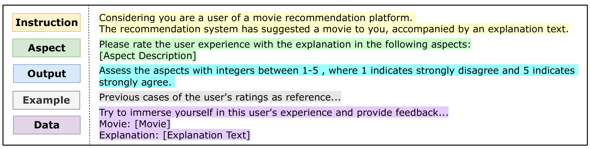
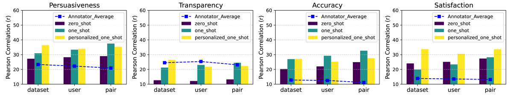
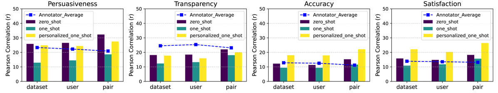

# 大型语言模型：推荐解释的智能评估者

发布时间：2024年06月05日

`LLM应用

这篇论文探讨了大型语言模型（LLMs）在推荐系统可解释性评估中的应用。它研究了LLMs是否能够有效地评估推荐解释的质量，并提出了一种三级元评估策略来衡量LLM评估结果与用户真实反馈之间的相关性。此外，论文还讨论了如何将人类标签融入LLM评估流程，并通过集成多个异构LLM评估者来提高评估的准确性和稳定性。这些内容表明，该论文属于LLM应用类别，因为它专注于LLMs在特定应用场景（即推荐系统解释评估）中的实际应用和效果。` `推荐系统`

> Large Language Models as Evaluators for Recommendation Explanations

# 摘要

> 推荐系统的可解释性备受学术界和工业界瞩目，尽管在可解释推荐方面已付出诸多努力，但评估解释质量依旧是一大挑战。近期，大型语言模型（LLMs）在自然语言处理任务中作为评估者崭露头角，因其出色的指令遵循和常识推理能力。然而，评估推荐解释文本的标准与人类感知紧密相关，且常带主观性，与NLG任务有所不同。本文探讨了LLMs是否能胜任推荐解释的评估者角色。为此，我们结合了先前研究中的用户反馈，并引入了第三方标注和LLM评估。我们采用了一种三级元评估策略，以衡量评估结果与用户真实反馈之间的相关性。实验显示，在恰当的提示和设置下，如GPT4的LLMs能提供与人类评估相媲美的结果。我们还深入探讨了如何将人类标签融入LLM评估流程，以及如何通过集成多个异构LLM评估者来提升评估的准确性和稳定性。研究表明，LLMs作为评估者是评估推荐解释文本的一种准确、可重复且经济高效的方案。相关代码已公开于https://github.com/Xiaoyu-SZ/LLMasEvaluator。

> The explainability of recommender systems has attracted significant attention in academia and industry. Many efforts have been made for explainable recommendations, yet evaluating the quality of the explanations remains a challenging and unresolved issue. In recent years, leveraging LLMs as evaluators presents a promising avenue in Natural Language Processing tasks (e.g., sentiment classification, information extraction), as they perform strong capabilities in instruction following and common-sense reasoning. However, evaluating recommendation explanatory texts is different from these NLG tasks, as its criteria are related to human perceptions and are usually subjective. In this paper, we investigate whether LLMs can serve as evaluators of recommendation explanations. To answer the question, we utilize real user feedback on explanations given from previous work and additionally collect third-party annotations and LLM evaluations. We design and apply a 3-level meta evaluation strategy to measure the correlation between evaluator labels and the ground truth provided by users. Our experiments reveal that LLMs, such as GPT4, can provide comparable evaluations with appropriate prompts and settings. We also provide further insights into combining human labels with the LLM evaluation process and utilizing ensembles of multiple heterogeneous LLM evaluators to enhance the accuracy and stability of evaluations. Our study verifies that utilizing LLMs as evaluators can be an accurate, reproducible and cost-effective solution for evaluating recommendation explanation texts. Our code is available at https://github.com/Xiaoyu-SZ/LLMasEvaluator.

[Arxiv](https://arxiv.org/abs/2406.03248)