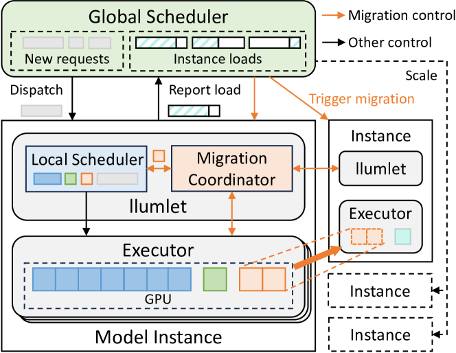

# Llumnix：大型语言模型服务的动态调度策略

发布时间：2024年06月05日

`LLM应用

理由：这篇论文主要讨论了大型语言模型（LLMs）的服务问题，特别是如何通过实时重新调度多个模型实例来应对多变且难以预测的请求资源和延迟需求。论文介绍了一个名为Llumnix的系统，该系统通过优化请求的重新调度来提高负载均衡、减少资源碎片，并根据请求优先级和服务水平目标（SLO）进行差异化处理。这些内容直接关联到LLM的实际应用场景，特别是在服务和优化LLM性能方面，因此属于LLM应用分类。` `云计算` `人工智能`

> Llumnix: Dynamic Scheduling for Large Language Model Serving

# 摘要

> 大型语言模型（LLMs）的推理服务是其在日常生活中发挥潜力的关键。然而，由于应用多样性和LLMs的动态特性，请求的资源和延迟需求本质上是多变且难以预测的，这使得高效服务LLMs成为一个持续的挑战。现有系统难以应对这些特性，导致排队延迟严重、尾部延迟差和违反服务水平目标（SLO）等问题。为此，我们开发了Llumnix，一个能够通过实时重新调度多个模型实例来应对这些异构和不可预测请求的LLM服务系统。借鉴现代操作系统中CPU核心间的上下文切换机制，Llumnix优化了请求的重新调度，以实现更好的负载均衡和隔离，减少资源碎片，并根据请求优先级和SLO进行差异化处理。通过一个高效且可扩展的实时迁移机制，Llumnix能够处理请求及其内存状态，并在一个动态调度策略中巧妙地整合了多种重新调度场景。评估结果表明，Llumnix显著提升了尾部延迟，加速了高优先级请求，同时节省了成本，性能优于当前最先进的LLM服务系统。Llumnix的代码已在GitHub上公开，地址为https://github.com/AlibabaPAI/llumnix。

> Inference serving for large language models (LLMs) is the key to unleashing their potential in people's daily lives. However, efficient LLM serving remains challenging today because the requests are inherently heterogeneous and unpredictable in terms of resource and latency requirements, as a result of the diverse applications and the dynamic execution nature of LLMs. Existing systems are fundamentally limited in handling these characteristics and cause problems such as severe queuing delays, poor tail latencies, and SLO violations.
  We introduce Llumnix, an LLM serving system that reacts to such heterogeneous and unpredictable requests by runtime rescheduling across multiple model instances. Similar to context switching across CPU cores in modern operating systems, Llumnix reschedules requests to improve load balancing and isolation, mitigate resource fragmentation, and differentiate request priorities and SLOs. Llumnix implements the rescheduling with an efficient and scalable live migration mechanism for requests and their in-memory states, and exploits it in a dynamic scheduling policy that unifies the multiple rescheduling scenarios elegantly. Our evaluations show that Llumnix improves tail latencies by an order of magnitude, accelerates high-priority requests by up to 1.5x, and delivers up to 36% cost savings while achieving similar tail latencies, compared against state-of-the-art LLM serving systems. Llumnix is publicly available at https://github.com/AlibabaPAI/llumnix.

[Arxiv](https://arxiv.org/abs/2406.03243)