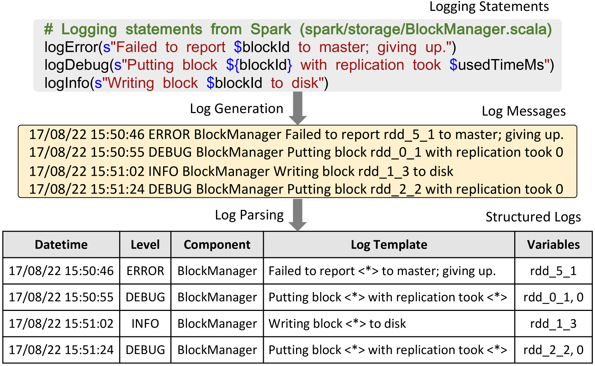
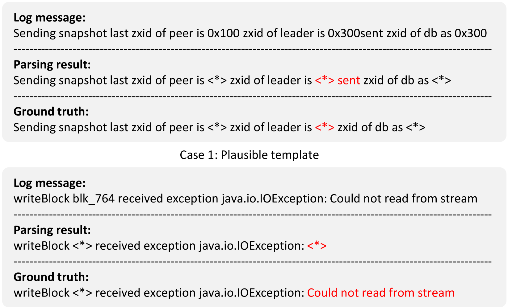
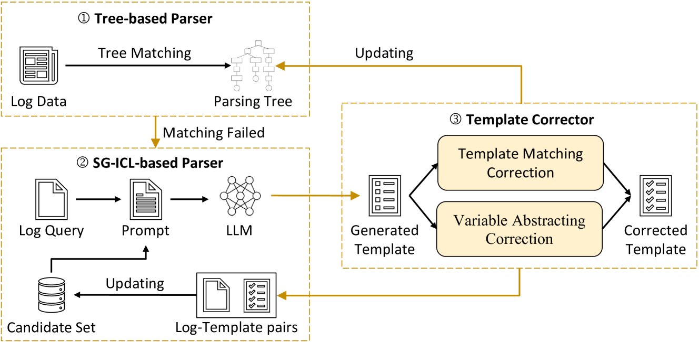
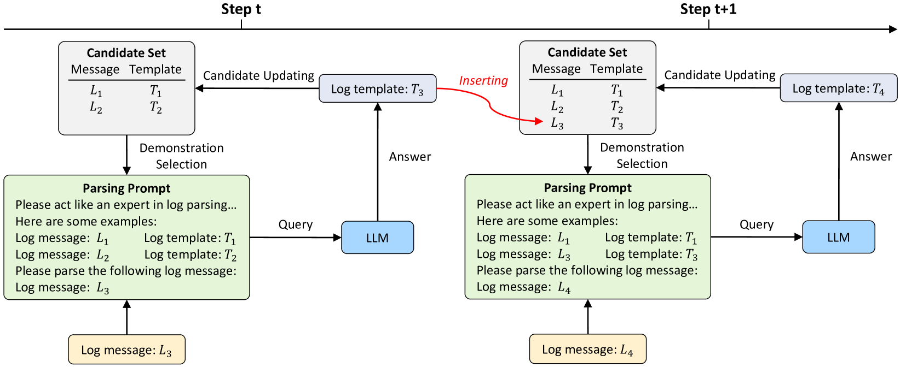
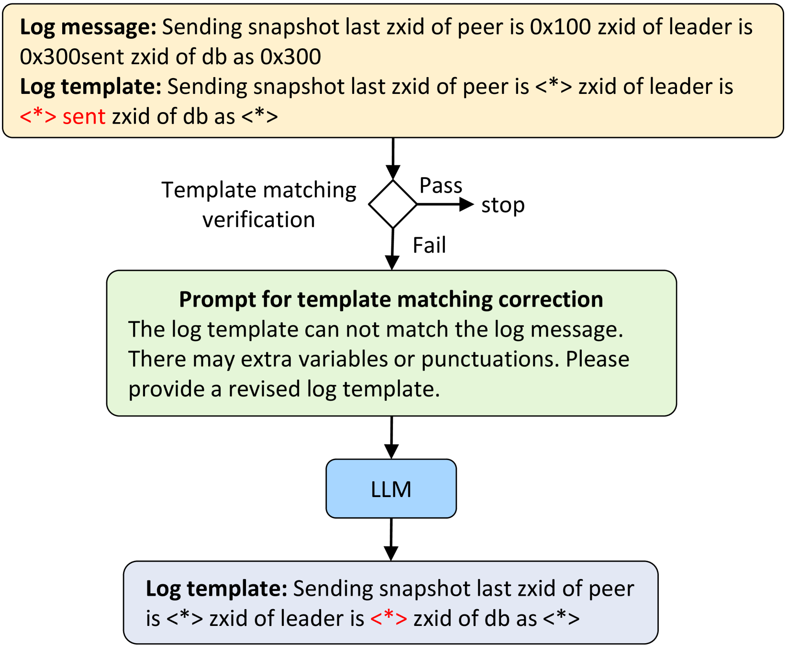
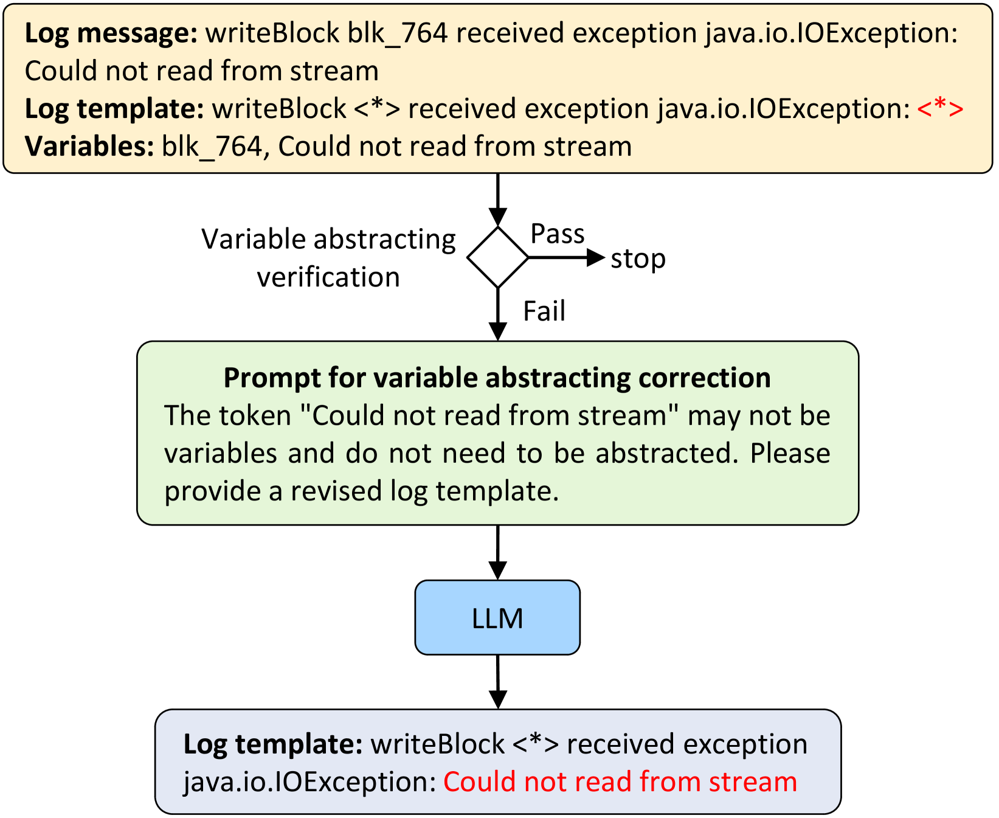
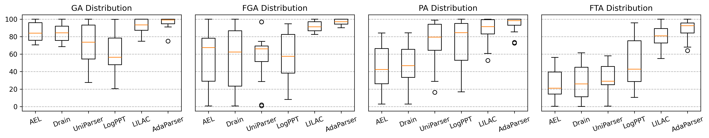
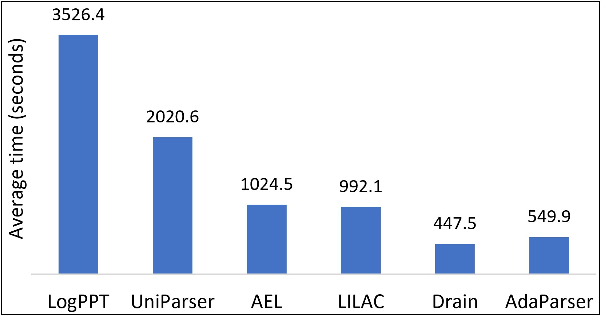

# 利用自生成的上下文学习与自我修正技术解析日志

发布时间：2024年06月05日

`LLM应用

这篇论文摘要描述了一种名为AdaParser的新型日志解析框架，该框架利用大型语言模型（LLMs）的能力来提高日志解析的准确性和适应性。AdaParser通过自生成上下文学习和自我修正机制，以及模板校正器和动态候选集的使用，有效地解决了传统日志解析方法在处理动态日志数据时的局限性。这种方法特别强调了LLMs在实际应用中的效能，尤其是在数据稀缺或变化的环境中。因此，这篇论文应归类为LLM应用，因为它展示了LLMs在特定技术问题（即日志解析）中的应用和改进。` `日志管理` `运维自动化`

> Log Parsing with Self-Generated In-Context Learning and Self-Correction

# 摘要

> 日志解析是将日志消息结构化的关键步骤，但现有方法在处理动态日志数据时表现不佳，主要因依赖人工规则或训练数据有限的学习模型。大型语言模型（LLMs）的兴起为日志解析带来了新希望，因其强大的自然语言和代码理解能力。尽管如此，基于LLM的解析器直接使用模型生成的模板，可能导致解析不准确。此外，这些解析器依赖大量历史数据，难以应对数据稀缺或变化的情况。为此，我们开发了AdaParser，一种利用LLMs的自适应日志解析框架，它通过自生成上下文学习和自我修正机制，提高了解析的准确性。AdaParser中的模板校正器能纠正潜在错误，而动态候选集则帮助适应日志数据的变化。实验证明，AdaParser在多种情况下均超越了现有技术，显著提升了LLMs的解析性能。

> Log parsing transforms log messages into structured formats, serving as a crucial step for log analysis. Despite a variety of log parsing methods that have been proposed, their performance on evolving log data remains unsatisfactory due to reliance on human-crafted rules or learning-based models with limited training data. The recent emergence of large language models (LLMs) has demonstrated strong abilities in understanding natural language and code, making it promising to apply LLMs for log parsing. Consequently, several studies have proposed LLM-based log parsers. However, LLMs may produce inaccurate templates, and existing LLM-based log parsers directly use the template generated by the LLM as the parsing result, hindering the accuracy of log parsing. Furthermore, these log parsers depend heavily on historical log data as demonstrations, which poses challenges in maintaining accuracy when dealing with scarce historical log data or evolving log data. To address these challenges, we propose AdaParser, an effective and adaptive log parsing framework using LLMs with self-generated in-context learning (SG-ICL) and self-correction. To facilitate accurate log parsing, AdaParser incorporates a novel component, a template corrector, which utilizes the LLM to correct potential parsing errors in the templates it generates. In addition, AdaParser maintains a dynamic candidate set composed of previously generated templates as demonstrations to adapt evolving log data. Extensive experiments on public large-scale datasets show that AdaParser outperforms state-of-the-art methods across all metrics, even in zero-shot scenarios. Moreover, when integrated with different LLMs, AdaParser consistently enhances the performance of the utilized LLMs by a large margin.

[Arxiv](https://arxiv.org/abs/2406.03376)