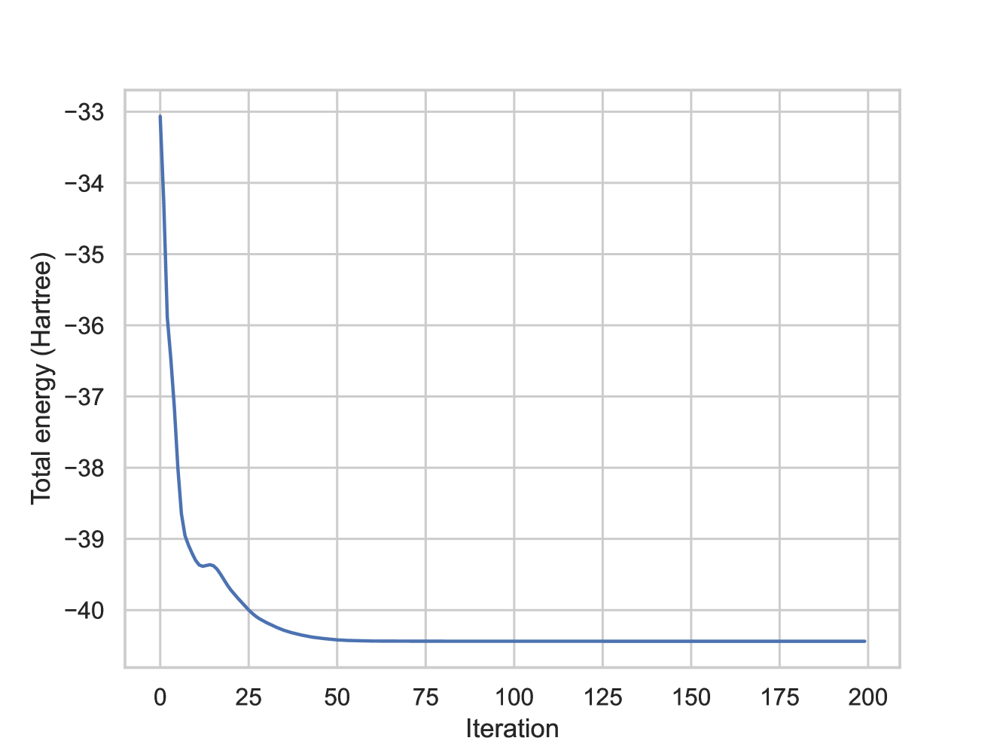
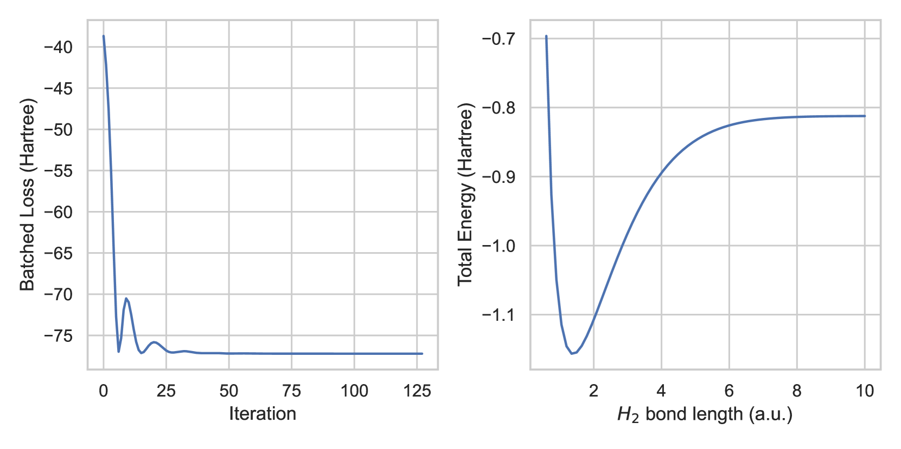

# MESS：现代电子结构模拟探索

发布时间：2024年06月05日

`LLM应用

理由：这篇论文主要介绍了MESS（一个基于JAX的现代电子结构模拟包），它将电子结构模拟（ESS）带入了机器学习（ML）领域。论文探讨了采用ML软件开发实践对科学计算任务的影响，并分析了其利弊。虽然涉及到了机器学习和科学计算，但主要关注的是如何将ML技术应用于科学计算领域，特别是电子结构模拟，而不是深入探讨LLM的理论或Agent的设计与应用。因此，这篇论文更适合归类为“LLM应用”，因为它展示了如何将现代ML技术应用于特定的科学计算任务中。` `材料科学`

> MESS: Modern Electronic Structure Simulations

# 摘要

> 电子结构模拟（ESS）历经数十年，为原子级科学研究提供了精确的量化视角，促进了化学、生物学及材料科学等领域的进步。这些研究背后的软件工具，遵循科学计算的常规，多采用FORTRAN和C等编译语言开发。然而，随着机器学习（ML）的兴起，这些领域面临新的挑战：要么用传统语言编写ML模型，要么在Python中的ML模型与庞大的编译软件系统之间搭建复杂的桥梁。这与现代ML框架的发展趋势背道而驰，后者通过Python中张量程序的硬件加速，追求易用性与高性能的优化。我们推出了MESS：一个基于JAX的现代电子结构模拟包，将ESS带入ML领域。本文探讨了采用ML软件开发实践对这一关键科学任务的影响，分析其利弊。MESS在多种硬件加速器上实现了显著的速度提升，并为ESS与ML的融合铺平了道路。项目地址：https://github.com/graphcore-research/mess。

> Electronic structure simulation (ESS) has been used for decades to provide quantitative scientific insights on an atomistic scale, enabling advances in chemistry, biology, and materials science, among other disciplines. Following standard practice in scientific computing, the software packages driving these studies have been implemented in compiled languages such as FORTRAN and C. However, the recent introduction of machine learning (ML) into these domains has meant that ML models must be coded in these languages, or that complex software bridges have to be built between ML models in Python and these large compiled software systems. This is in contrast with recent progress in modern ML frameworks which aim to optimise both ease of use and high performance by harnessing hardware acceleration of tensor programs defined in Python. We introduce MESS: a modern electronic structure simulation package implemented in JAX; porting the ESS code to the ML world. We outline the costs and benefits of following the software development practices used in ML for this important scientific workload. MESS shows significant speedups n widely available hardware accelerators and simultaneously opens a clear pathway towards combining ESS with ML. MESS is available at https://github.com/graphcore-research/mess.

[Arxiv](https://arxiv.org/abs/2406.03121)