# Missci：揭秘科学误解中的谬误重构

发布时间：2024年06月05日

`Agent

这篇论文介绍了一种名为Missci的新型谬误推理模型和数据集，专注于生物医学文献的错误引用。该模型不仅要求识别谣言与引用文献之间的不匹配，还要求解释这种不匹配的隐含谬误。通过在零-shot设置下测试大型语言模型（LLMs）的关键推理能力，论文展示了GPT 4等模型在处理此类任务时的表现和挑战。这种模型可以被视为一个智能Agent，因为它能够自动分析和解释信息，特别是在社交媒体上的健康谣言处理方面，具有重要的应用价值。因此，这篇论文更适合归类于Agent分类。` `社交媒体` `生物医学`

> Missci: Reconstructing Fallacies in Misrepresented Science

# 摘要

> 社交媒体上的健康谣言可能导致决策失误和现实风险。这些谣言常错误引用科学文献以增加可信度。为了自动反驳这些谣言，系统需解释谣言如何错误引用文献。现有的自动事实核查方法未能评估谣言与引用文献之间的不匹配。为此，我们推出了Missci，一种新的谬误推理模型和数据集，专注于生物医学文献的错误引用。与以往不同，Missci要求模型识别并解释隐含谬误，而不仅仅是分类。我们用Missci测试大型语言模型（LLMs）在零-shot设置下的关键推理能力，评估了两个代表性模型及不同提示细节的影响。实验和人类评估表明，GPT 4表现出色，但也揭示了任务的挑战性。

> Health-related misinformation on social networks can lead to poor decision-making and real-world dangers. Such misinformation often misrepresents scientific publications and cites them as "proof" to gain perceived credibility. To effectively counter such claims automatically, a system must explain how the claim was falsely derived from the cited publication. Current methods for automated fact-checking or fallacy detection neglect to assess the (mis)used evidence in relation to misinformation claims, which is required to detect the mismatch between them. To address this gap, we introduce Missci, a novel argumentation theoretical model for fallacious reasoning together with a new dataset for real-world misinformation detection that misrepresents biomedical publications. Unlike previous fallacy detection datasets, Missci (i) focuses on implicit fallacies between the relevant content of the cited publication and the inaccurate claim, and (ii) requires models to verbalize the fallacious reasoning in addition to classifying it. We present Missci as a dataset to test the critical reasoning abilities of large language models (LLMs), that are required to reconstruct real-world fallacious arguments, in a zero-shot setting. We evaluate two representative LLMs and the impact of different levels of detail about the fallacy classes provided to the LLM via prompts. Our experiments and human evaluation show promising results for GPT 4, while also demonstrating the difficulty of this task.

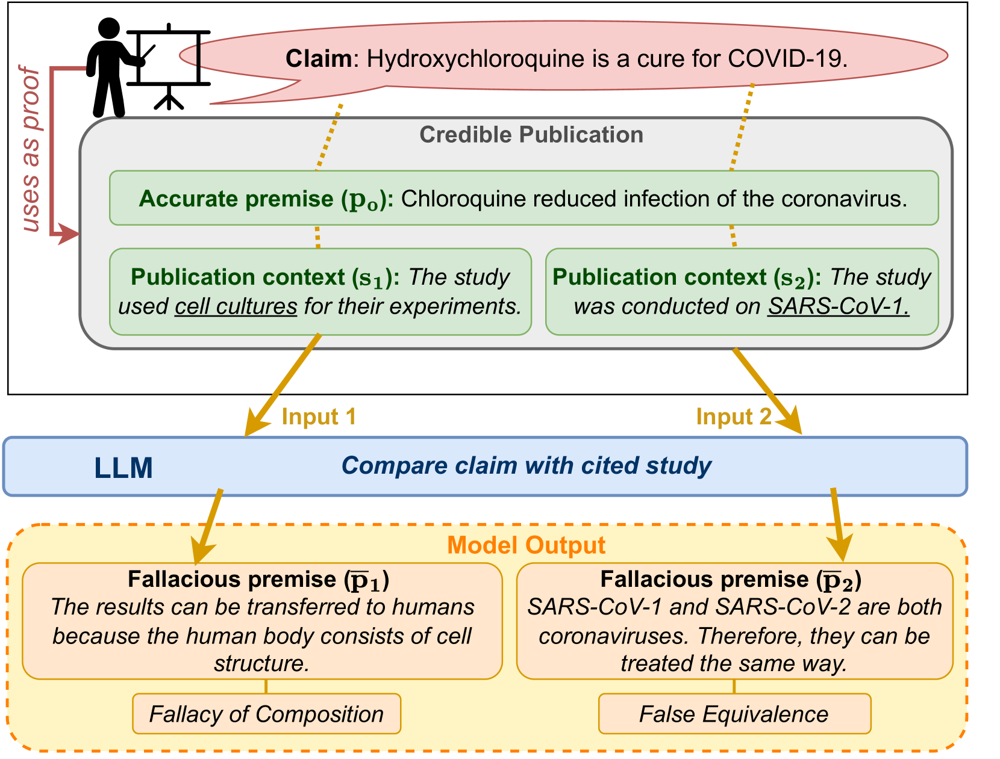

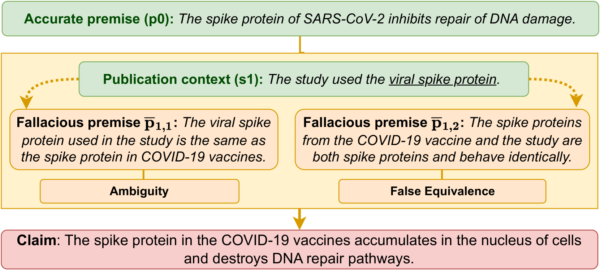

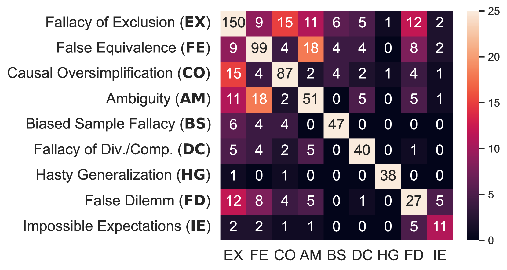

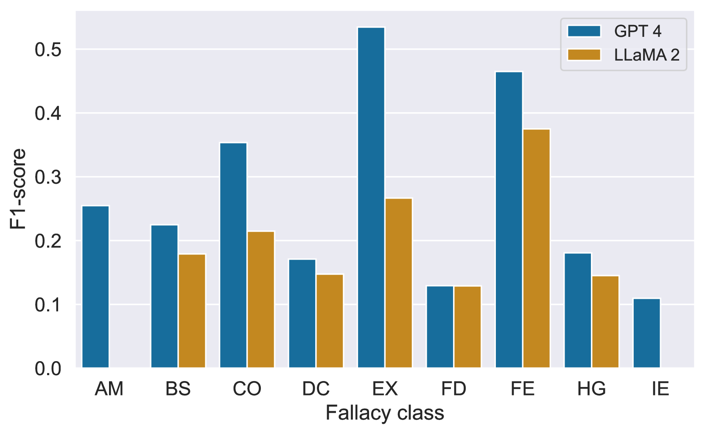

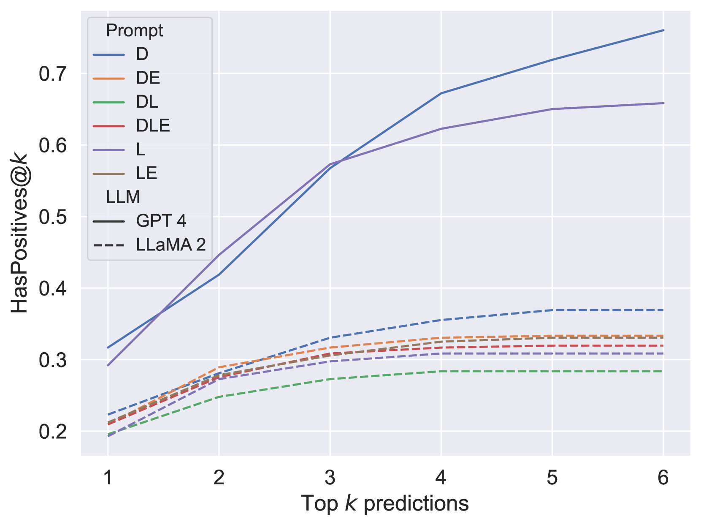

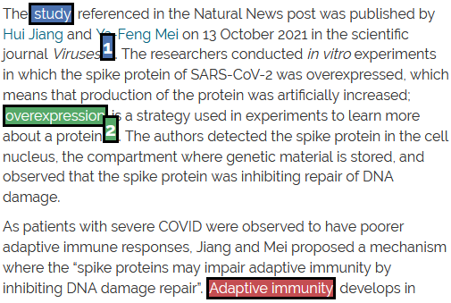

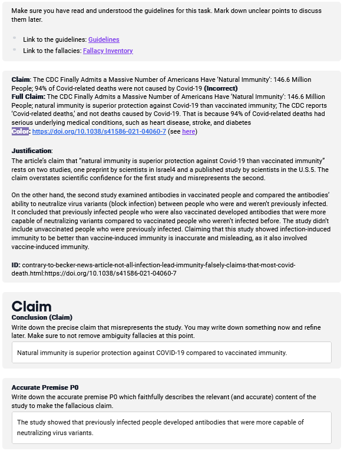

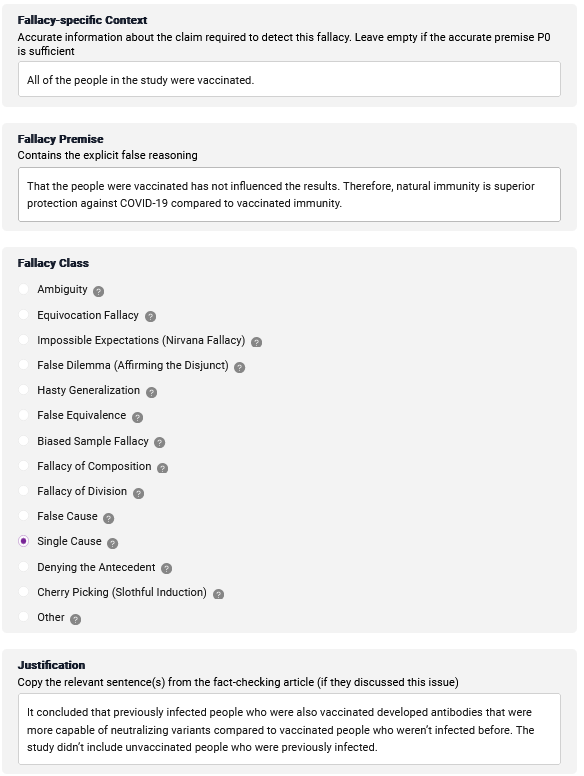

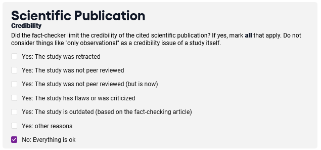

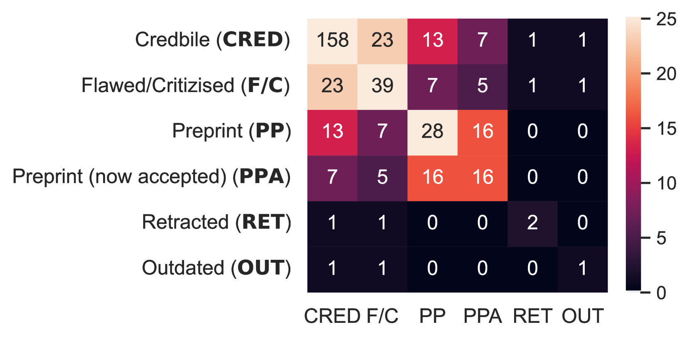

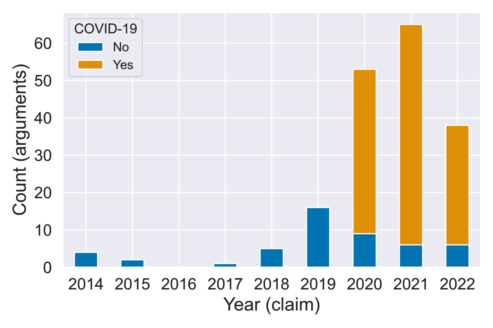

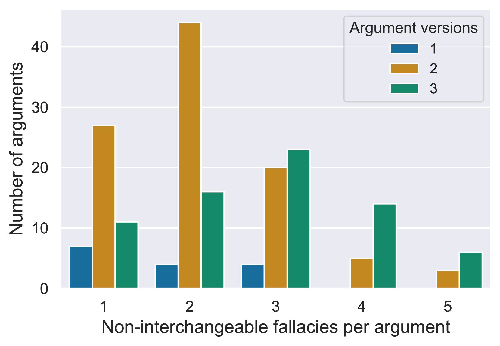

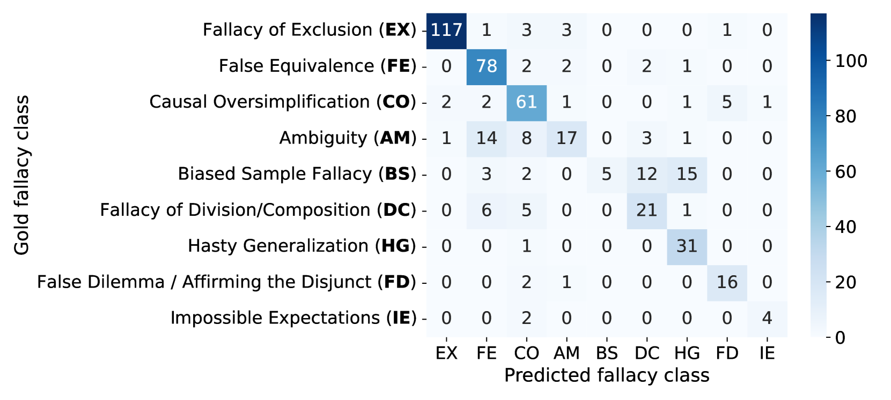

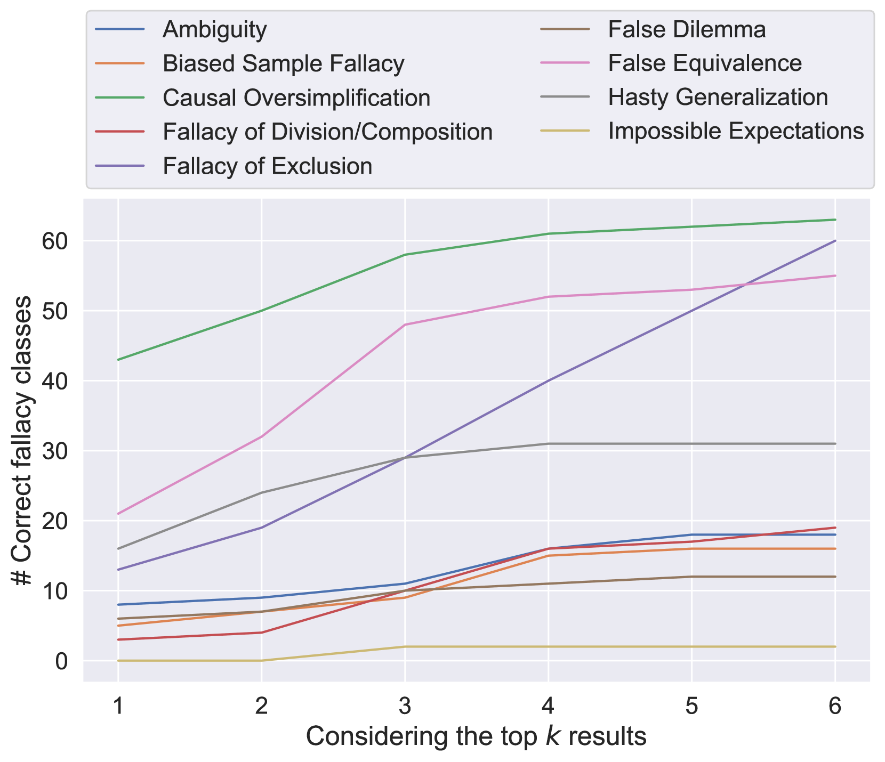

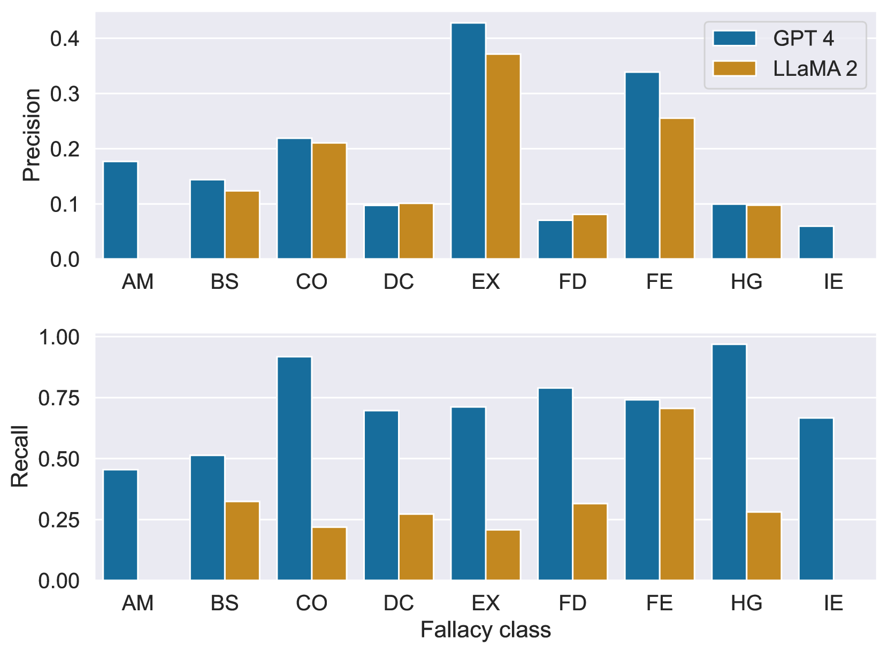

[Arxiv](https://arxiv.org/abs/2406.03181)