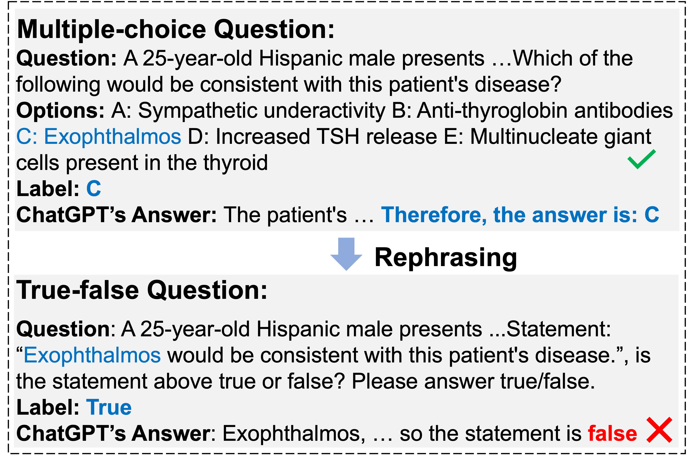
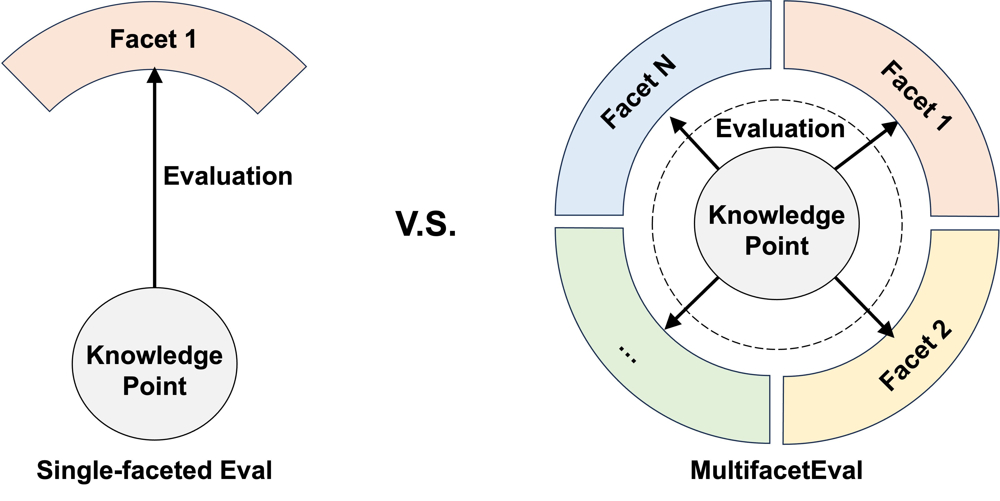
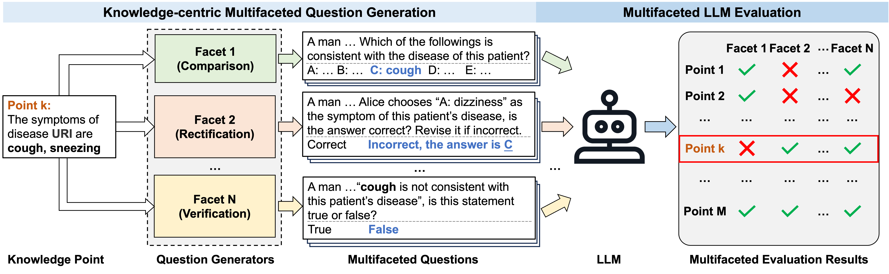
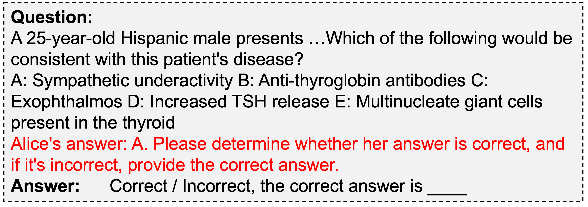
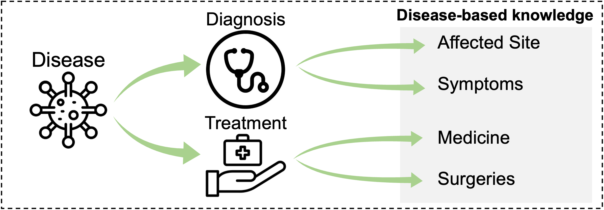
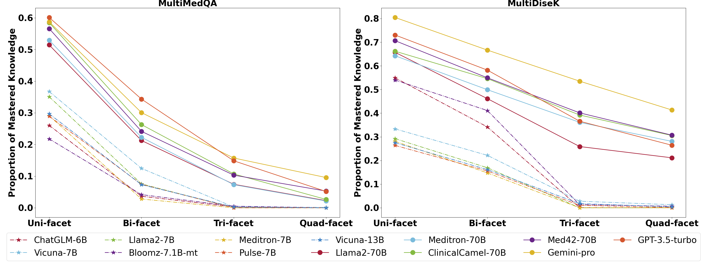
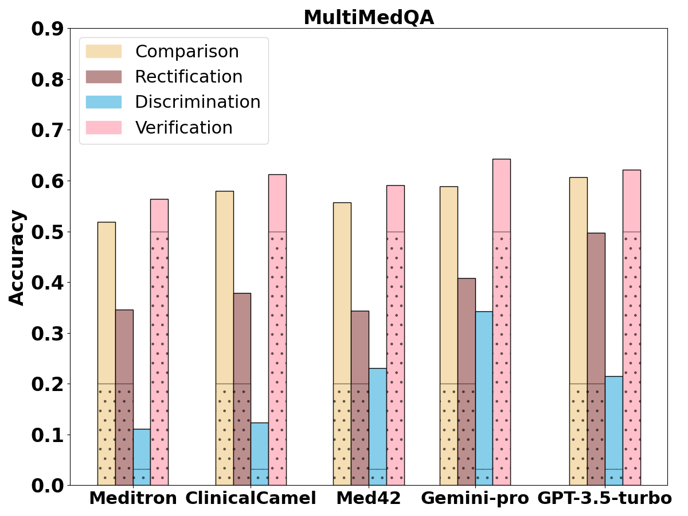
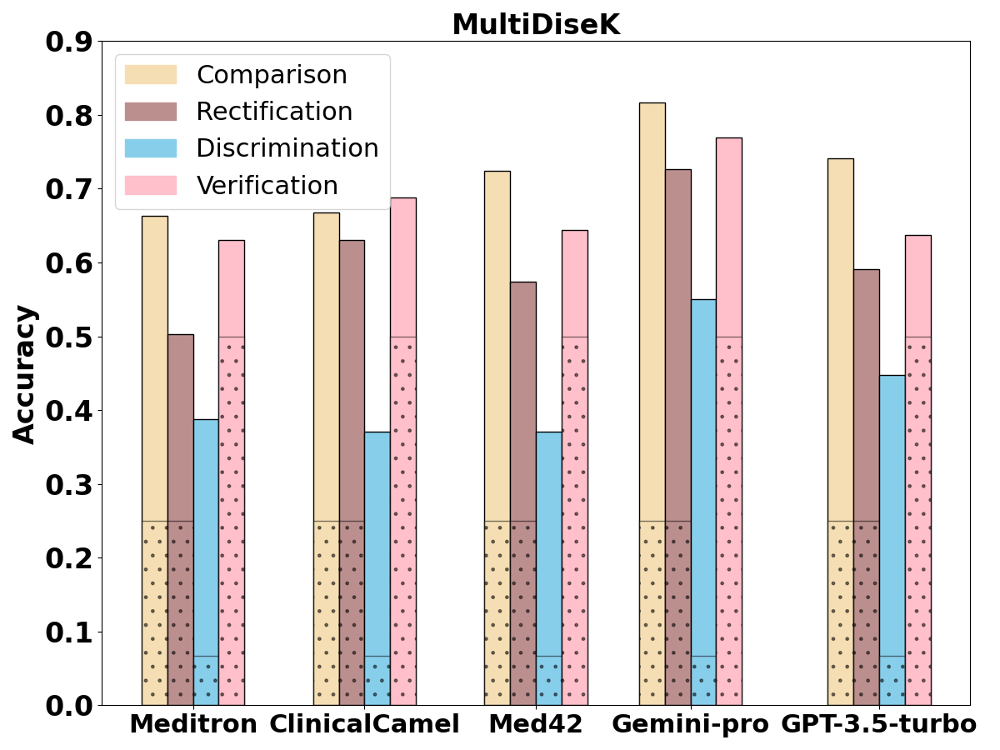

# MultifacetEval：探究大型语言模型医学知识掌握能力的多面性评估

发布时间：2024年06月05日

`LLM应用

这篇论文主要探讨了大型语言模型（LLMs）在医疗领域的应用效果，并提出了一个多维度的评估框架来深入分析LLMs在医学知识掌握上的表现。论文通过创建新的评估数据集和进行实验，揭示了LLMs在实际医疗应用中的不足，特别是在深度、精确性和全面性方面。因此，这篇论文属于LLM应用类别，因为它关注的是LLMs在特定领域（医疗）的应用性能和评估。` `评估基准`

> MultifacetEval: Multifaceted Evaluation to Probe LLMs in Mastering Medical Knowledge

# 摘要

> 大型语言模型（LLMs）在医疗领域如MedQA等评估基准上表现卓越，但与实际医疗场景中的应用效果相比，仍显不足。本文通过多维度的审视框架，深入探究LLMs对医学知识的掌握情况，揭示了这一差距的根源。我们创新性地提出了MultifacetEval评估框架，全面考察LLMs在医学知识的多维度（比较、校正、区分和验证）上的掌握程度。基于此框架，我们创建了MultiDiseK和MultiMedQA两个多维度评估数据集，实验结果显示，LLMs在医学知识掌握上的表现远不及其在传统基准上的成绩，暴露出其在深度、精确性和全面性上的不足。因此，LLMs在实际医疗应用上尚未成熟。相关代码和数据集已公开于https://github.com/THUMLP/MultifacetEval。

> Large language models (LLMs) have excelled across domains, also delivering notable performance on the medical evaluation benchmarks, such as MedQA. However, there still exists a significant gap between the reported performance and the practical effectiveness in real-world medical scenarios. In this paper, we aim to explore the causes of this gap by employing a multifaceted examination schema to systematically probe the actual mastery of medical knowledge by current LLMs. Specifically, we develop a novel evaluation framework MultifacetEval to examine the degree and coverage of LLMs in encoding and mastering medical knowledge at multiple facets (comparison, rectification, discrimination, and verification) concurrently. Based on the MultifacetEval framework, we construct two multifaceted evaluation datasets: MultiDiseK (by producing questions from a clinical disease knowledge base) and MultiMedQA (by rephrasing each question from a medical benchmark MedQA into multifaceted questions). The experimental results on these multifaceted datasets demonstrate that the extent of current LLMs in mastering medical knowledge is far below their performance on existing medical benchmarks, suggesting that they lack depth, precision, and comprehensiveness in mastering medical knowledge. Consequently, current LLMs are not yet ready for application in real-world medical tasks. The codes and datasets are available at https://github.com/THUMLP/MultifacetEval.

[Arxiv](https://arxiv.org/abs/2406.02919)