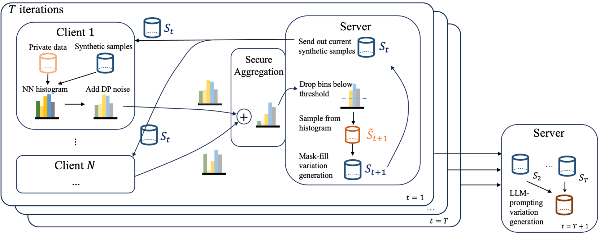
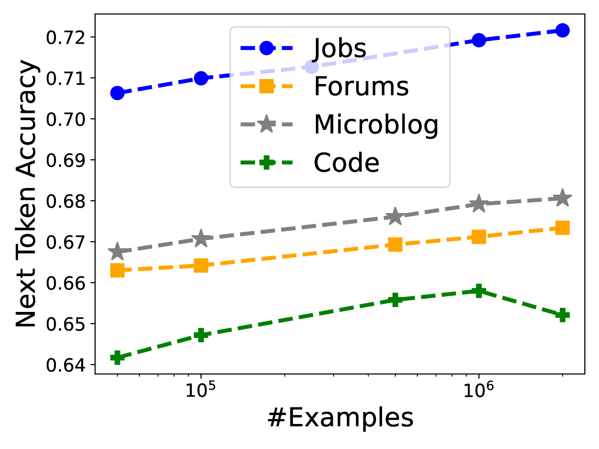

# PrE-Text：大型语言模型时代下的私有联邦数据语言模型训练

发布时间：2024年06月05日

`LLM应用

理由：这篇论文主要探讨了使用差分私有合成文本数据（PrE-Text）来训练机器学习模型的方法，这种方法旨在解决设备端训练的局限性，如资源限制和隐私保护问题。论文通过实验展示了使用PrE-Text合成数据训练的模型在性能上的优势，尤其是在隐私保护方面。这种方法直接应用于大型语言模型（LLM）的训练和微调，因此属于LLM应用类别。` `机器学习` `数据隐私`

> PrE-Text: Training Language Models on Private Federated Data in the Age of LLMs

# 摘要

> 设备端训练虽为当前主流，用于在用户私有且分布式的数据上训练 ML 模型，但其弊端显而易见：用户设备容量有限，难以承载大型模型训练；设备端训练对通信和计算资源要求极高；调试与部署过程复杂。为此，我们开发了私有进化文本（PrE-Text），一种能够生成差分私有合成文本数据的新方法。实验表明，在多个数据集上，使用 PrE-Text 合成数据训练的小型模型，在实际隐私保护水平下，性能超越了设备端训练的同类模型，且所需轮次减少 9 倍，每轮计算量降低 6 倍，通信量削减 100 倍。此外，大型模型在 PrE-Text 的 DP 合成数据上进行微调后，其在私有数据上的表现亦有显著提升。综上所述，DP 合成数据上的训练或许是比设备端训练更为优越的选择。相关代码已公开于 https://github.com/houcharlie/PrE-Text。

> On-device training is currently the most common approach for training machine learning (ML) models on private, distributed user data. Despite this, on-device training has several drawbacks: (1) most user devices are too small to train large models on-device, (2) on-device training is communication- and computation-intensive, and (3) on-device training can be difficult to debug and deploy. To address these problems, we propose Private Evolution-Text (PrE-Text), a method for generating differentially private (DP) synthetic textual data. First, we show that across multiple datasets, training small models (models that fit on user devices) with PrE-Text synthetic data outperforms small models trained on-device under practical privacy regimes ($ε=1.29$, $ε=7.58$). We achieve these results while using 9$\times$ fewer rounds, 6$\times$ less client computation per round, and 100$\times$ less communication per round. Second, finetuning large models on PrE-Text's DP synthetic data improves large language model (LLM) performance on private data across the same range of privacy budgets. Altogether, these results suggest that training on DP synthetic data can be a better option than training a model on-device on private distributed data. Code is available at https://github.com/houcharlie/PrE-Text.

[Arxiv](https://arxiv.org/abs/2406.02958)