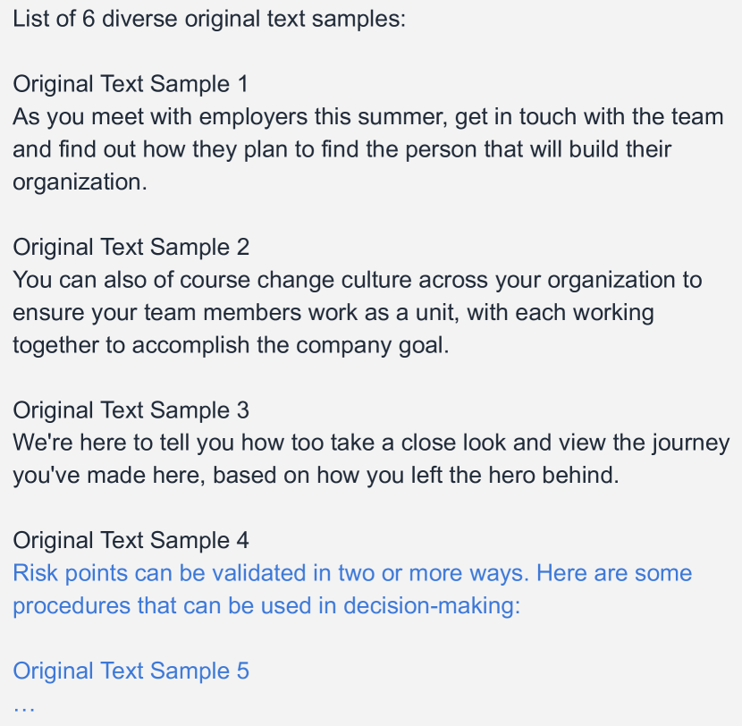

# PrE-Text：大型语言模型时代下的私有联邦数据语言模型训练

发布时间：2024年06月05日

`Agent

理由：这篇论文介绍了一种名为“私有进化文本（PrE-Text）”的新方法，用于生成差分私有合成文本数据，以解决设备上训练ML模型时遇到的隐私和效率问题。这种方法可以被视为一种智能代理（Agent），因为它能够自主地生成数据并优化模型训练过程，以提高隐私保护和效率。虽然这种方法涉及到文本数据的处理，但它更多地关注于数据生成和模型训练的优化策略，而不是直接应用于大型语言模型（LLM）的理论或应用。因此，将其归类为Agent更为合适。` `机器学习` `隐私保护`

> PrE-Text: Training Language Models on Private Federated Data in the Age of LLMs

# 摘要

> 设备上训练是当前处理私有、分布式用户数据上ML模型的主流方式，但面临挑战：设备容量有限、通信计算负担重、调试部署困难。为此，我们开发了私有进化文本（PrE-Text），一种生成差分私有合成文本数据的新方法。实验表明，使用PrE-Text合成数据训练的小型模型，在实际隐私保护下，性能超越了设备上训练的模型，且效率更高——轮次减少9倍，每轮计算减少6倍，通信减少100倍。此外，大型模型在PrE-Text的DP数据上微调后，在私有数据上的表现也有显著提升。这些发现提示，DP合成数据训练可能是优于设备上训练的更佳选择。相关代码已公开于https://github.com/houcharlie/PrE-Text。

> On-device training is currently the most common approach for training machine learning (ML) models on private, distributed user data. Despite this, on-device training has several drawbacks: (1) most user devices are too small to train large models on-device, (2) on-device training is communication- and computation-intensive, and (3) on-device training can be difficult to debug and deploy. To address these problems, we propose Private Evolution-Text (PrE-Text), a method for generating differentially private (DP) synthetic textual data. First, we show that across multiple datasets, training small models (models that fit on user devices) with PrE-Text synthetic data outperforms small models trained on-device under practical privacy regimes ($ε=1.29$, $ε=7.58$). We achieve these results while using 9$\times$ fewer rounds, 6$\times$ less client computation per round, and 100$\times$ less communication per round. Second, finetuning large models on PrE-Text's DP synthetic data improves large language model (LLM) performance on private data across the same range of privacy budgets. Altogether, these results suggest that training on DP synthetic data can be a better option than training a model on-device on private distributed data. Code is available at https://github.com/houcharlie/PrE-Text.

[Arxiv](https://arxiv.org/abs/2406.02958)