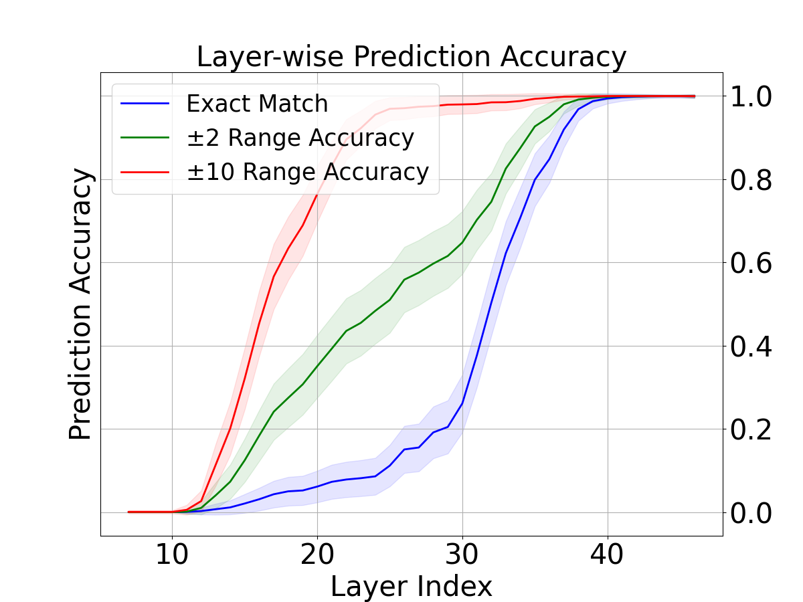
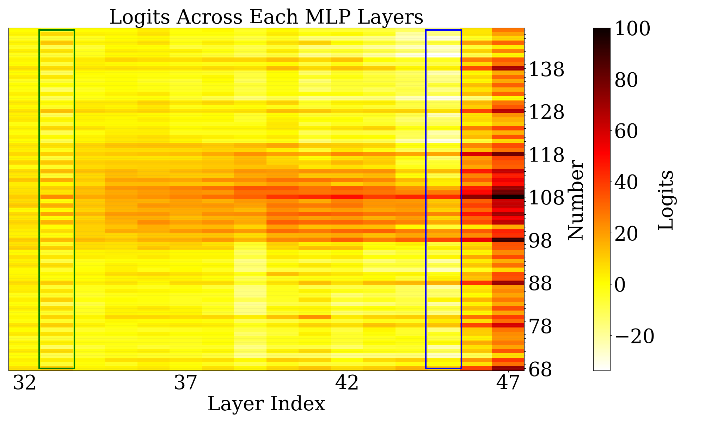
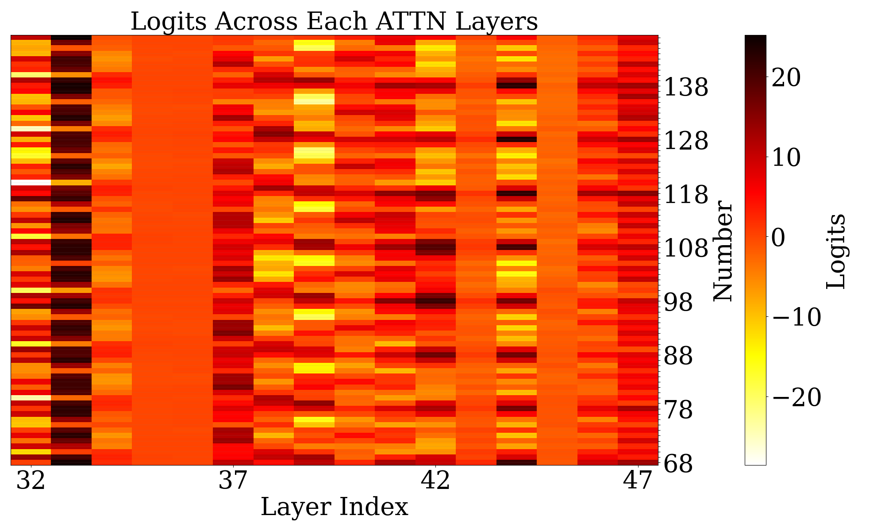
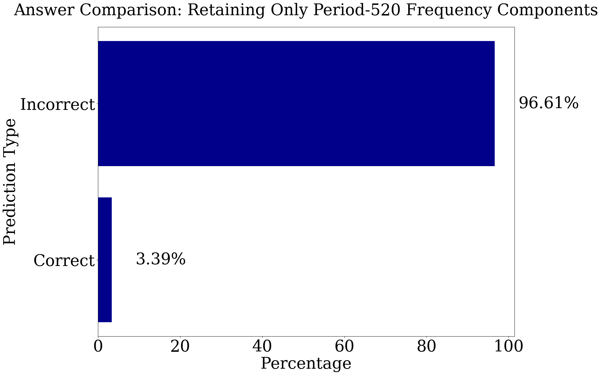

# 大型预训练语言模型采用傅里叶特征进行加法运算。

发布时间：2024年06月05日

`LLM理论

这篇论文探讨了大型语言模型（LLMs）在数学推理中的内部机制，特别是加法运算的处理方式。通过分析模型如何利用傅里叶特征（频域稀疏特征）来执行加法，论文揭示了预训练表示（如傅里叶特征）对于激发Transformer模型学习算法任务精确机制的重要性。这种深入的理论分析和机制探讨属于LLM理论范畴，因为它关注的是模型内部的运作原理和预训练对模型性能的影响。` `数学教育`

> Pre-trained Large Language Models Use Fourier Features to Compute Addition

# 摘要

> 预训练的大型语言模型（LLMs）在数学推理上表现出色，但其加法运算的内部机制尚不明确。研究发现，这些模型通过傅里叶特征（隐藏状态中代表数字的频域稀疏特征）进行加法。模型中的MLP层利用低频特征估算答案大小，而注意力层则通过高频特征判断答案的奇偶性。预训练是关键，因为仅利用低频特征的模型准确性较低。通过引入预训练的令牌嵌入，随机初始化的模型性能得以恢复。我们的分析揭示，恰当的预训练表示（如傅里叶特征）能激发Transformer学习算法任务精确机制的潜能。

> Pre-trained large language models (LLMs) exhibit impressive mathematical reasoning capabilities, yet how they compute basic arithmetic, such as addition, remains unclear. This paper shows that pre-trained LLMs add numbers using Fourier features -- dimensions in the hidden state that represent numbers via a set of features sparse in the frequency domain. Within the model, MLP and attention layers use Fourier features in complementary ways: MLP layers primarily approximate the magnitude of the answer using low-frequency features, while attention layers primarily perform modular addition (e.g., computing whether the answer is even or odd) using high-frequency features. Pre-training is crucial for this mechanism: models trained from scratch to add numbers only exploit low-frequency features, leading to lower accuracy. Introducing pre-trained token embeddings to a randomly initialized model rescues its performance. Overall, our analysis demonstrates that appropriate pre-trained representations (e.g., Fourier features) can unlock the ability of Transformers to learn precise mechanisms for algorithmic tasks.

[Arxiv](https://arxiv.org/abs/2406.03445)