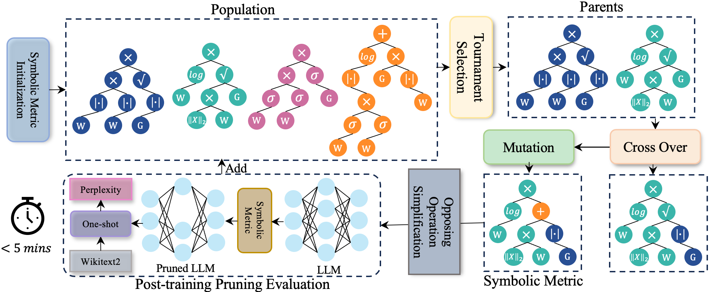
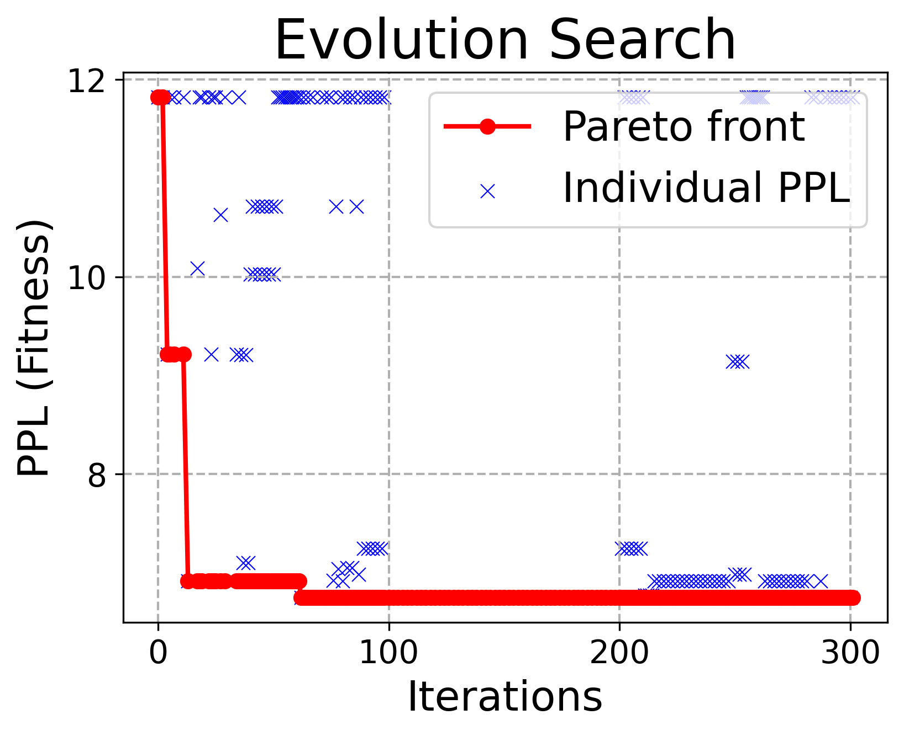
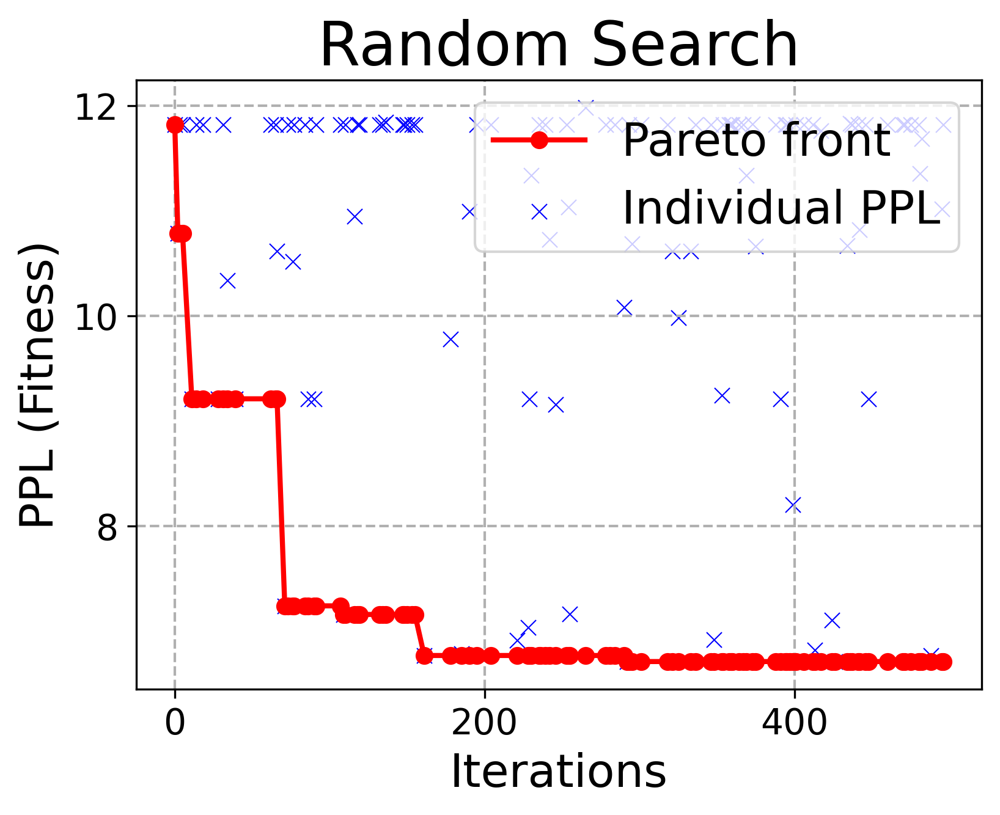
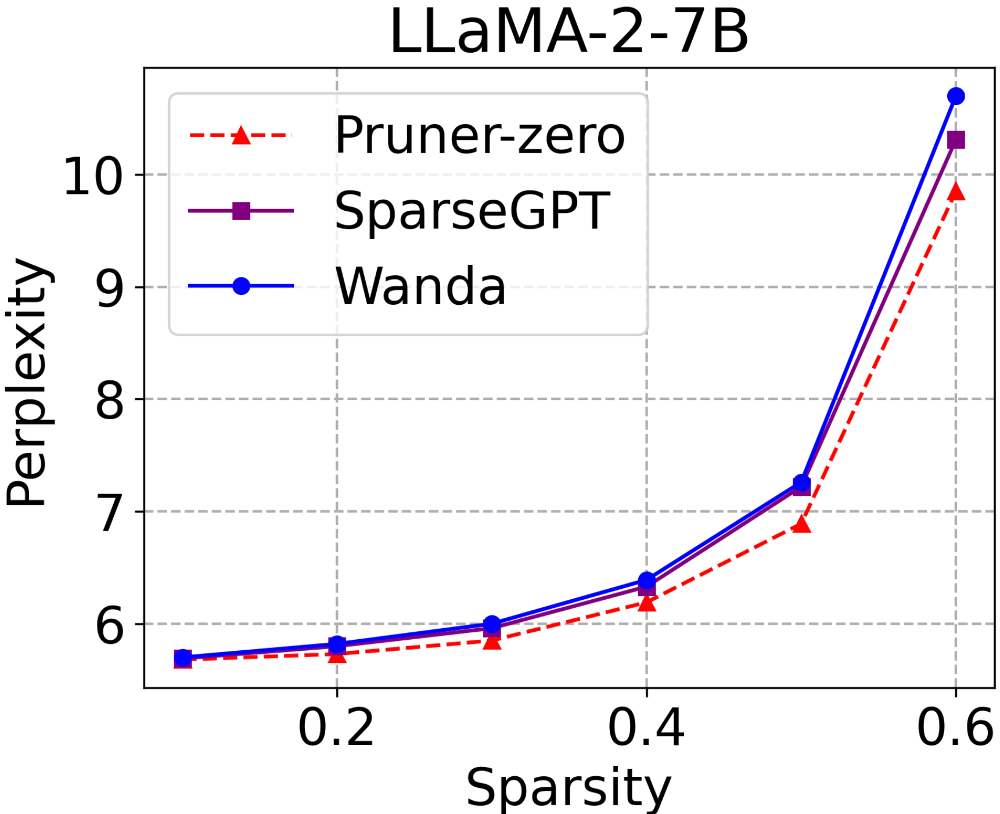
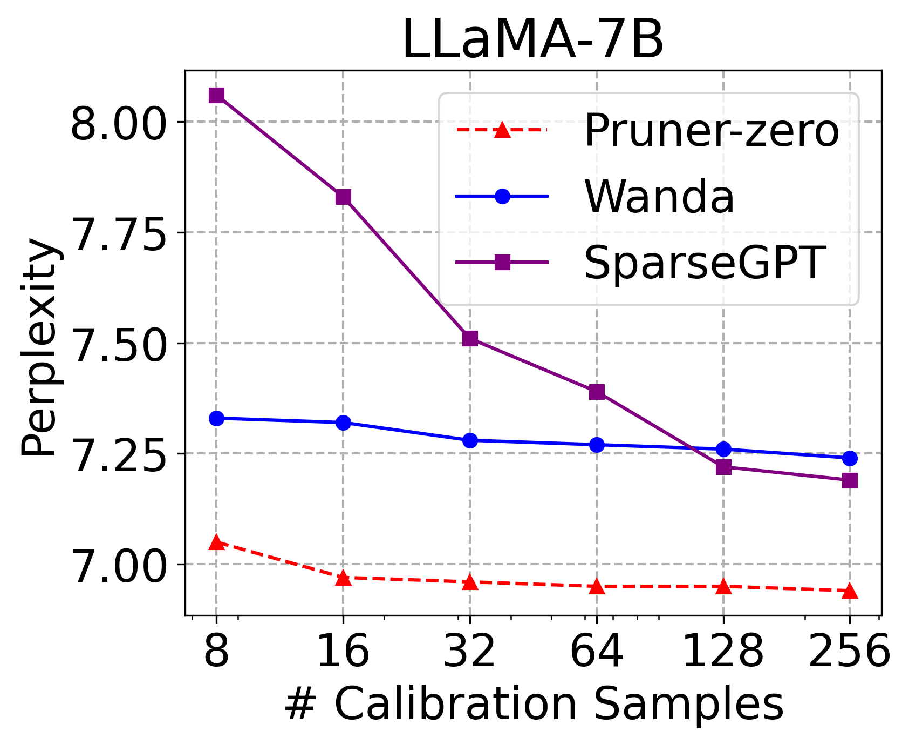
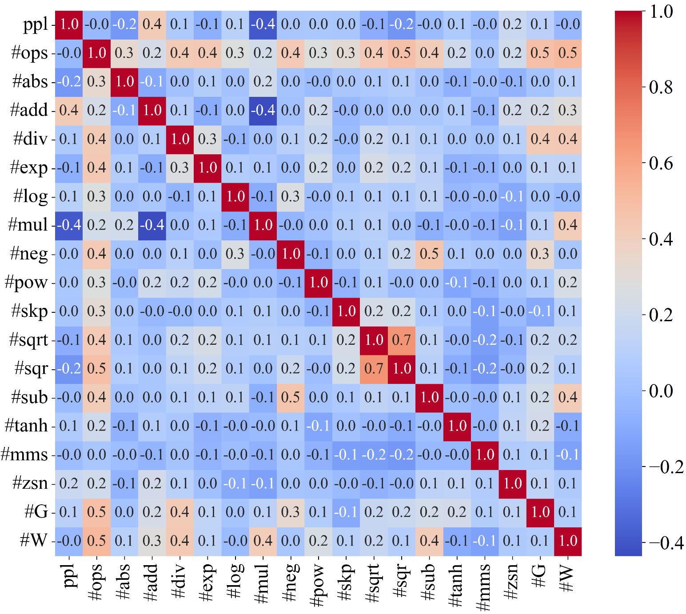

# Pruner-Zero：为大型语言模型量身定制，从零开始演化符号剪枝度量

发布时间：2024年06月05日

`LLM理论

理由：这篇论文主要探讨了大型语言模型（LLMs）的剪枝技术，特别是通过自动化框架和遗传编程来探索和创造新的剪枝度量。这种方法涉及到模型优化和性能提升的理论研究，而不是直接的应用或Agent行为，也不是关于检索增强生成（RAG）的具体研究。因此，它更符合LLM理论的分类。` `人工智能` `模型优化`

> Pruner-Zero: Evolving Symbolic Pruning Metric from scratch for Large Language Models

# 摘要

> 尽管大型语言模型（LLMs）能力非凡，但其庞大的体积却给部署带来了难题。剪枝技术通过剔除部分权重来加速模型，但多数方法需重新训练，成本高昂且计算量大。近期，后训练剪枝技术引入了创新度量，使得LLMs无需重新训练即可剪枝，但这些度量仍需依赖专家的反复试验。为此，我们开发了一个自动化框架，运用遗传编程来探索符号剪枝度量。我们精心设计了一个搜索空间，覆盖现有度量，以挖掘潜在的剪枝度量。通过引入对立操作简化策略，我们增强了种群的多样性，使得Pruner-Zero能够自动创造剪枝度量。基于这些发现，我们分析了剪枝度量与剪枝后性能的关系，并提炼出若干原则。在LLaMA和LLaMA-2上的语言建模及零-shot任务的广泛测试中，Pruner-Zero的表现超越了当前最先进的方法。代码已公开：\url{https://github.com/pprp/Pruner-Zero}。

> Despite the remarkable capabilities, Large Language Models (LLMs) face deployment challenges due to their extensive size. Pruning methods drop a subset of weights to accelerate, but many of them require retraining, which is prohibitively expensive and computationally demanding. Recently, post-training pruning approaches introduced novel metrics, enabling the pruning of LLMs without retraining. However, these metrics require the involvement of human experts and tedious trial and error. To efficiently identify superior pruning metrics, we develop an automatic framework for searching symbolic pruning metrics using genetic programming. In particular, we devise an elaborate search space encompassing the existing pruning metrics to discover the potential symbolic pruning metric. We propose an opposing operation simplification strategy to increase the diversity of the population. In this way, Pruner-Zero allows auto-generation of symbolic pruning metrics. Based on the searched results, we explore the correlation between pruning metrics and performance after pruning and summarize some principles. Extensive experiments on LLaMA and LLaMA-2 on language modeling and zero-shot tasks demonstrate that our Pruner-Zero obtains superior performance than SOTA post-training pruning methods. Code at: \url{https://github.com/pprp/Pruner-Zero}.

[Arxiv](https://arxiv.org/abs/2406.02924)