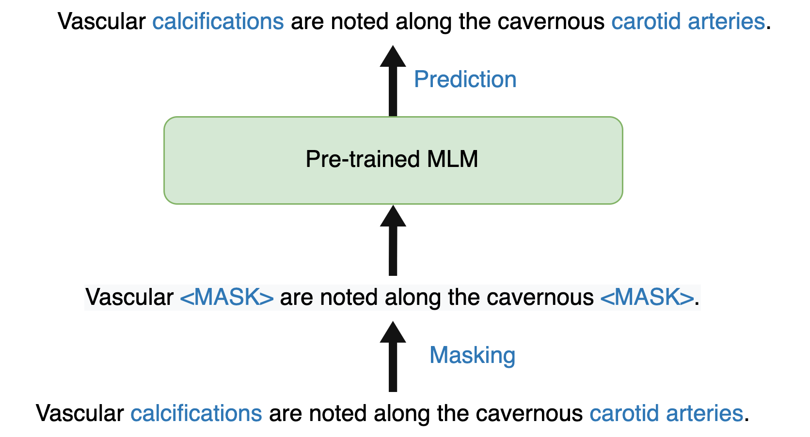
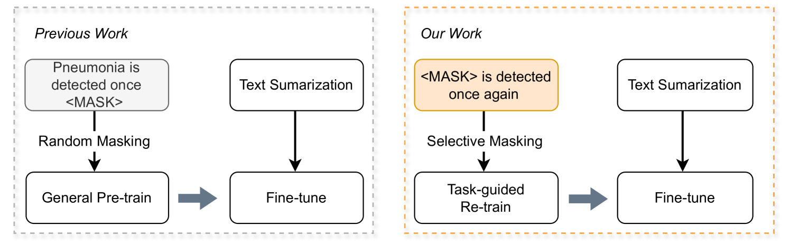
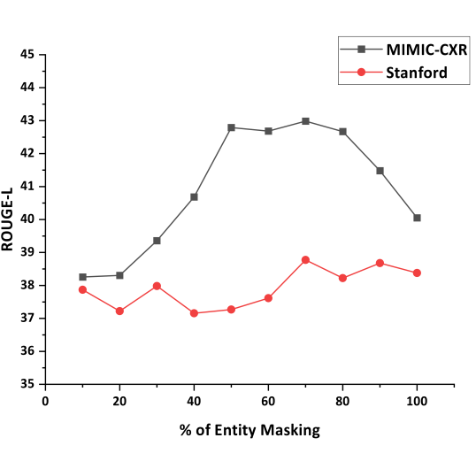

# RadBARTsum：专为放射学报告摘要定制的去噪序列到序列模型领域适应方案

发布时间：2024年06月05日

`LLM应用

理由：这篇论文介绍了一个专门为放射学报告摘要任务定制的模型RadBARTsum，该模型通过结合领域特定的知识和创新的实体掩码策略来改进BART模型。这种改进旨在提高模型在特定领域（即放射学）的性能，特别是在理解和生成关键临床信息方面。因此，这项研究属于大型语言模型（LLM）的应用范畴，因为它展示了如何将LLM技术应用于特定的实际问题，即医学报告的自动摘要。` `放射学`

> RadBARTsum: Domain Specific Adaption of Denoising Sequence-to-Sequence Models for Abstractive Radiology Report Summarization

# 摘要

> 本研究开发的RadBARTsum模型，专为放射学报告摘要量身定制，通过本体辅助的BART模型改进，助力医生迅速捕捉报告中的关键临床信息。研究分为两大步骤：首先，采用创新的实体掩码策略，在大量放射学报告上重训BART模型，强化其生物医学领域知识；其次，针对摘要任务微调模型，利用报告的发现与背景部分预测印象部分。实验中尝试了多种掩码策略，结果表明，结合领域知识的掩码重训显著提升了模型在多场景下的性能。此项研究不仅为放射学报告摘要提供了一个特定领域的生成语言模型，还开创了一种利用医学知识进行实体掩码的新方法，为提升语言模型在临床知识理解上的效率指明了新方向。

> Radiology report summarization is a crucial task that can help doctors quickly identify clinically significant findings without the need to review detailed sections of reports. This study proposes RadBARTsum, a domain-specific and ontology facilitated adaptation of the BART model for abstractive radiology report summarization. The approach involves two main steps: 1) re-training the BART model on a large corpus of radiology reports using a novel entity masking strategy to improving biomedical domain knowledge learning, and 2) fine-tuning the model for the summarization task using the Findings and Background sections to predict the Impression section. Experiments are conducted using different masking strategies. Results show that the re-training process with domain knowledge facilitated masking improves performances consistently across various settings. This work contributes a domain-specific generative language model for radiology report summarization and a method for utilising medical knowledge to realise entity masking language model. The proposed approach demonstrates a promising direction of enhancing the efficiency of language models by deepening its understanding of clinical knowledge in radiology reports.

[Arxiv](https://arxiv.org/abs/2406.03062)