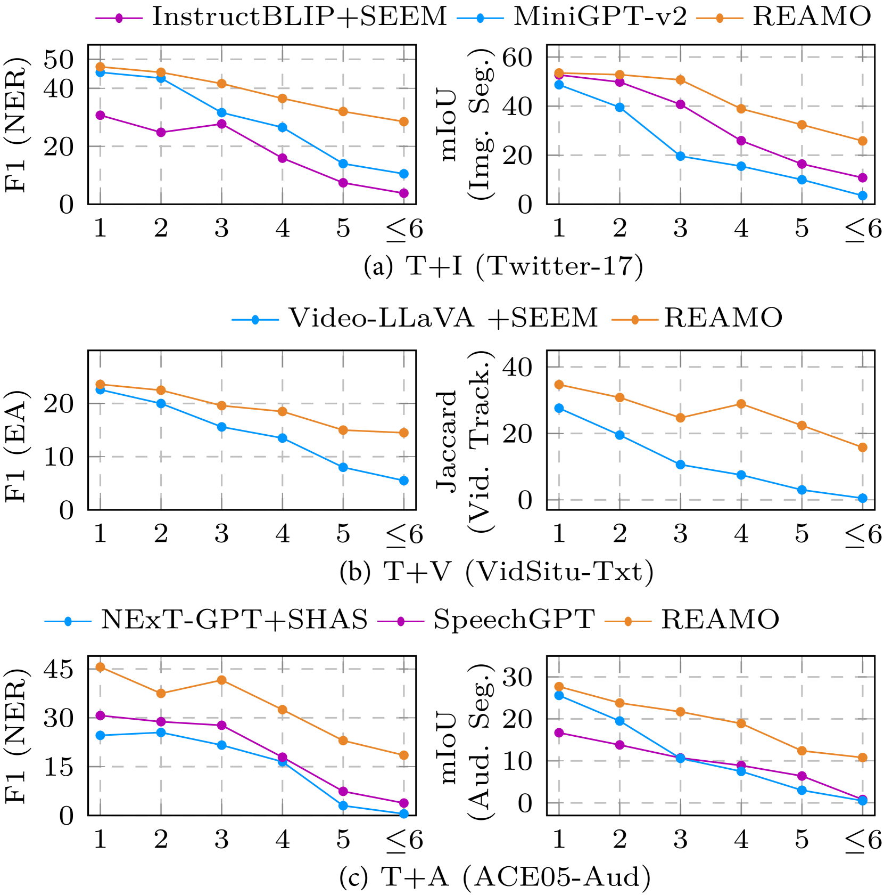

# 全面洞察：基于基础的多模态通用信息提取，实现对所有模态内容的即时识别。

发布时间：2024年06月05日

`LLM应用

这篇论文介绍了一个多模态大型语言模型Reamo，它能够从多种模态中提取信息并实体化，这属于大型语言模型（LLM）的具体应用。论文中提到的Reamo模型及其在多模态信息提取任务中的应用，以及创建的测试集和公开资源，都表明这是一项关于LLM在实际应用中的研究，因此应归类为LLM应用。` `信息提取` `多模态分析`

> Recognizing Everything from All Modalities at Once: Grounded Multimodal Universal Information Extraction

# 摘要

> 在信息提取领域，传统研究往往孤立地探讨不同模态及其组合的任务，忽视了跨模态信息的深入分析。为此，本研究首次提出了基于实体的多模态通用信息提取（MUIE）框架，旨在统一分析各种模态下的信息提取任务及其精细的实体基础。我们开发了多模态大型语言模型Reamo，它能从所有模态中同时提取并实体化信息。通过多样化的调优策略，Reamo展现出强大的信息识别和多模态实体化能力。针对缺乏合适的MUIE基准问题，我们创建了一个高质量、多样且挑战性的测试集，覆盖9种模态组合的IE任务及其多模态实体基础。与现有MLLM的比较表明，Reamo在各方面均表现出色，为后续研究设立了高标准。相关资源已公开于https://haofei.vip/MUIE。

> In the field of information extraction (IE), tasks across a wide range of modalities and their combinations have been traditionally studied in isolation, leaving a gap in deeply recognizing and analyzing cross-modal information. To address this, this work for the first time introduces the concept of grounded Multimodal Universal Information Extraction (MUIE), providing a unified task framework to analyze any IE tasks over various modalities, along with their fine-grained groundings. To tackle MUIE, we tailor a multimodal large language model (MLLM), Reamo, capable of extracting and grounding information from all modalities, i.e., recognizing everything from all modalities at once. Reamo is updated via varied tuning strategies, equipping it with powerful capabilities for information recognition and fine-grained multimodal grounding. To address the absence of a suitable benchmark for grounded MUIE, we curate a high-quality, diverse, and challenging test set, which encompasses IE tasks across 9 common modality combinations with the corresponding multimodal groundings. The extensive comparison of Reamo with existing MLLMs integrated into pipeline approaches demonstrates its advantages across all evaluation dimensions, establishing a strong benchmark for the follow-up research. Our resources are publicly released at https://haofei.vip/MUIE.

[Arxiv](https://arxiv.org/abs/2406.03701)