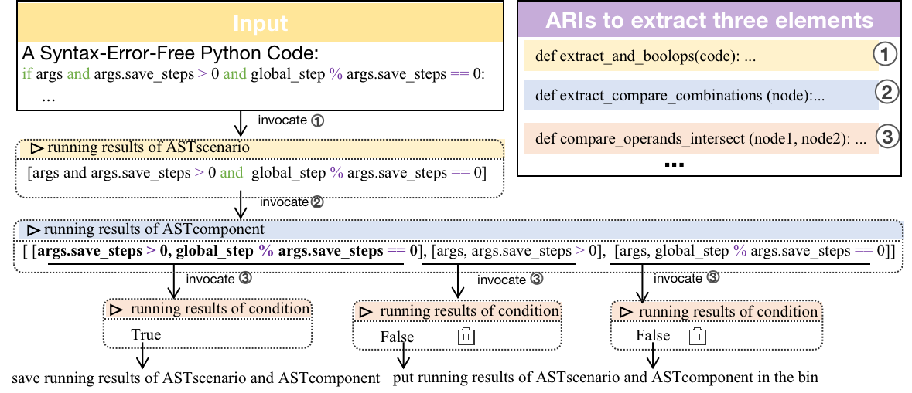
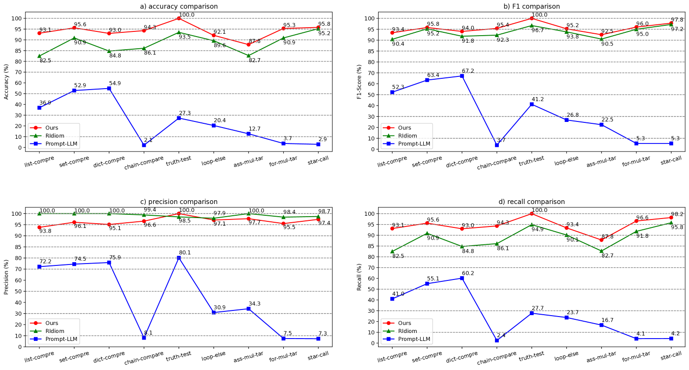
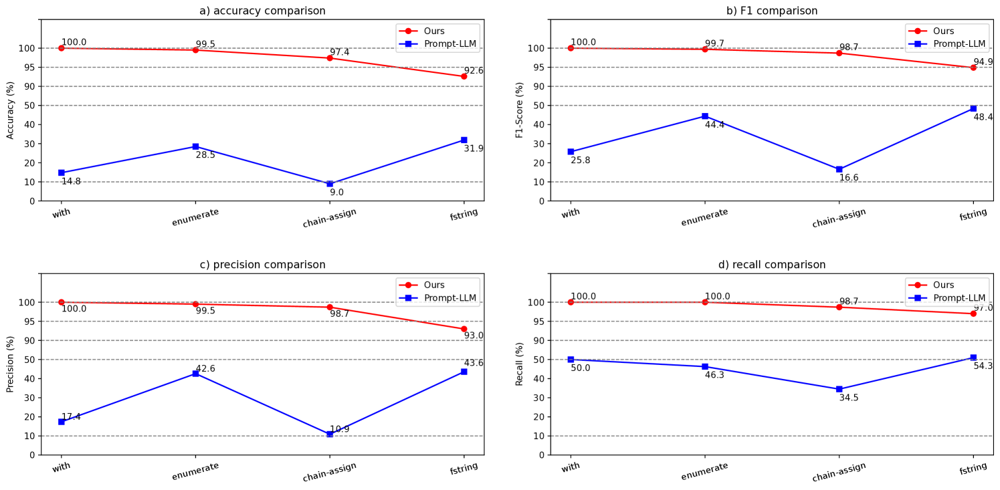

# 利用大型语言模型，探索 Pythonic 惯用法的重构之道：一种混合知识驱动的新途径

发布时间：2024年06月05日

`LLM应用

理由：这篇论文主要探讨了如何利用大型语言模型（LLM）结合规则确定性来解决Python代码惯用化的问题。论文中提出的方法包括使用LLMs生成代码并结合分析规则接口（ARIs）来辅助完成任务，这表明了LLM在实际应用中的使用，特别是在编程语言的优化和改进方面。因此，这篇论文更适合归类于“LLM应用”类别，而不是“Agent”、“RAG”或“LLM理论”。` `编程教育` `软件开发`

> Refactoring to Pythonic Idioms: A Hybrid Knowledge-Driven Approach Leveraging Large Language Models

# 摘要

> Pythonic idioms在Python社区中广受推崇，但许多用户在使用时感到困难。传统的基于规则或仅依赖LLM的方法难以解决代码惯用化中的三大难题：代码遗漏、错误检测和错误重构。为此，我们提出了一种结合规则确定性与LLM适应性的混合方法，包含三个模块。我们通过编写提示指导LLMs执行任务，并利用分析规则接口（ARIs）辅助完成任务。ARIs是LLMs生成的Python代码。首先，我们构建了一个包含AST场景、AST组件和条件的知识模块，并利用LLMs生成代码加入ARIs库。接着，对于无语法错误的Python代码，我们调用ARIs库中的接口提取并筛选AST组件。最后，我们设计提示引导LLMs将代码抽象化和惯用化，并使用ARIs将非惯用代码转换为惯用代码。我们对RIdiom和Prompt-LLM在九个已知的Pythonic idioms上进行了评估，结果显示我们的方法在准确性、F1分数和召回率上表现优异，精确度与RIdiom相当，各项指标均超过或接近90%。此外，我们还评估了四个新的Pythonic idioms，我们的方法在这些指标上均超过90%，持续优于Prompt-LLM。

> Pythonic idioms are highly valued and widely used in the Python programming community. However, many Python users find it challenging to use Pythonic idioms. Adopting a rule-based approach or LLM-only approach is not sufficient to overcome three persistent challenges of code idiomatization including code miss, wrong detection and wrong refactoring. Motivated by the determinism of rules and adaptability of LLMs, we propose a hybrid approach consisting of three modules. We not only write prompts to instruct LLMs to complete tasks, but we also invoke Analytic Rule Interfaces (ARIs) to accomplish tasks. The ARIs are Python code generated by prompting LLMs to generate code. We first construct a knowledge module with three elements including ASTscenario, ASTcomponent and Condition, and prompt LLMs to generate Python code for incorporation into an ARI library for subsequent use. After that, for any syntax-error-free Python code, we invoke ARIs from the ARI library to extract ASTcomponent from the ASTscenario, and then filter out ASTcomponent that does not meet the condition. Finally, we design prompts to instruct LLMs to abstract and idiomatize code, and then invoke ARIs from the ARI library to rewrite non-idiomatic code into the idiomatic code. Next, we conduct a comprehensive evaluation of our approach, RIdiom, and Prompt-LLM on nine established Pythonic idioms in RIdiom. Our approach exhibits superior accuracy, F1-score, and recall, while maintaining precision levels comparable to RIdiom, all of which consistently exceed or come close to 90% for each metric of each idiom. Lastly, we extend our evaluation to encompass four new Pythonic idioms. Our approach consistently outperforms Prompt-LLM, achieving metrics with values consistently exceeding 90% for accuracy, F1-score, precision, and recall.

[Arxiv](https://arxiv.org/abs/2406.03660)