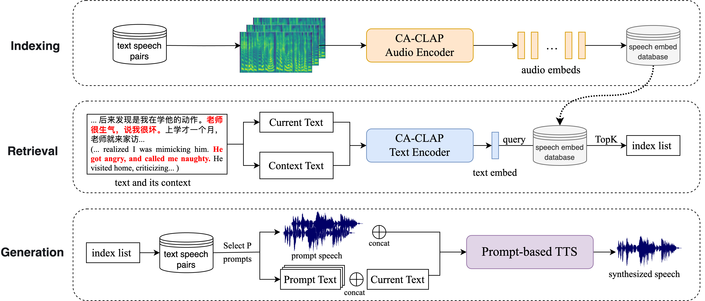
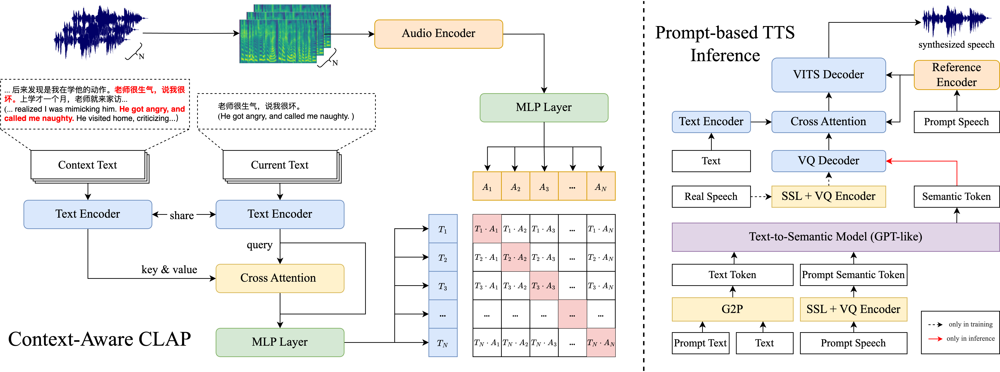

# 在基于提示的文本到语音合成领域，通过上下文感知对比语言-音频预训练，实现了检索增强的生成技术。

发布时间：2024年06月05日

`RAG

这篇论文主要介绍了将检索增强生成（RAG）技术应用于文本转语音（TTS）模型中，并提出了上下文感知对比语言-音频预训练（CA-CLAP）模型，以改进语音提示的选择过程。这种方法特别强调了上下文信息在检索过程中的重要性，并通过实验证明了其有效性。因此，这篇论文应归类于RAG，因为它专注于RAG技术在TTS领域的应用和改进。` `语音合成`

> Retrieval Augmented Generation in Prompt-based Text-to-Speech Synthesis with Context-Aware Contrastive Language-Audio Pretraining

# 摘要

> 基于提示的文本转语音（TTS）模型近期已能通过简短的语音提示克隆未知说话者，其强大的上下文模仿能力涵盖了说话者风格、韵律及情感。语音提示的选择对生成语音影响重大，其重要性不亚于大型语言模型（LLMs）中的提示。然而，现有TTS模型在选择语音提示时或是手动操作，或是随机选择。为此，本文将LLMs中的检索增强生成（RAG）技术应用于TTS，并创新性地在检索过程中融入上下文信息，推出了上下文感知对比语言-音频预训练（CA-CLAP）模型，以提取与风格紧密相关的上下文感知特征。评估结果显示，我们的RAG方法超越了传统基线，而CA-CLAP在文本检索方面更是取得了显著进步。

> Recent prompt-based text-to-speech (TTS) models can clone an unseen speaker using only a short speech prompt. They leverage a strong in-context ability to mimic the speech prompts, including speaker style, prosody, and emotion. Therefore, the selection of a speech prompt greatly influences the generated speech, akin to the importance of a prompt in large language models (LLMs). However, current prompt-based TTS models choose the speech prompt manually or simply at random. Hence, in this paper, we adapt retrieval augmented generation (RAG) from LLMs to prompt-based TTS. Unlike traditional RAG methods, we additionally consider contextual information during the retrieval process and present a Context-Aware Contrastive Language-Audio Pre-training (CA-CLAP) model to extract context-aware, style-related features. The objective and subjective evaluations demonstrate that our proposed RAG method outperforms baselines, and our CA-CLAP achieves better results than text-only retrieval methods.

[Arxiv](https://arxiv.org/abs/2406.03714)