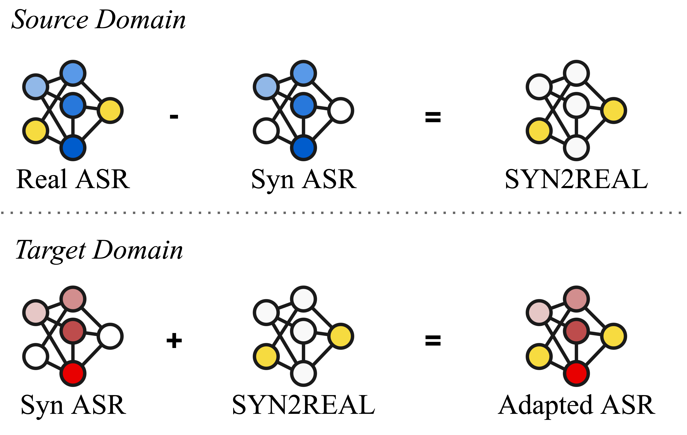
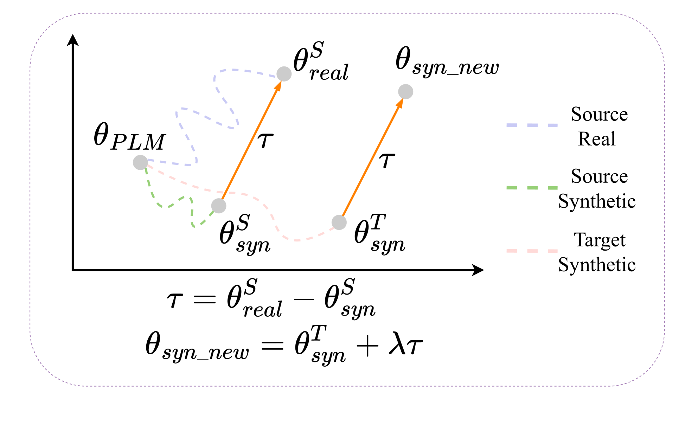
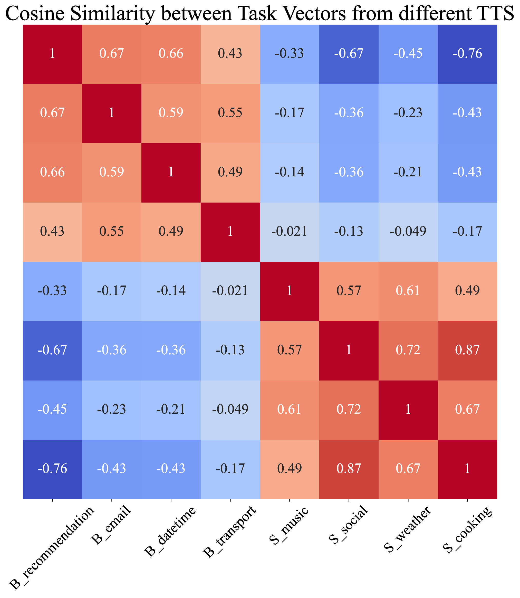
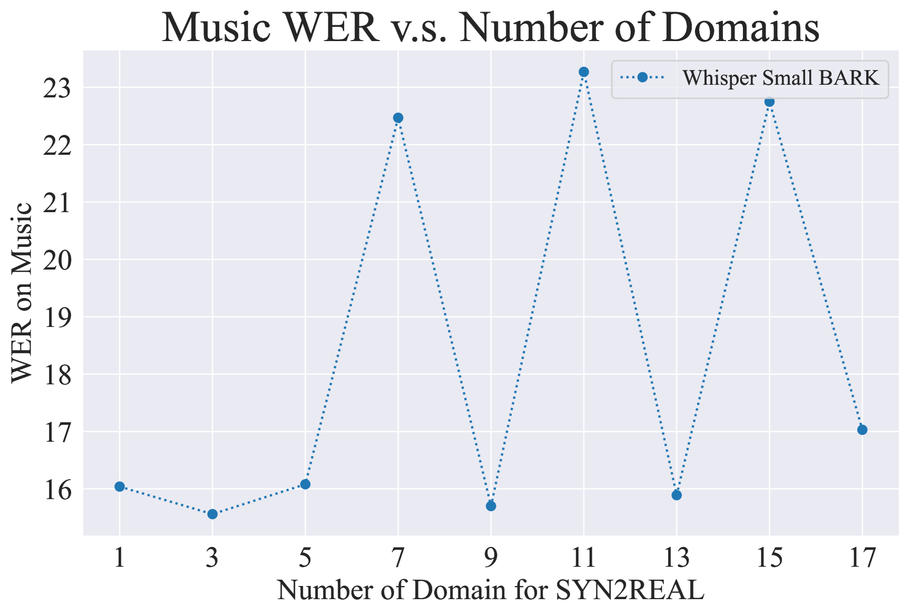

# SYN2REAL：借助任务算术，缓解自动语音识别领域适应中的合成与真实数据差异

发布时间：2024年06月05日

`LLM应用

这篇论文探讨了大型语言模型（LLMs）在自动语音识别（ASR）领域的应用，特别是在领域适应性方面的创新方法。通过提出“SYN2REAL”任务向量，该研究解决了合成语音与真实语音之间的声学差异问题，从而提高了模型在不同语音领域的适应性。这种方法在SLURP数据集上的实验结果表明，它能够显著降低单词错误率，展示了LLMs在特定应用场景下的实际效用和改进潜力。因此，这篇论文应归类于LLM应用。` `语音识别` `领域适应`

> SYN2REAL: Leveraging Task Arithmetic for Mitigating Synthetic-Real Discrepancies in ASR Domain Adaptation

# 摘要

> 大型语言模型（LLMs）的最新进展中，“任务向量”概念虽在多领域产生显著影响，但在语音识别领域仍显探索不足。本文创新性地提出了“SYN2REAL”任务向量，专为自动语音识别（ASR）中的领域适应设计，尤其针对纯文本领域。传统上，对合成语音的微调常因声学差异导致性能退化。为此，我们提出通过模型在真实与合成语音微调后的参数差异来构建“SYN2REAL”向量，有效弥合了两领域间的鸿沟。实验于SLURP数据集上进行，结果显示，我们的方法在未知目标领域中将单词错误率平均降低了11.15%，充分展现了任务向量在提升语音领域适应性方面的巨大潜力。

> Recent advancements in large language models (LLMs) have introduced the 'task vector' concept, which has significantly impacted various domains but remains underexplored in speech recognition. This paper presents a novel 'SYN2REAL' task vector for domain adaptation in automatic speech recognition (ASR), specifically targeting text-only domains. Traditional fine-tuning on synthetic speech often results in performance degradation due to acoustic mismatches. To address this issue, we propose creating a 'SYN2REAL' vector by subtracting the parameter differences between models fine-tuned on real and synthetic speech. This vector effectively bridges the gap between the two domains. Experiments on the SLURP dataset demonstrate that our approach yields an average improvement of 11.15% in word error rate for unseen target domains, highlighting the potential of task vectors in enhancing speech domain adaptation.

[Arxiv](https://arxiv.org/abs/2406.02925)