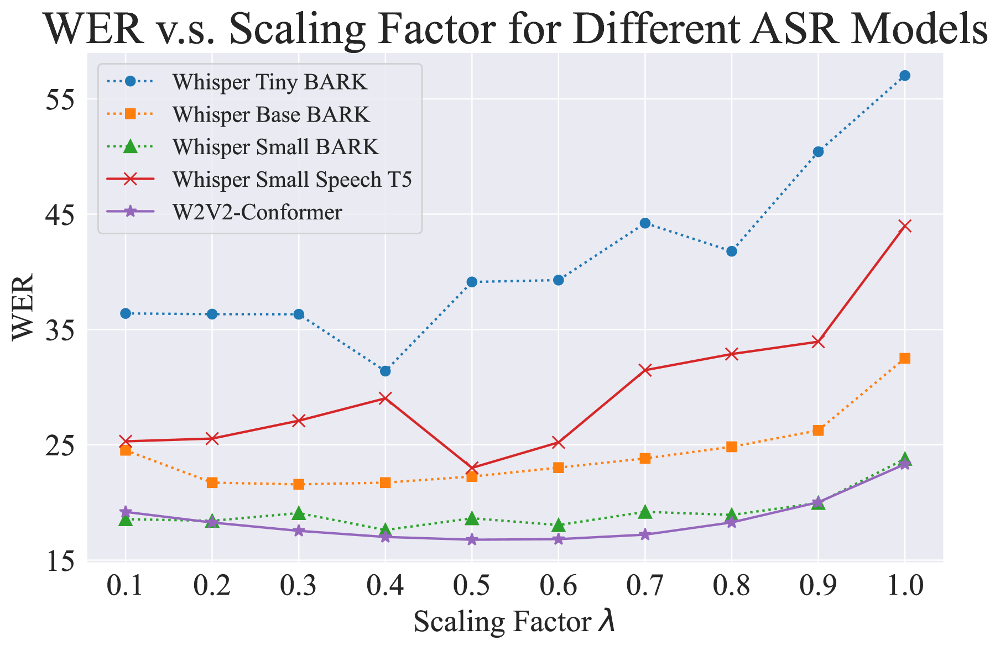

# SYN2REAL：通过任务算术策略，缓解自动语音识别领域适应中的合成数据与真实数据差异

发布时间：2024年06月05日

`LLM应用

这篇论文探讨了大型语言模型在语音识别领域的应用，特别是通过引入“SYN2REAL”任务向量来改善自动语音识别中的领域适应性。这种方法通过计算真实语音与合成语音微调模型间的参数差异，有效地解决了声学不匹配问题，并在实验中显著降低了单词错误率。因此，这篇论文属于LLM应用分类，因为它专注于将LLM技术应用于特定的实际问题——语音识别的领域适应。` `语音识别` `领域适应`

> SYN2REAL: Leveraging Task Arithmetic for Mitigating Synthetic-Real Discrepancies in ASR Domain Adaptation

# 摘要

> 大型语言模型的最新进展中，“任务向量”概念的引入在多个领域产生了显著影响，但在语音识别领域仍未得到充分探索。本文创新性地提出了“SYN2REAL”任务向量，专为自动语音识别中的领域适应设计，特别针对仅文本领域。传统上，对合成语音的微调常因声学不匹配导致性能下降。为此，我们提出通过计算真实语音与合成语音微调模型间的参数差异来构建“SYN2REAL”向量，有效弥合了两领域间的鸿沟。实验结果显示，在SLURP数据集上，我们的方法使未见领域中的单词错误率平均降低了11.15%，充分展示了任务向量在提升语音识别领域适应性方面的巨大潜力。

> Recent advancements in large language models (LLMs) have introduced the 'task vector' concept, which has significantly impacted various domains but remains underexplored in speech recognition. This paper presents a novel 'SYN2REAL' task vector for domain adaptation in automatic speech recognition (ASR), specifically targeting text-only domains. Traditional fine-tuning on synthetic speech often results in performance degradation due to acoustic mismatches. To address this issue, we propose creating a 'SYN2REAL' vector by subtracting the parameter differences between models fine-tuned on real and synthetic speech. This vector effectively bridges the gap between the two domains. Experiments on the SLURP dataset demonstrate that our approach yields an average improvement of 11.15% in word error rate for unseen target domains, highlighting the potential of task vectors in enhancing speech domain adaptation.

[Arxiv](https://arxiv.org/abs/2406.02925)