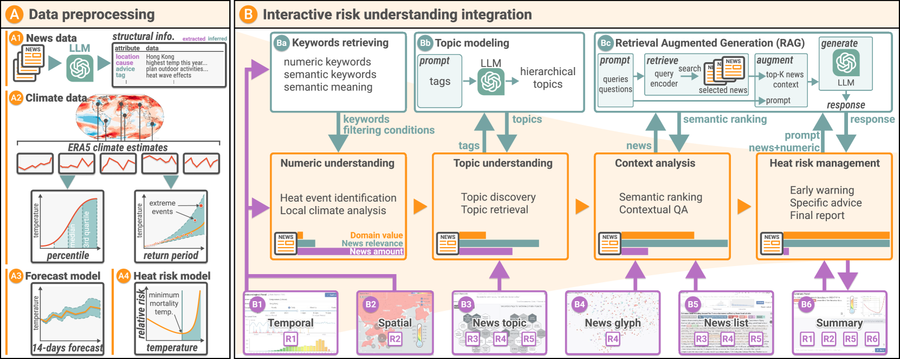
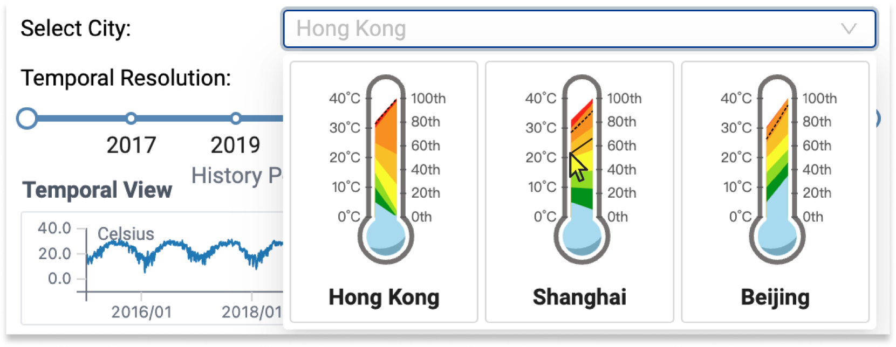
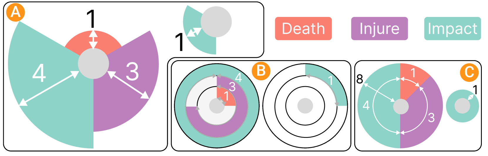
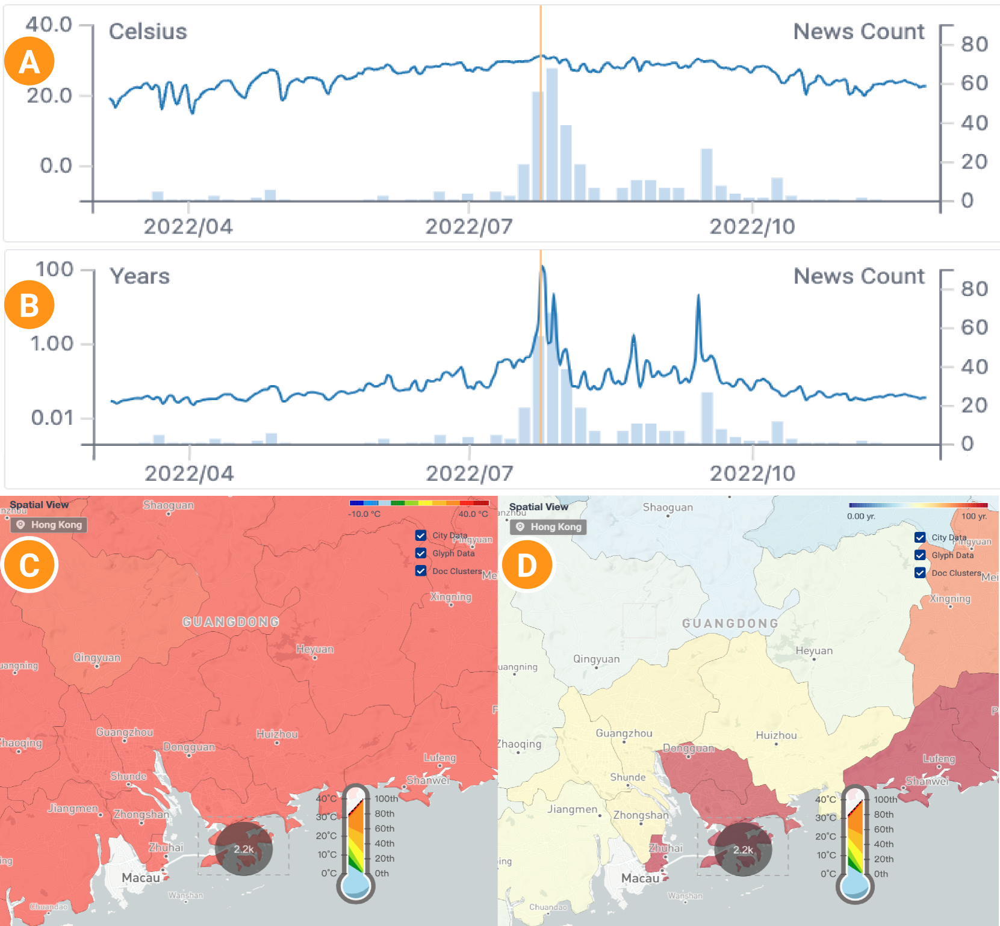
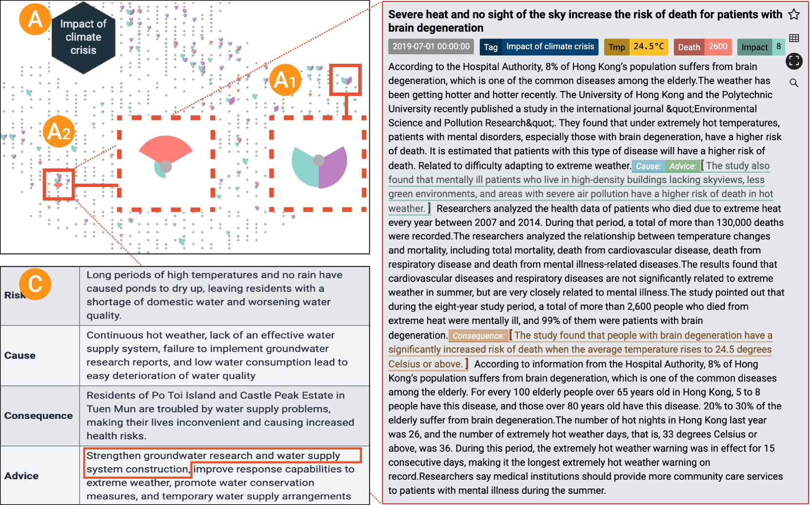
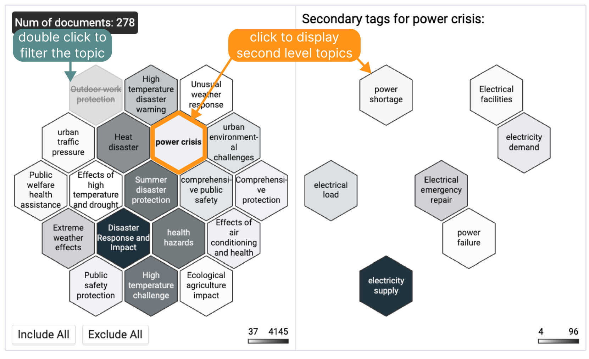

# 炎夏备忘：基于LLM的热风险视觉分析系统

发布时间：2024年06月05日

`LLM应用

这篇论文介绍了一种利用大型语言模型（LLMs）从新闻报道中提取深度上下文信息的方法，并开发了一个名为Havior的视觉分析系统，用于增强炎热风险的直观理解和分析。这种方法结合了数值模型的精确数据分析和新闻报道的细致信息，展示了LLM在实际应用中的潜力，特别是在风险管理和环境分析领域。因此，它属于LLM应用分类。` `气候变化` `风险管理`

> Save It for the "Hot" Day: An LLM-Empowered Visual Analytics System for Heat Risk Management

# 摘要

> 随着热浪等热相关气候事件的频发和加剧，我们急需更先进的炎热风险管理策略。目前依赖数值模型的方法在时空分辨率和捕捉环境、社会与行为因素动态交互方面存在局限，难以将风险评估转化为有效的缓解措施。为此，我们提出了一种创新方法，利用大型语言模型（LLMs）从新闻报道中提取深度上下文信息，并开发了名为Havior的视觉分析系统。该系统结合了数值模型的精确数据分析和新闻报道的细致信息，采用如“热图标”和新闻图标等创新视觉设计，增强了炎热风险的直观理解和分析。此外，基于LLM的技术还支持专家指导下的高级信息检索和语义知识提取。通过在两个热浪严重城市的案例研究和与五位专家的访谈，我们证明了Havior系统在提供深入且实用的炎热风险管理见解方面的有效性。

> The escalating frequency and intensity of heat-related climate events, particularly heatwaves, emphasize the pressing need for advanced heat risk management strategies. Current approaches, primarily relying on numerical models, face challenges in spatial-temporal resolution and in capturing the dynamic interplay of environmental, social, and behavioral factors affecting heat risks. This has led to difficulties in translating risk assessments into effective mitigation actions. Recognizing these problems, we introduce a novel approach leveraging the burgeoning capabilities of Large Language Models (LLMs) to extract rich and contextual insights from news reports. We hence propose an LLM-empowered visual analytics system, Havior, that integrates the precise, data-driven insights of numerical models with nuanced news report information. This hybrid approach enables a more comprehensive assessment of heat risks and better identification, assessment, and mitigation of heat-related threats. The system incorporates novel visualization designs, such as "thermoglyph" and news glyph, enhancing intuitive understanding and analysis of heat risks. The integration of LLM-based techniques also enables advanced information retrieval and semantic knowledge extraction that can be guided by experts' analytics needs. Our case studies on two cities that faced significant heatwave events and interviews with five experts have demonstrated the usefulness of our system in providing in-depth and actionable insights for heat risk management.

[Arxiv](https://arxiv.org/abs/2406.03317)