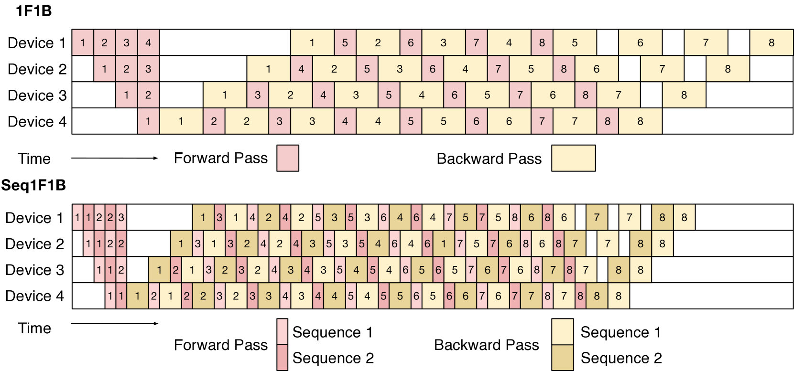
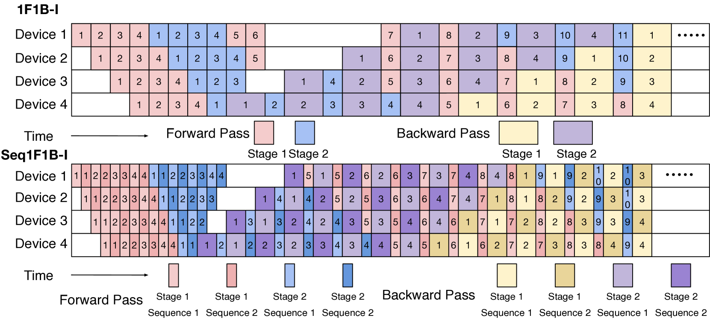
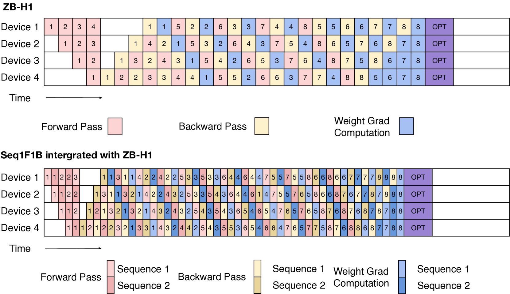
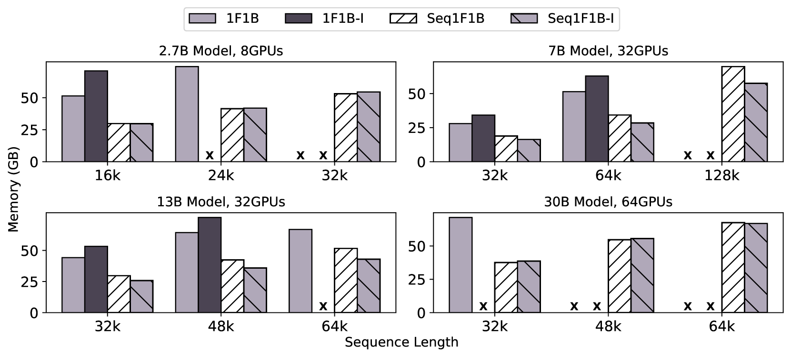

# Seq1F1B：大型语言模型训练的高效序列级流水线并行策略

发布时间：2024年06月05日

`LLM理论

理由：这篇论文主要探讨了大型语言模型（LLMs）在分布式训练中的技术挑战，特别是针对长序列训练的流水线并行技术。论文提出了一种新的调度策略Seq1F1B，旨在优化内存使用和减少流水线气泡，这是对LLMs训练理论和方法的深入研究。因此，它属于LLM理论分类，因为它关注的是模型训练的技术细节和优化方法，而不是模型的应用或安全性问题。` `人工智能` `高性能计算`

> Seq1F1B: Efficient Sequence-Level Pipeline Parallelism for Large Language Model Training

# 摘要

> 大型语言模型（LLMs）的崛起，得益于分布式训练策略，尤其是流水线并行技术的重大贡献。随着LLMs的训练序列长度激增，达到32k乃至128k，现有的流水线并行方法遭遇了内存占用过高和流水线气泡过多的难题，严重制约了模型的扩展性和训练效率。为此，我们提出了一种名为Seq1F1B的高效序列级1F1B流水线调度策略，专为长序列LLMs训练量身定制。Seq1F1B将调度单元从批量级细化至序列级，有效缩减了气泡和内存需求。针对Seq1F1B在均匀分割序列时可能产生的额外气泡，我们采用了一种计算策略来优化序列分割，以减轻这一影响。与Megatron 1F1B等先进方法相比，我们的Seq1F1B不仅训练吞吐量更高，内存占用也更低。特别地，Seq1F1B成功在64个NVIDIA A100 GPU上，无需重计算，训练了一个参数达30B的LLM，序列长度高达64k，超越了现有技术的极限。我们的代码基于Megatron-LM，现已开放源代码，详情请访问：https://github.com/MayDomine/Seq1F1B.git。

> The emergence of large language models (LLMs) relies heavily on distributed training strategies, among which pipeline parallelism plays a crucial role. As LLMs' training sequence length extends to 32k or even 128k, the current pipeline parallel methods face severe bottlenecks, including high memory footprints and substantial pipeline bubbles, greatly hindering model scalability and training throughput. To enhance memory efficiency and training throughput, in this work, we introduce an efficient sequence-level one-forward-one-backward (1F1B) pipeline scheduling method tailored for training LLMs on long sequences named Seq1F1B. Seq1F1B decomposes batch-level schedulable units into finer sequence-level units, reducing bubble size and memory footprint. Considering that Seq1F1B may produce slight extra bubbles if sequences are split evenly, we design a computation-wise strategy to partition input sequences and mitigate this side effect. Compared to competitive pipeline baseline methods such as Megatron 1F1B pipeline parallelism, our method achieves higher training throughput with less memory footprint. Notably, Seq1F1B efficiently trains a LLM with 30B parameters on sequences up to 64k using 64 NVIDIA A100 GPUs without recomputation strategies, a feat unachievable with existing methods. Our source code is based on Megatron-LM, and now is avaiable at: https://github.com/MayDomine/Seq1F1B.git.

[Arxiv](https://arxiv.org/abs/2406.03488)