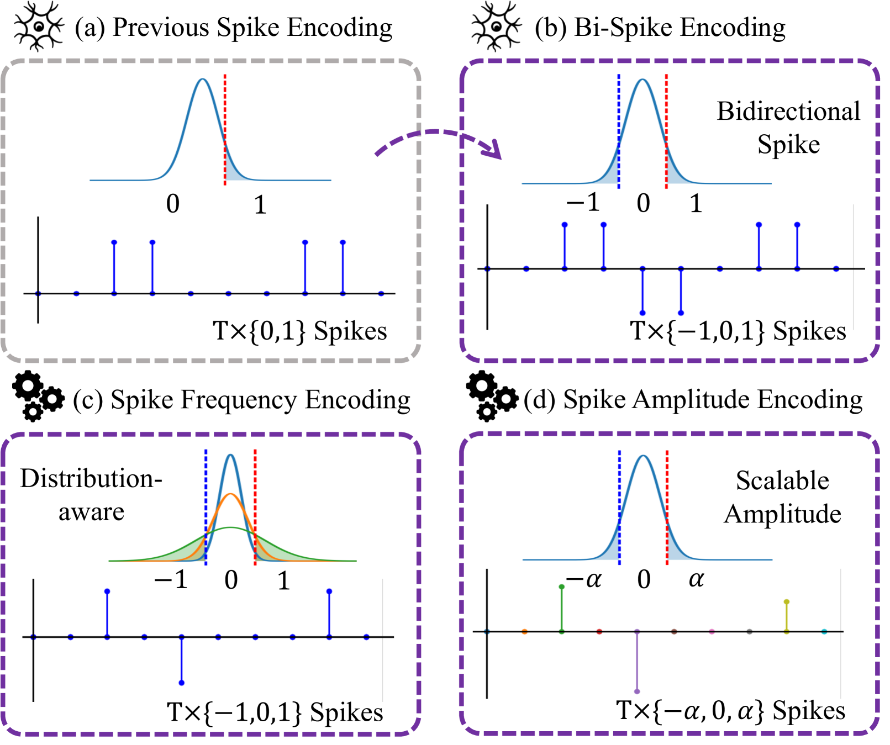
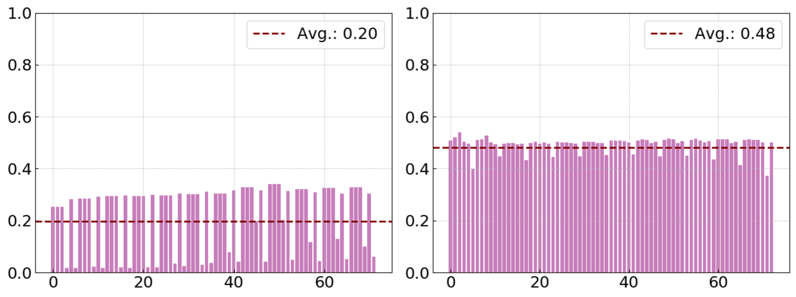
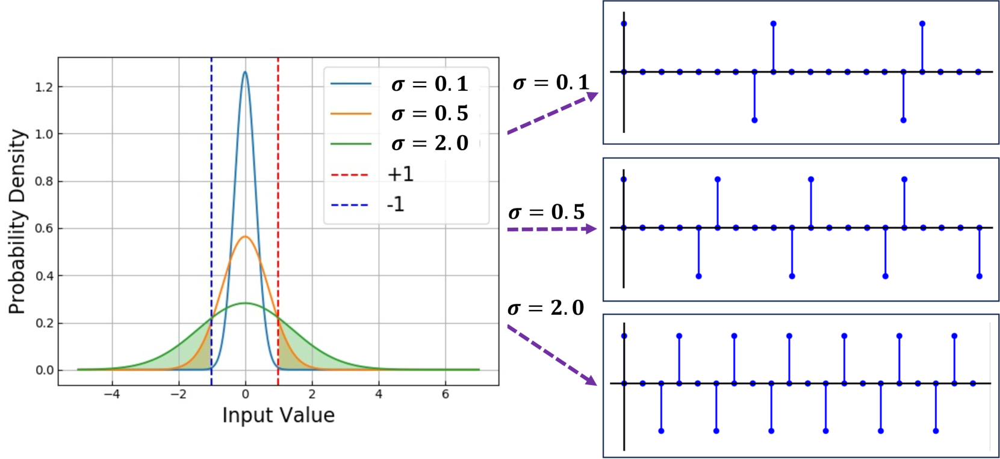
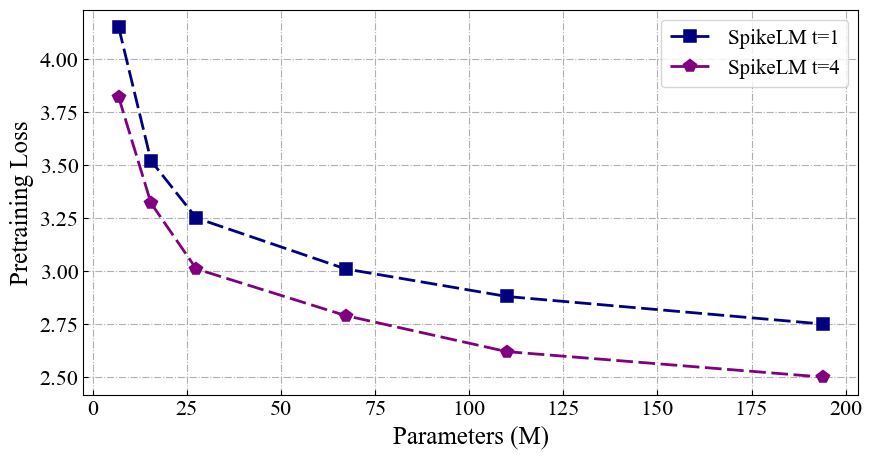
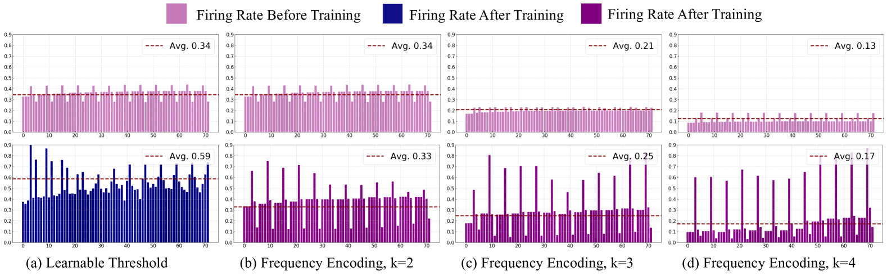
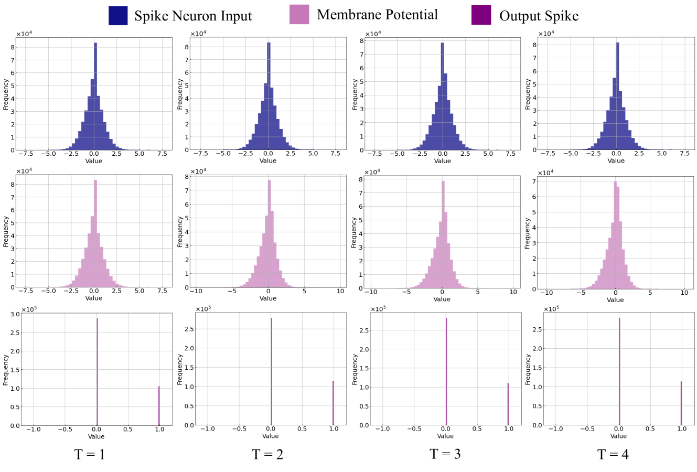
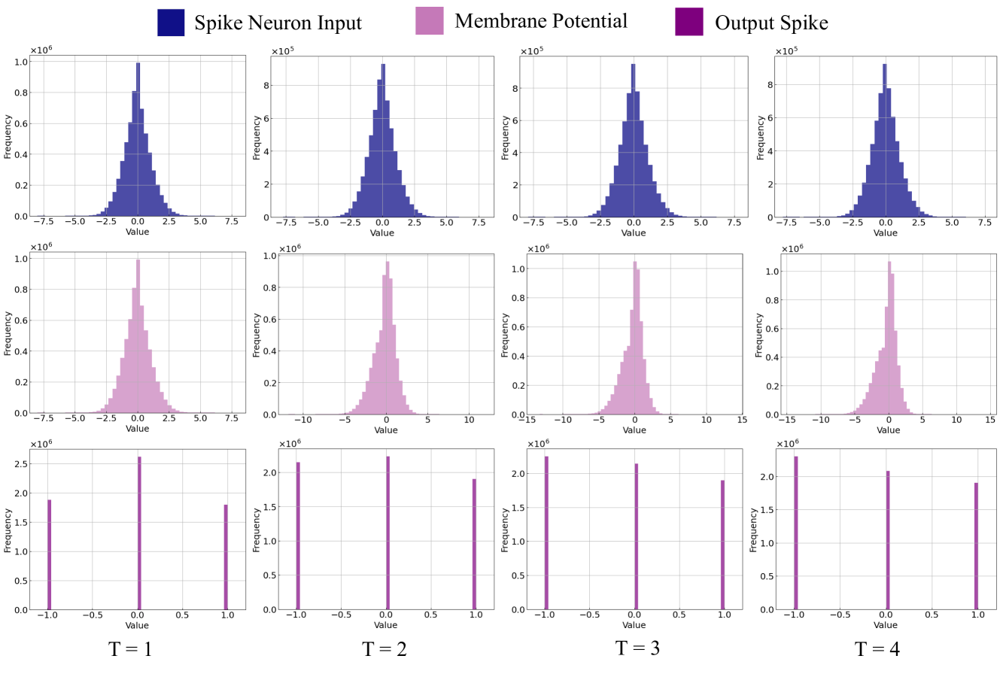
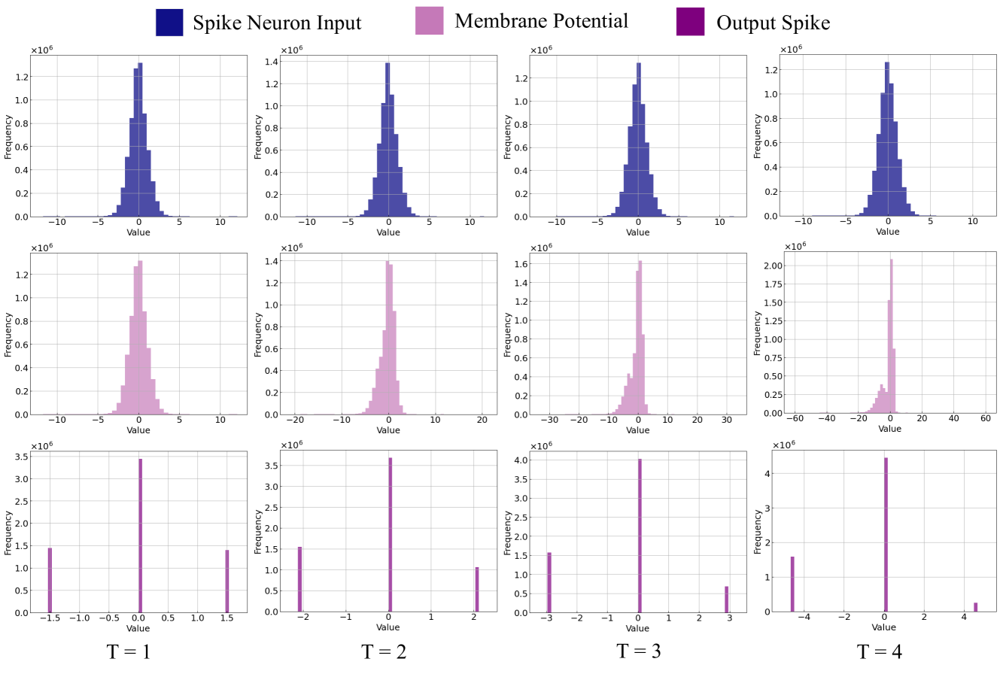

# SpikeLM：借助弹性双脉冲机制，迈向通用脉冲驱动的语言建模新境界

发布时间：2024年06月05日

`LLM理论

理由：这篇论文探讨了脉冲神经网络（SNNs）在语言建模中的应用，并提出了一种新的脉冲编码机制，旨在提高SNNs在语言任务中的泛化能力。这种研究涉及到对大型语言模型（LLM）理论层面的深入探讨，特别是在神经网络模型和编码机制的创新上，因此属于LLM理论分类。论文中提出的SpikeLM模型和其编码机制的创新，是对现有LLM理论的扩展和深化，而不是直接的应用或Agent相关的研究。` `人工智能` `语言建模`

> SpikeLM: Towards General Spike-Driven Language Modeling via Elastic Bi-Spiking Mechanisms

# 摘要

> 受生物启发的脉冲神经网络（SNNs）因其生物合理性、事件驱动的稀疏性和二进制激活特性，成为实现人脑般高效能人工智能的有力候选。近期，大型语言模型展现出卓越的泛化能力，激发了对更通用脉冲驱动模型的探索。然而，现有SNNs中的二进制脉冲在编码语义信息方面存在局限，对泛化能力构成挑战。本研究首次提出了一种全脉冲机制，适用于包括判别性和生成性在内的通用语言任务。与传统的{0,1}级别脉冲不同，我们创新性地引入了双向、弹性幅度和频率的脉冲编码方式，同时保留了SNNs的加法特性。在单个时间步内，脉冲通过方向和幅度的增强，而在脉冲频率上，我们精心设计了控制脉冲发放率的策略。这一弹性双向脉冲机制被应用于语言建模，命名为SpikeLM，首次实现了全脉冲驱动模型在通用语言任务中的应用，其准确度大幅超越以往。SpikeLM显著缩小了SNNs与ANNs在语言建模领域的性能差距。相关代码已公开于https://github.com/Xingrun-Xing/SpikeLM。

> Towards energy-efficient artificial intelligence similar to the human brain, the bio-inspired spiking neural networks (SNNs) have advantages of biological plausibility, event-driven sparsity, and binary activation. Recently, large-scale language models exhibit promising generalization capability, making it a valuable issue to explore more general spike-driven models. However, the binary spikes in existing SNNs fail to encode adequate semantic information, placing technological challenges for generalization. This work proposes the first fully spiking mechanism for general language tasks, including both discriminative and generative ones. Different from previous spikes with {0,1} levels, we propose a more general spike formulation with bi-directional, elastic amplitude, and elastic frequency encoding, while still maintaining the addition nature of SNNs. In a single time step, the spike is enhanced by direction and amplitude information; in spike frequency, a strategy to control spike firing rate is well designed. We plug this elastic bi-spiking mechanism in language modeling, named SpikeLM. It is the first time to handle general language tasks with fully spike-driven models, which achieve much higher accuracy than previously possible. SpikeLM also greatly bridges the performance gap between SNNs and ANNs in language modeling. Our code is available at https://github.com/Xingrun-Xing/SpikeLM.

[Arxiv](https://arxiv.org/abs/2406.03287)