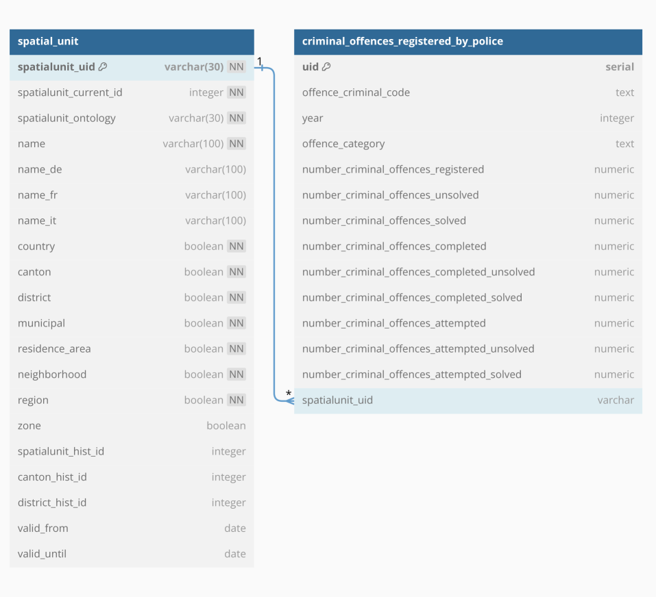

# StatBot.Swiss：自然语言环境下的双语开放数据探索平台

发布时间：2024年06月05日

`LLM应用

这篇论文主要探讨了大型语言模型（LLMs）在Text-to-SQL系统中的应用，特别是在非英语语言（如德语）中的表现。通过引入一个新的双语基准数据集StatBot.Swiss，并测试了多个顶尖LLMs在该数据集上的表现，论文展示了这些模型在跨语言环境下的泛化能力不足。因此，这篇论文属于LLM应用分类，因为它关注的是LLMs在特定应用场景（Text-to-SQL）中的实际表现和挑战。` `数据库管理`

> StatBot.Swiss: Bilingual Open Data Exploration in Natural Language

# 摘要

> 大型语言模型（LLMs）在Text-to-SQL系统中的潜力主要在英语数据集上得到验证，而其他语言的表现则鲜为人知。为此，我们推出了StatBot.Swiss数据集，这是首个基于实际应用的双语基准，用于Text-to-SQL系统的评估。该数据集包含455个英语和德语的自然语言/SQL对，覆盖35个复杂度各异的大型数据库。我们采用情境学习方法，测试了GPT-3.5-Turbo和mixtral-8x7b-instruct等顶尖LLMs在Text-to-SQL翻译任务上的能力。实验结果显示，这些模型在我们新推出的双语数据集上生成SQL查询时，泛化能力不足。

> The potential for improvements brought by Large Language Models (LLMs) in Text-to-SQL systems is mostly assessed on monolingual English datasets. However, LLMs' performance for other languages remains vastly unexplored. In this work, we release the StatBot.Swiss dataset, the first bilingual benchmark for evaluating Text-to-SQL systems based on real-world applications. The StatBot.Swiss dataset contains 455 natural language/SQL-pairs over 35 big databases with varying level of complexity for both English and German.
  We evaluate the performance of state-of-the-art LLMs such as GPT-3.5-Turbo and mixtral-8x7b-instruct for the Text-to-SQL translation task using an in-context learning approach. Our experimental analysis illustrates that current LLMs struggle to generalize well in generating SQL queries on our novel bilingual dataset.

[Arxiv](https://arxiv.org/abs/2406.03170)