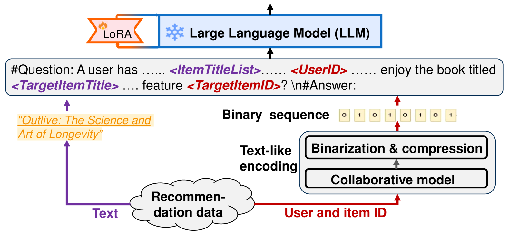
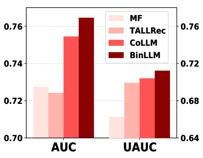
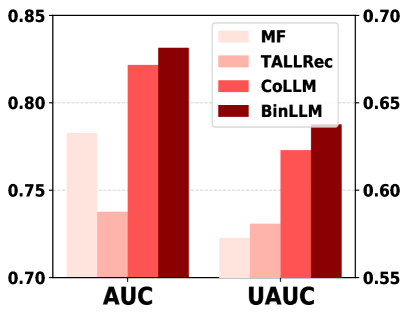
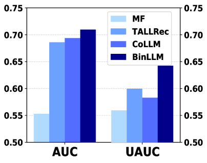
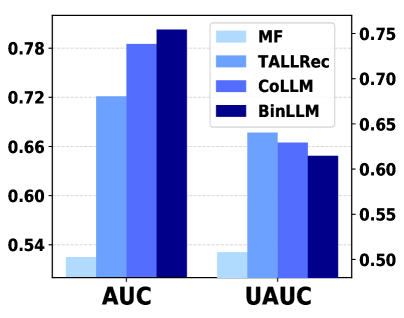
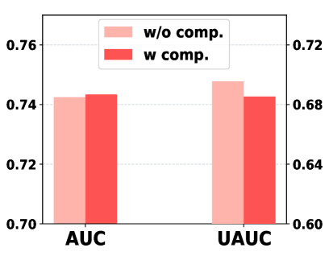
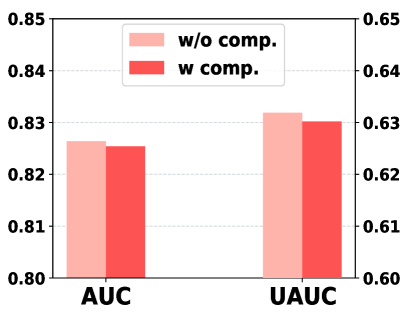

# 大规模语言模型中，采用类似文本的方式编码协作信息，以优化推荐系统。

发布时间：2024年06月05日

`LLM应用

这篇论文介绍了一种名为BinLLM的新方法，用于在推荐系统中应用大型语言模型（LLM）。该方法通过将外部模型的协同嵌入转换为LLM可以直接理解和操作的二进制序列，从而有效地整合了协同信息。这种方法特别强调了以文本格式表示信息，这与LLM的特性相契合。此外，论文还提到了使用点十进制表示法来压缩二进制序列，以避免序列过长。通过实验验证，BinLLM能够显著提升性能。因此，这篇论文属于LLM应用类别，因为它专注于开发和应用LLM技术来改进推荐系统。` `推荐系统` `电子商务`

> Text-like Encoding of Collaborative Information in Large Language Models for Recommendation

# 摘要

> 在将大型语言模型（LLM）应用于推荐系统（LLMRec）时，整合协同信息至关重要。现有方法虽通过学习LLM潜在空间中的协同嵌入或外部模型映射来实现这一点，但未能以文本格式有效表示信息，这可能与LLM的特性不完全契合。为此，我们推出了BinLLM，一种创新的LLMRec方法，它通过文本式编码巧妙地融合了协同信息。BinLLM将外部模型的协同嵌入转换为LLM可直接理解和操作的二进制序列，使得LLM能直接利用文本格式的协同信息。此外，BinLLM还提供了使用点十进制表示法压缩二进制序列的选项，以避免序列过长。大量实验证明，BinLLM以更贴合LLM的方式引入了协同信息，显著提升了性能。我们的代码已公开于https://github.com/zyang1580/BinLLM。

> When adapting Large Language Models for Recommendation (LLMRec), it is crucial to integrate collaborative information. Existing methods achieve this by learning collaborative embeddings in LLMs' latent space from scratch or by mapping from external models. However, they fail to represent the information in a text-like format, which may not align optimally with LLMs. To bridge this gap, we introduce BinLLM, a novel LLMRec method that seamlessly integrates collaborative information through text-like encoding. BinLLM converts collaborative embeddings from external models into binary sequences -- a specific text format that LLMs can understand and operate on directly, facilitating the direct usage of collaborative information in text-like format by LLMs. Additionally, BinLLM provides options to compress the binary sequence using dot-decimal notation to avoid excessively long lengths. Extensive experiments validate that BinLLM introduces collaborative information in a manner better aligned with LLMs, resulting in enhanced performance. We release our code at https://github.com/zyang1580/BinLLM.

[Arxiv](https://arxiv.org/abs/2406.03210)