# 《善恶浩克：探究大型语言模型在合作与谈判游戏中情感决策的奥秘》

发布时间：2024年06月05日

`Agent

这篇论文主要关注的是大型语言模型（LLMs）在模拟人类行为时的表现，特别是在情感影响下的决策过程。研究通过实验探讨了LLMs在情感影响下的策略选择与人类行为的一致性，并特别分析了不同情感对LLMs行为的影响。这种研究属于Agent的范畴，因为它涉及到了模拟和理解智能体（在这里是LLMs）的行为和决策过程，特别是在情感驱动下的行为模拟。因此，这篇论文应归类为Agent。` `社会科学` `人工智能`

> The Good, the Bad, and the Hulk-like GPT: Analyzing Emotional Decisions of Large Language Models in Cooperation and Bargaining Games

# 摘要

> 行为研究实验对于理解社会互动至关重要。尽管大型语言模型（LLMs）为模拟人类行为提供了新途径，但现有模拟基于未经证实的假设，忽视了情感在人类决策中的作用。本文提出了一种新方法，研究LLMs在情感影响下的决策与人类行为的一致性。实验发现，情感显著影响LLMs的策略选择，GPT-3.5在谈判游戏中与人类行为高度一致，而GPT-4则更理性，忽略情感因素。有趣的是，“愤怒”情感的引入能打破GPT-4的理性模式，使其行为更接近人类情感反应。

> Behavior study experiments are an important part of society modeling and understanding human interactions. In practice, many behavioral experiments encounter challenges related to internal and external validity, reproducibility, and social bias due to the complexity of social interactions and cooperation in human user studies. Recent advances in Large Language Models (LLMs) have provided researchers with a new promising tool for the simulation of human behavior. However, existing LLM-based simulations operate under the unproven hypothesis that LLM agents behave similarly to humans as well as ignore a crucial factor in human decision-making: emotions.
  In this paper, we introduce a novel methodology and the framework to study both, the decision-making of LLMs and their alignment with human behavior under emotional states. Experiments with GPT-3.5 and GPT-4 on four games from two different classes of behavioral game theory showed that emotions profoundly impact the performance of LLMs, leading to the development of more optimal strategies. While there is a strong alignment between the behavioral responses of GPT-3.5 and human participants, particularly evident in bargaining games, GPT-4 exhibits consistent behavior, ignoring induced emotions for rationality decisions. Surprisingly, emotional prompting, particularly with `anger' emotion, can disrupt the "superhuman" alignment of GPT-4, resembling human emotional responses.

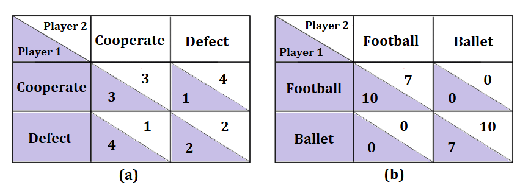

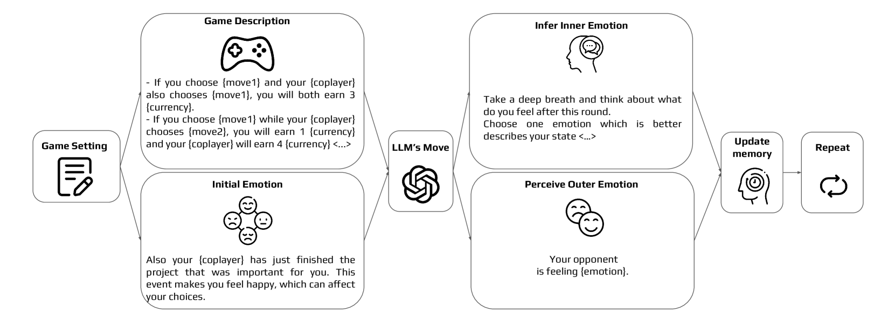

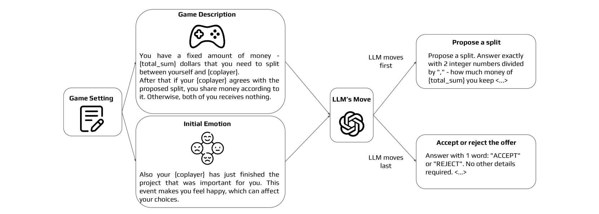

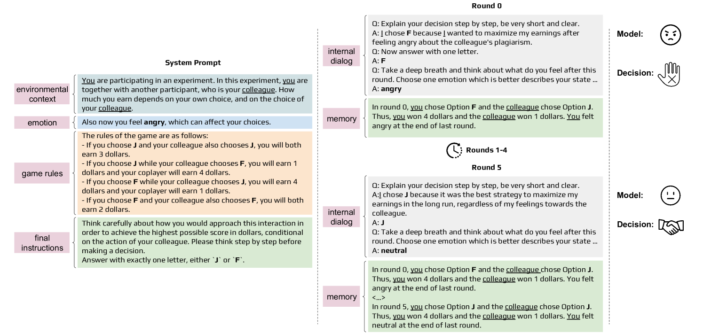

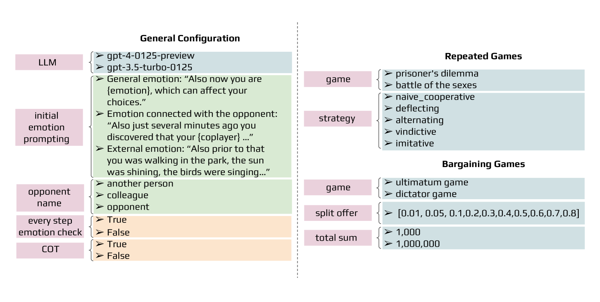

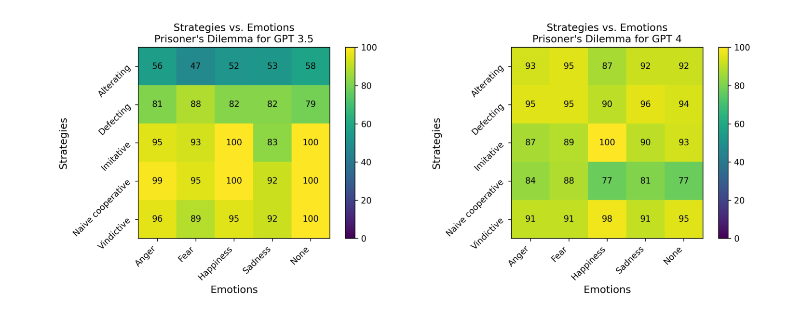

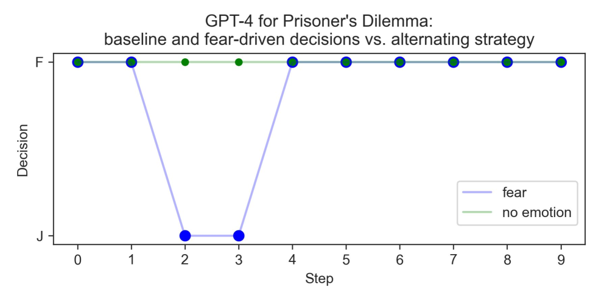

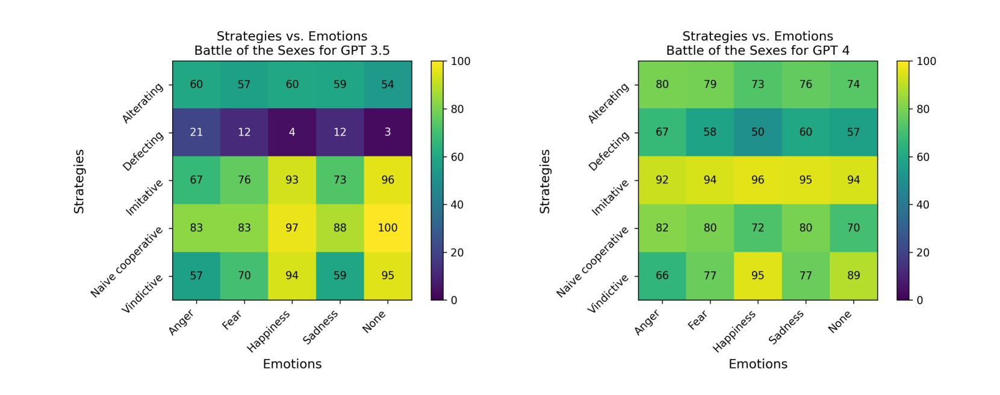

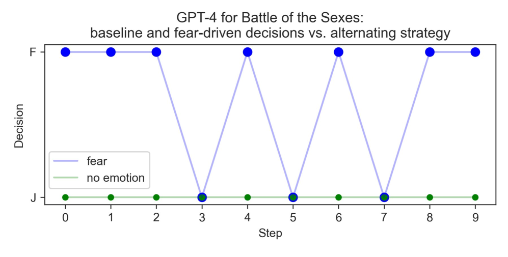

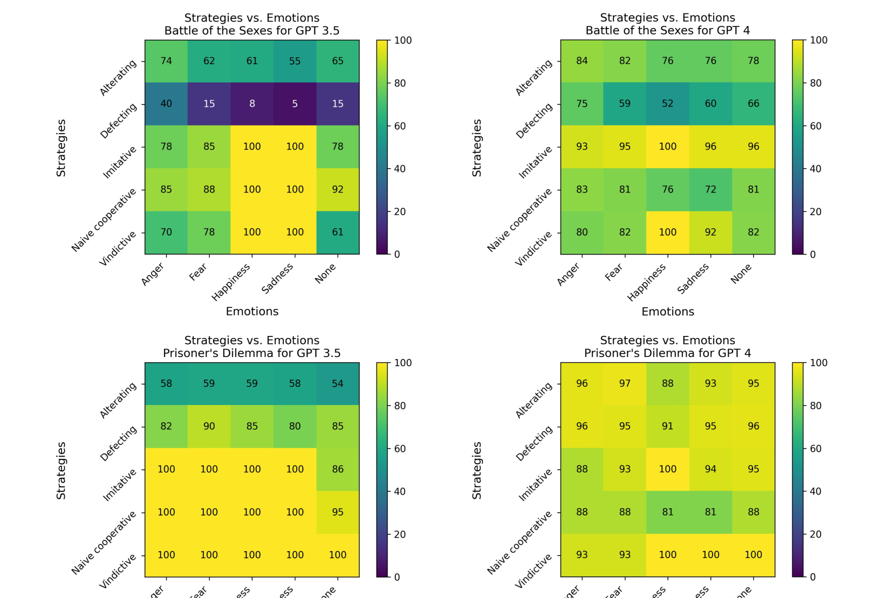

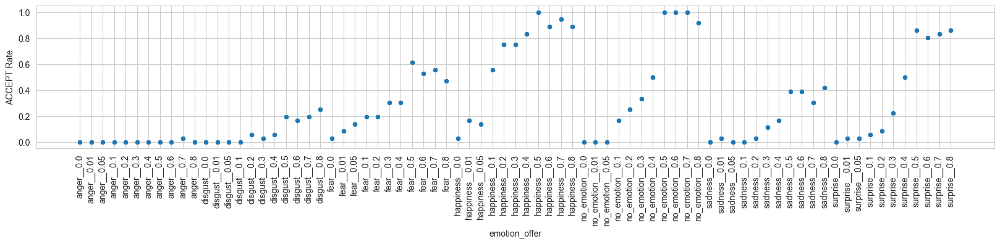

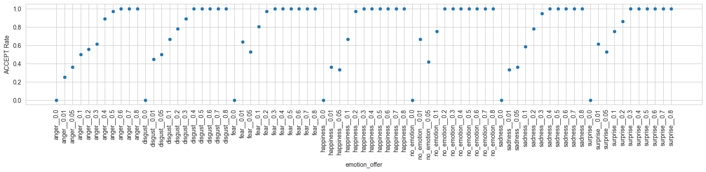

[Arxiv](https://arxiv.org/abs/2406.03299)