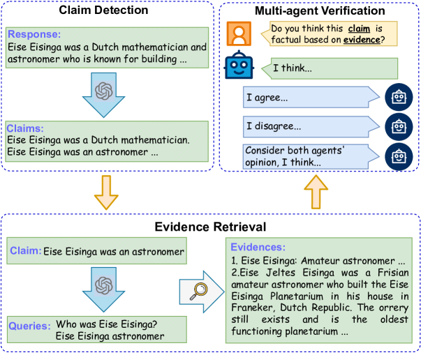
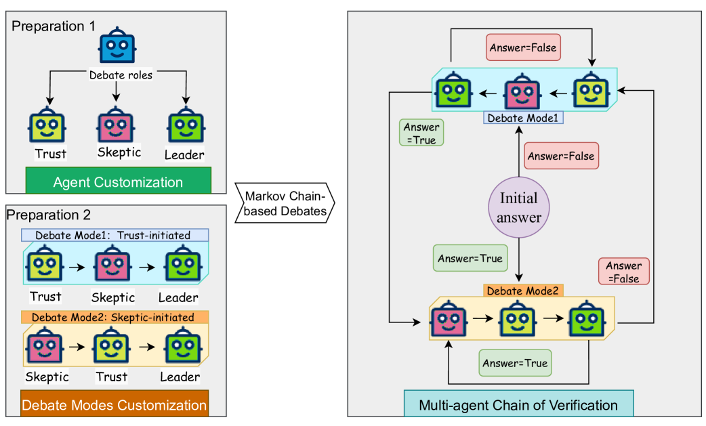
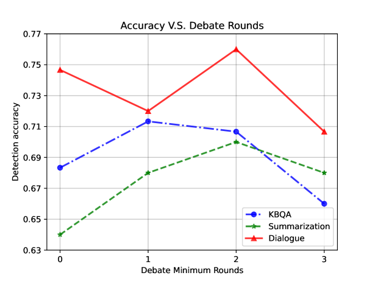

# 利用基于马尔可夫链的多智能体辩论框架，探索检测大型语言模型幻觉的新途径

发布时间：2024年06月05日

`Agent

这篇论文主要介绍了一种基于马尔可夫链的多代理辩论验证框架，用于提升自然语言文本生成中的幻觉检测准确性。该框架通过调动多个代理对声明进行验证，涉及声明检测、证据检索和多代理验证等过程。这种方法属于Agent的范畴，因为它涉及多个代理（Agent）的协作和交互，以解决特定的问题（即内容幻觉问题）。因此，这篇论文应归类于Agent。` `内容验证`

> Towards Detecting LLMs Hallucination via Markov Chain-based Multi-agent Debate Framework

# 摘要

> 随着大型语言模型（LLMs）的兴起，自然语言文本生成技术得到了飞速发展，但同时也带来了前所未有的挑战——内容幻觉问题日益凸显。目前，解决这一问题的方法往往需要在训练过程中进行昂贵且复杂的干预。有些方法虽然注重问题分解，却忽略了至关重要的验证环节，从而导致性能下降或应用范围受限。为此，我们提出了一种基于马尔可夫链的多代理辩论验证框架，旨在提升简洁声明中幻觉检测的准确性。该框架融合了事实核查的全过程，包括声明检测、证据检索以及多代理验证。在验证阶段，我们通过灵活的马尔可夫链辩论机制，调动多个代理对单个声明进行细致验证。实验结果显示，在三个生成任务上，我们的方法相较于传统基线方法取得了显著的性能提升。

> The advent of large language models (LLMs) has facilitated the development of natural language text generation. It also poses unprecedented challenges, with content hallucination emerging as a significant concern. Existing solutions often involve expensive and complex interventions during the training process. Moreover, some approaches emphasize problem disassembly while neglecting the crucial validation process, leading to performance degradation or limited applications. To overcome these limitations, we propose a Markov Chain-based multi-agent debate verification framework to enhance hallucination detection accuracy in concise claims. Our method integrates the fact-checking process, including claim detection, evidence retrieval, and multi-agent verification. In the verification stage, we deploy multiple agents through flexible Markov Chain-based debates to validate individual claims, ensuring meticulous verification outcomes. Experimental results across three generative tasks demonstrate that our approach achieves significant improvements over baselines.

[Arxiv](https://arxiv.org/abs/2406.03075)