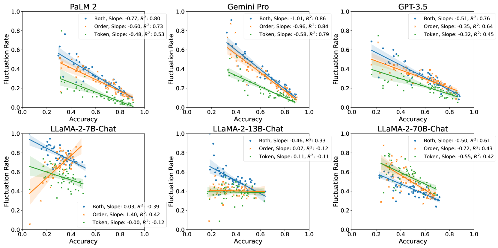
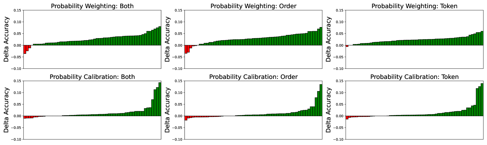
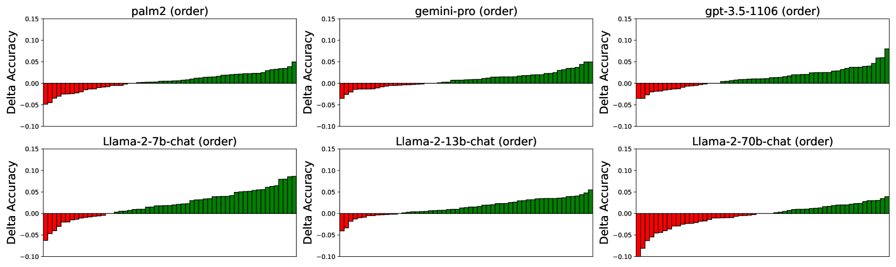
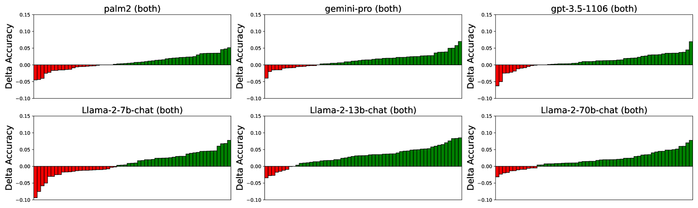

# 揭秘选择偏差：探究大型语言模型对顺序与令牌的敏感性

发布时间：2024年06月05日

`LLM理论

理由：这篇论文主要探讨了大型语言模型（LLMs）在选择任务中的“选择偏差”现象，并分析了选项顺序和令牌使用如何影响模型的决策。此外，论文还提出了减少这些偏差的策略，并进行了深入的分析。这些内容主要关注LLMs的理论分析和改进，而不是具体的应用、代理行为或检索增强生成（RAG）技术，因此更适合归类为LLM理论。` `人工智能` `机器学习`

> Unveiling Selection Biases: Exploring Order and Token Sensitivity in Large Language Models

# 摘要

> 本文探讨了大型语言模型（LLMs）在选择任务中的“选择偏差”现象，特别关注模型如何从有序序列中挑选最佳选项。我们分析了选项顺序和令牌使用如何影响模型的决策，并通过多模型和任务的实证研究量化了这些偏差的影响。我们还提出了针对性的策略，以减少这些偏差，提升模型的鲁棒性。主要贡献包括：1）精确评估选项顺序和令牌对LLMs的影响，2）制定策略以降低对顺序和令牌的敏感性，3）深入分析不同模型和任务的敏感性，为开发更稳定、可靠的LLM应用提供指导。

> In this paper, we investigate the phenomena of "selection biases" in Large Language Models (LLMs), focusing on problems where models are tasked with choosing the optimal option from an ordered sequence. We delve into biases related to option order and token usage, which significantly impact LLMs' decision-making processes. We also quantify the impact of these biases through an extensive empirical analysis across multiple models and tasks. Furthermore, we propose mitigation strategies to enhance model performance. Our key contributions are threefold: 1) Precisely quantifying the influence of option order and token on LLMs, 2) Developing strategies to mitigate the impact of token and order sensitivity to enhance robustness, and 3) Offering a detailed analysis of sensitivity across models and tasks, which informs the creation of more stable and reliable LLM applications for selection problems.

[Arxiv](https://arxiv.org/abs/2406.03009)