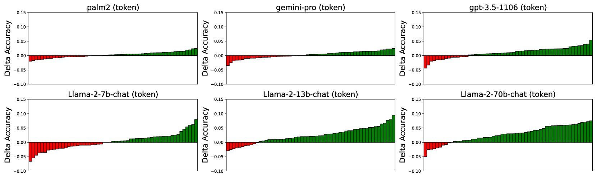

# 揭秘选择偏差：探究大型语言模型对顺序与令牌的敏感性

发布时间：2024年06月05日

`LLM应用

这篇论文主要探讨了大型语言模型（LLM）在选择任务中的“选择偏差”现象，并提出了一系列缓解策略以提升模型性能。研究内容涉及模型的实际应用问题，如选项顺序和令牌使用对模型决策的影响，以及如何通过策略改进模型的鲁棒性。因此，这篇论文更适合归类于LLM应用，因为它关注的是LLM在实际任务中的应用问题和改进方法，而不是理论研究或Agent、RAG相关的研究。` `人工智能` `机器学习`

> Unveiling Selection Biases: Exploring Order and Token Sensitivity in Large Language Models

# 摘要

> 本文深入探讨了大型语言模型在选择任务中的“选择偏差”现象，特别关注了模型在有序序列中挑选最佳选项时所面临的挑战。我们分析了选项顺序和令牌使用对模型决策的显著影响，并通过多模型和多任务的实证研究量化了这些偏差的具体影响。为了提升模型性能，我们提出了一系列缓解策略。我们的研究成果主要包括：1）精确评估了选项顺序和令牌对模型的影响；2）开发了降低令牌和顺序敏感性的策略，以增强模型的鲁棒性；3）详细分析了不同模型和任务中的敏感性，为构建更稳定、可靠的LLM应用提供了指导。

> In this paper, we investigate the phenomena of "selection biases" in Large Language Models (LLMs), focusing on problems where models are tasked with choosing the optimal option from an ordered sequence. We delve into biases related to option order and token usage, which significantly impact LLMs' decision-making processes. We also quantify the impact of these biases through an extensive empirical analysis across multiple models and tasks. Furthermore, we propose mitigation strategies to enhance model performance. Our key contributions are threefold: 1) Precisely quantifying the influence of option order and token on LLMs, 2) Developing strategies to mitigate the impact of token and order sensitivity to enhance robustness, and 3) Offering a detailed analysis of sensitivity across models and tasks, which informs the creation of more stable and reliable LLM applications for selection problems.

[Arxiv](https://arxiv.org/abs/2406.03009)