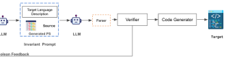
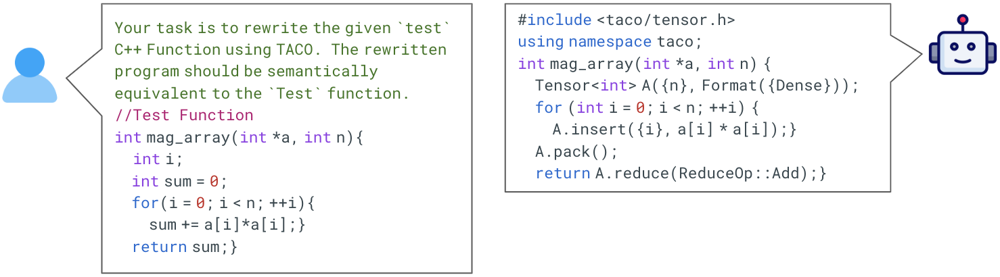
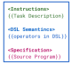
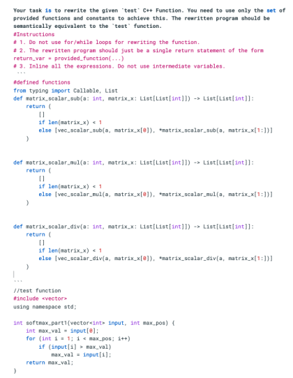
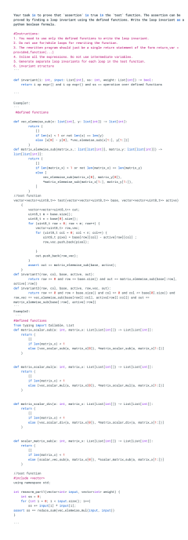

# 大型语言模型（LLMs）助力验证代码转译，确保代码转换的准确性与可靠性。

发布时间：2024年06月05日

`LLM应用

这篇论文介绍了一种名为LLMLift的新方法，它利用大型语言模型（LLMs）的推理能力来实现源代码到目标语言的转换，并生成功能等效的证明。这种方法特别针对领域特定语言（DSLs）的转换问题，旨在提高转换效率和保证转换后代码的功能正确性。由于论文主要关注的是LLMs在实际应用中的使用，即代码转换和验证，因此它属于LLM应用分类。` `软件开发` `编译器`

> Verified Code Transpilation with LLMs

# 摘要

> 领域特定语言（DSLs）在软件开发中扮演着关键角色，它们通过提供特定领域的优化和抽象来增强代码的可读性和可维护性。然而，使用DSL通常意味着开发者必须重写代码以适应其API。尽管大型语言模型（LLMs）在自动代码转换上取得了进展，但它们并未保证转换后的代码功能正确。为此，我们提出了一种名为LLMLift的新方法，它利用LLMs的推理能力，将源代码转换为目标语言的等效程序，并生成功能等效的证明。我们为四个不同领域的DSL开发了基于提升的编译器，结果显示，我们的方法在转换效率和时间上均优于传统工具，且构建过程更为简便。

> Domain-specific languages (DSLs) are integral to various software workflows. Such languages offer domain-specific optimizations and abstractions that improve code readability and maintainability. However, leveraging these languages requires developers to rewrite existing code using the specific DSL's API. While large language models (LLMs) have shown some success in automatic code transpilation, none of them provide any functional correctness guarantees on the transpiled code. Another approach for automating this task is verified lifting, which relies on program synthesis to find programs in the target language that are functionally equivalent to the source language program. While several verified lifting tools have been developed for various application domains, they are specialized for specific source-target languages or require significant expertise in domain knowledge to make the search efficient. In this paper, leveraging recent advances in LLMs, we propose an LLM-based approach (LLMLift) to building verified lifting tools. We use the LLM's capabilities to reason about programs to translate a given program into its corresponding equivalent in the target language. Additionally, we use LLMs to generate proofs for functional equivalence. We develop lifting-based compilers for {\em four different} DSLs targeting different application domains. Our approach not only outperforms previous symbolic-based tools in both the number of benchmarks transpiled and transpilation time, but also requires significantly less effort to build.

[Arxiv](https://arxiv.org/abs/2406.03003)