# 视觉与文本的精准对齐：优化视觉-语言模型中的相似度评分

发布时间：2024年06月05日

`RAG

这篇论文主要关注的是视觉-语言模型的改进，特别是通过提出加权视觉-文本交叉对齐（WCA）方法来提升零-shot性能。这种方法涉及利用局部视觉提示技术和预训练的视觉-语言模型（如CLIP）来更精确地对齐图像和文本描述。因此，它属于RAG（Retrieval-Augmented Generation）类别，因为它涉及通过检索增强生成过程，以改善模型在零-shot学习场景下的性能。` `计算机视觉`

> Visual-Text Cross Alignment: Refining the Similarity Score in Vision-Language Models

# 摘要

> 最近研究表明，通过预训练的视觉-语言模型（如CLIP）将查询图像与大型语言模型生成的精细文本描述对齐，能大幅提升零-shot性能。但本文实证指出，这些描述更擅长与图像的局部而非整体对齐，并通过理论分析证实了这一点。为此，我们提出了加权视觉-文本交叉对齐（WCA）方法，首先利用局部视觉提示技术定位图像中的关键区域，再通过预训练VLM构建相似度矩阵，实现这些区域与文本的精准匹配。我们基于此矩阵的加权相似度设计了评分函数，以量化图像与各分类的对齐度。实验结果显示，WCA在多个数据集上显著提升了零-shot性能，效果甚至媲美少-shot学习方法。

> It has recently been discovered that using a pre-trained vision-language model (VLM), e.g., CLIP, to align a whole query image with several finer text descriptions generated by a large language model can significantly enhance zero-shot performance. However, in this paper, we empirically find that the finer descriptions tend to align more effectively with local areas of the query image rather than the whole image, and then we theoretically validate this finding. Thus, we present a method called weighted visual-text cross alignment (WCA). This method begins with a localized visual prompting technique, designed to identify local visual areas within the query image. The local visual areas are then cross-aligned with the finer descriptions by creating a similarity matrix using the pre-trained VLM. To determine how well a query image aligns with each category, we develop a score function based on the weighted similarities in this matrix. Extensive experiments demonstrate that our method significantly improves zero-shot performance across various datasets, achieving results that are even comparable to few-shot learning methods.

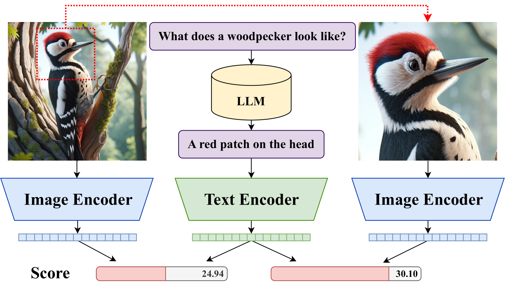

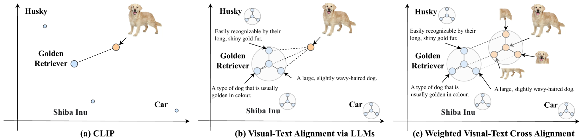

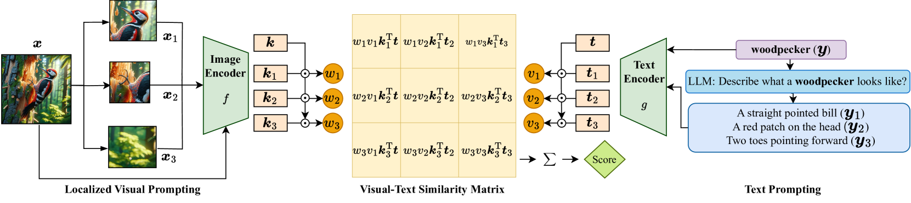

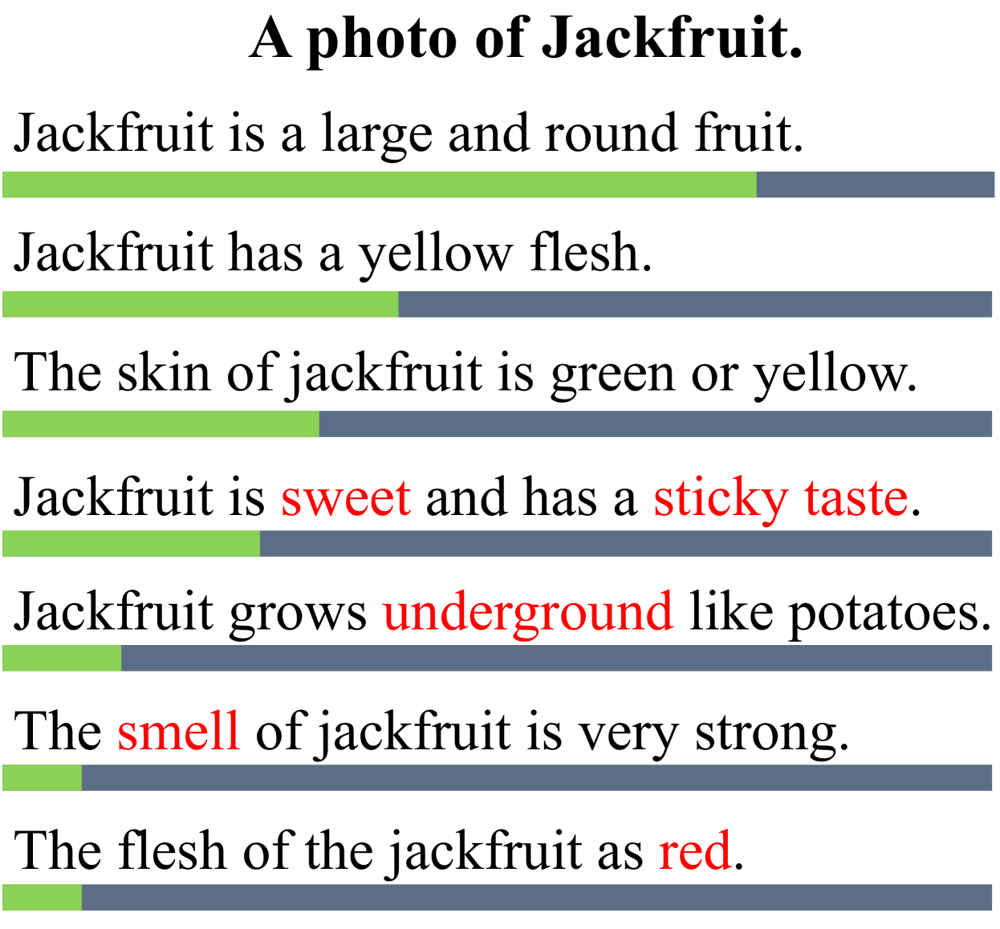

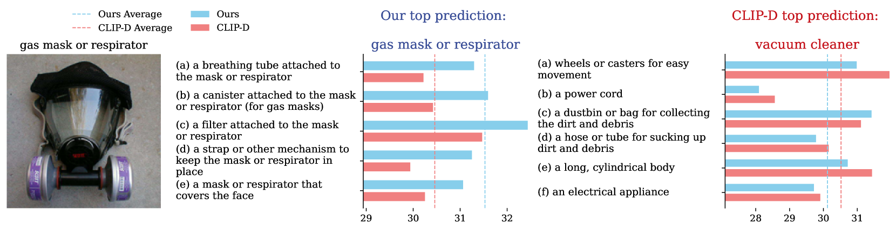

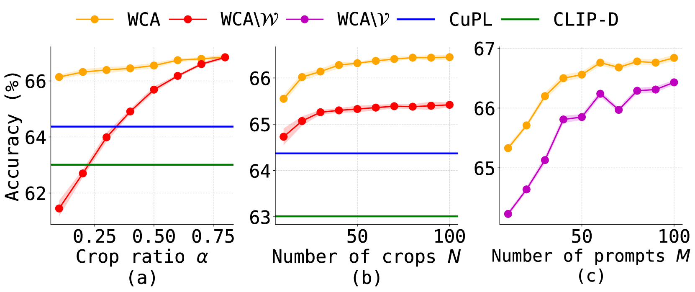

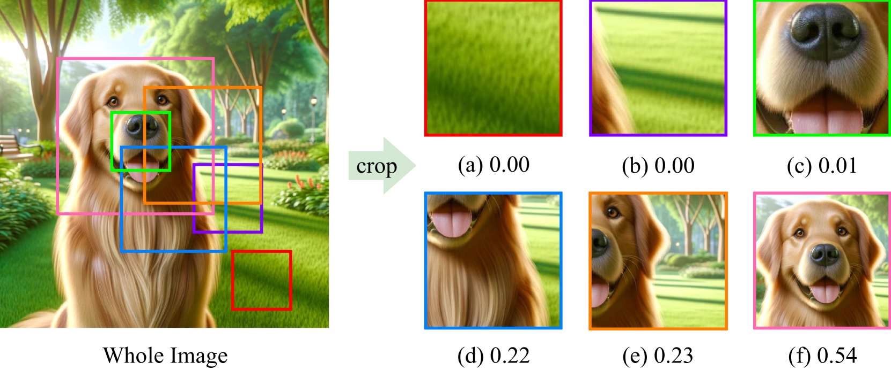

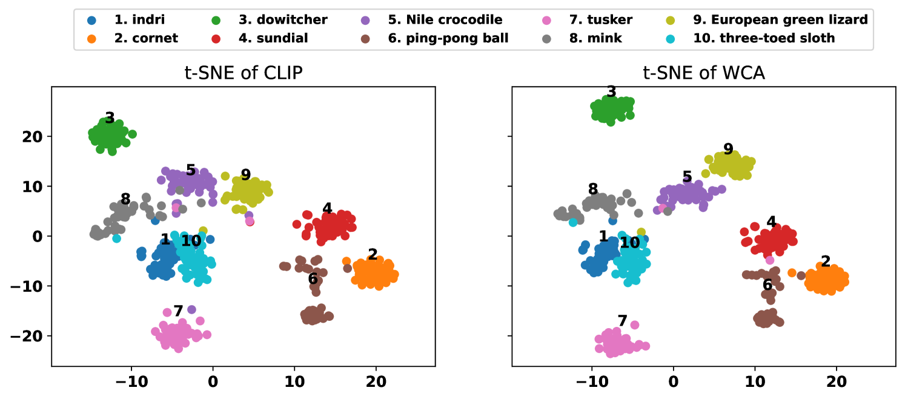

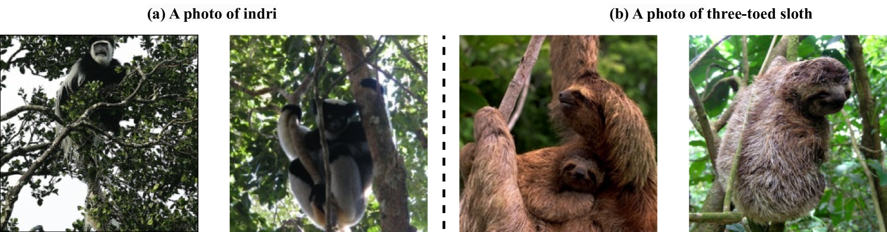

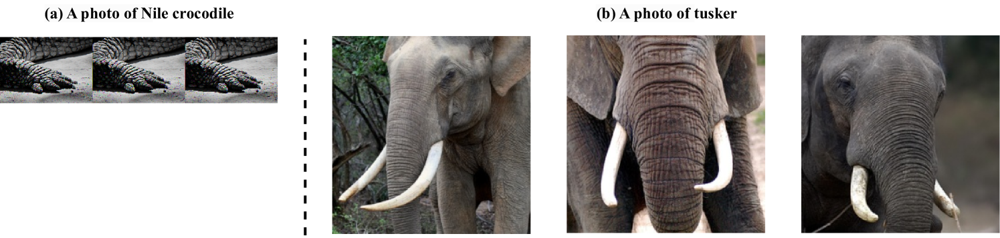

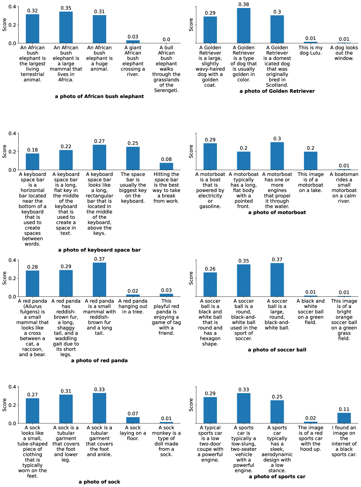

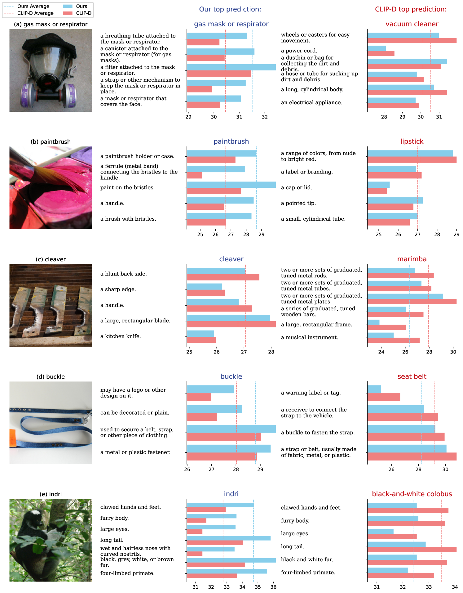

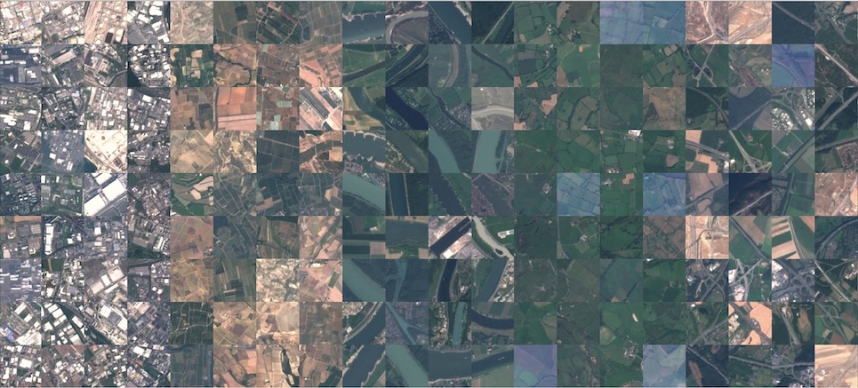

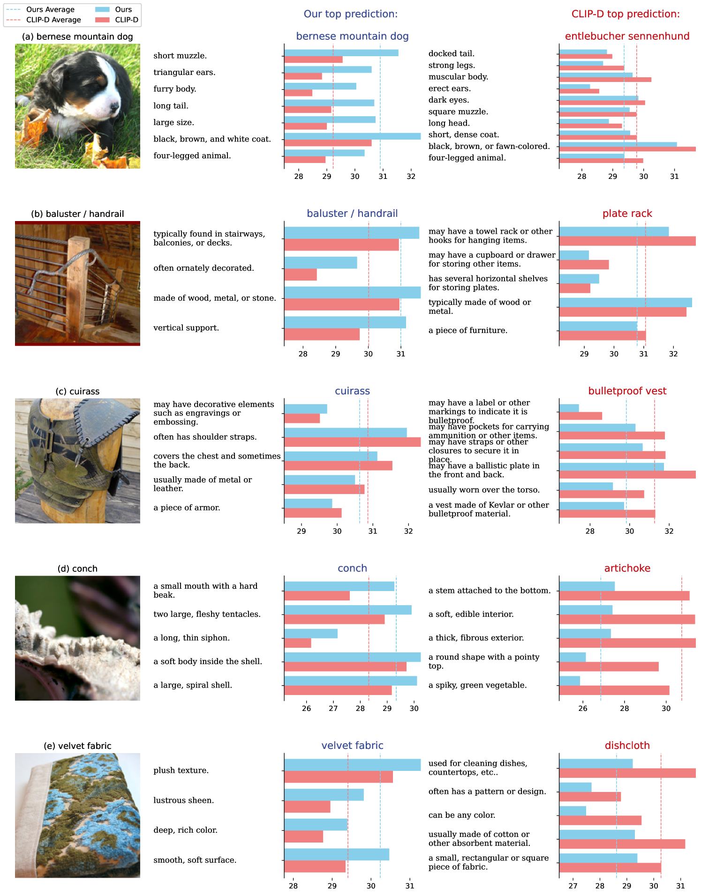

[Arxiv](https://arxiv.org/abs/2406.02915)