# 嵌入之问：自回归模型如何捕捉潜在生成之秘？

发布时间：2024年06月05日

`LLM理论

这篇论文探讨了自回归语言模型嵌入的含义，并研究了在不同情境下嵌入的最优内容。它结合了自回归预测目标与构建预测充分统计量的概念，分析了嵌入在独立同分布数据、潜在状态模型和离散假设空间中的作用。通过实证研究，论文展示了变压器模型如何有效编码这些潜在生成机制，并在特定条件下展现出优异性能。这些内容属于对大型语言模型（LLM）理论层面的探讨，因此归类为LLM理论。` `机器学习`

> What Should Embeddings Embed? Autoregressive Models Represent Latent Generating Distributions

# 摘要

> 自回归语言模型在提取文本潜在结构方面表现出色，其嵌入能够捕捉语言的句法和语义特征。然而，嵌入的真正含义是什么？本研究将自回归预测目标与构建预测充分统计量的概念相结合，探讨了嵌入在三种不同情境下的最优内容：独立同分布数据中，嵌入应反映数据的充分统计量；潜在状态模型中，嵌入应体现数据所揭示的状态后验分布；离散假设空间中，嵌入应映射数据所支持的假设后验分布。通过实证研究，我们发现变压器能够有效编码这三种潜在生成机制，并在分布外情况和无令牌记忆的情况下展现出优异性能。

> Autoregressive language models have demonstrated a remarkable ability to extract latent structure from text. The embeddings from large language models have been shown to capture aspects of the syntax and semantics of language. But what {\em should} embeddings represent? We connect the autoregressive prediction objective to the idea of constructing predictive sufficient statistics to summarize the information contained in a sequence of observations, and use this connection to identify three settings where the optimal content of embeddings can be identified: independent identically distributed data, where the embedding should capture the sufficient statistics of the data; latent state models, where the embedding should encode the posterior distribution over states given the data; and discrete hypothesis spaces, where the embedding should reflect the posterior distribution over hypotheses given the data. We then conduct empirical probing studies to show that transformers encode these three kinds of latent generating distributions, and that they perform well in out-of-distribution cases and without token memorization in these settings.

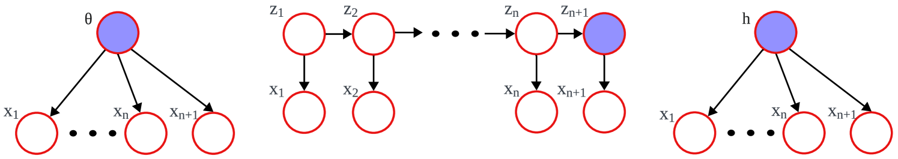

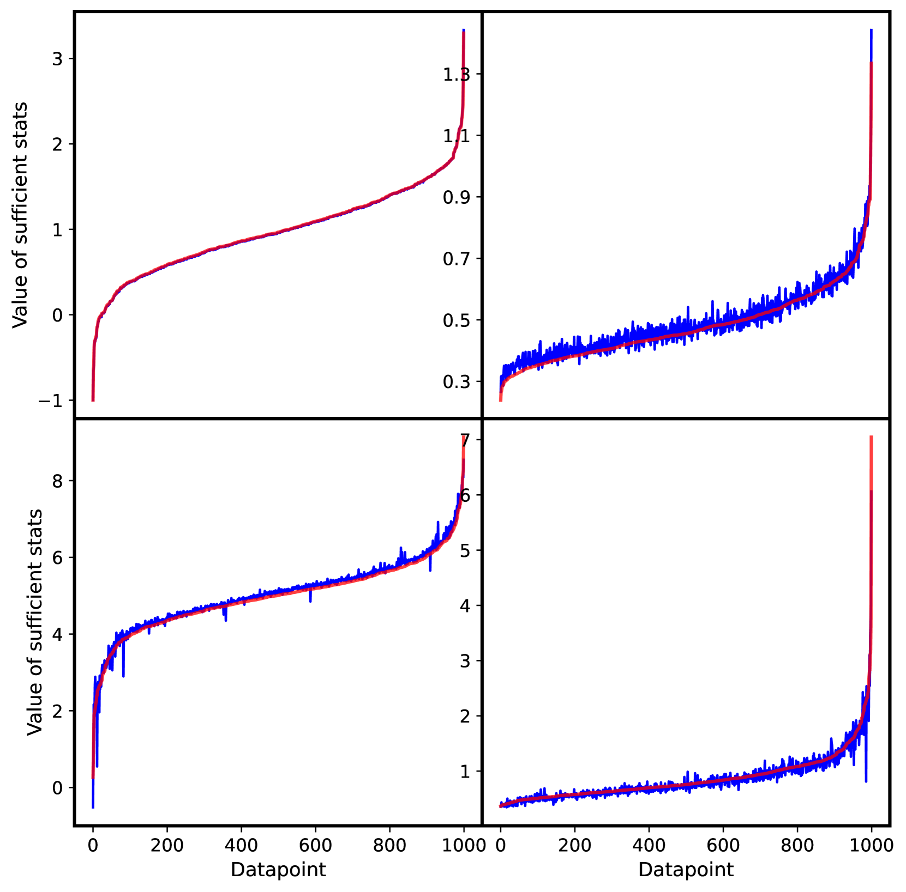

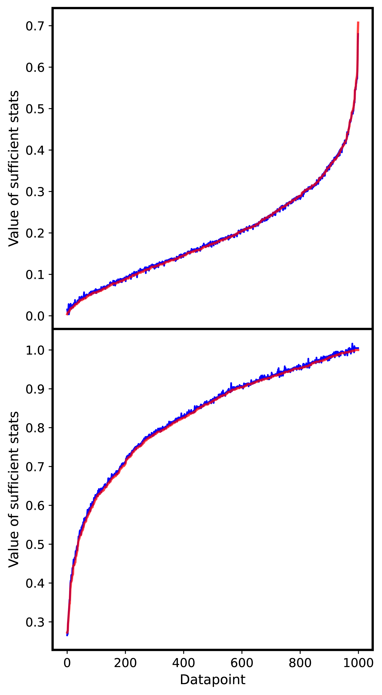

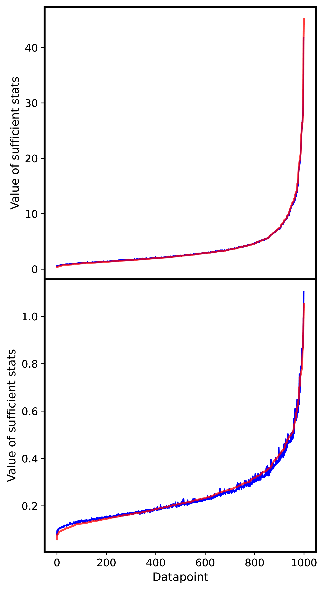

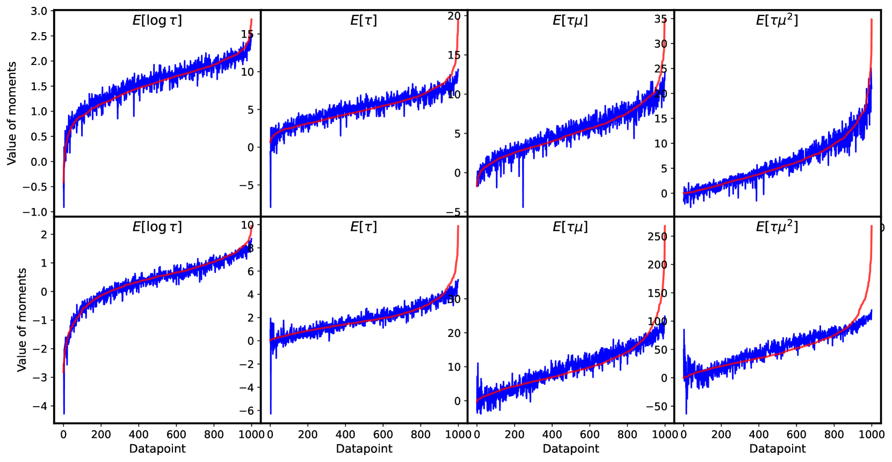

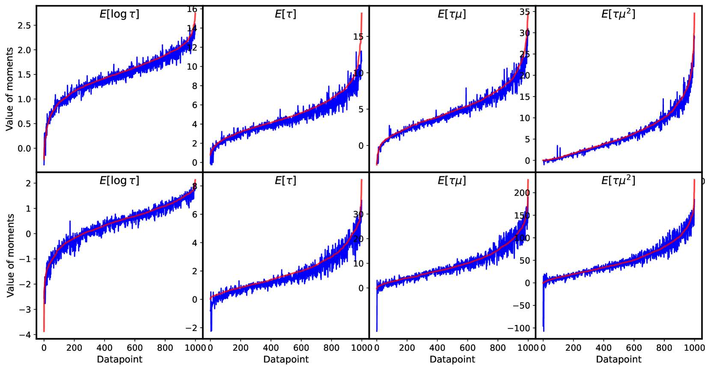

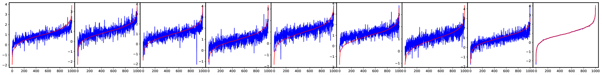

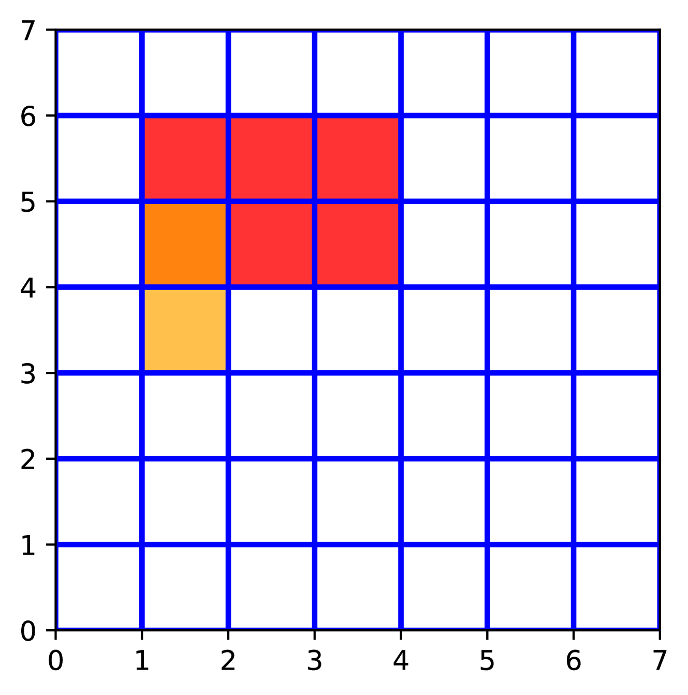

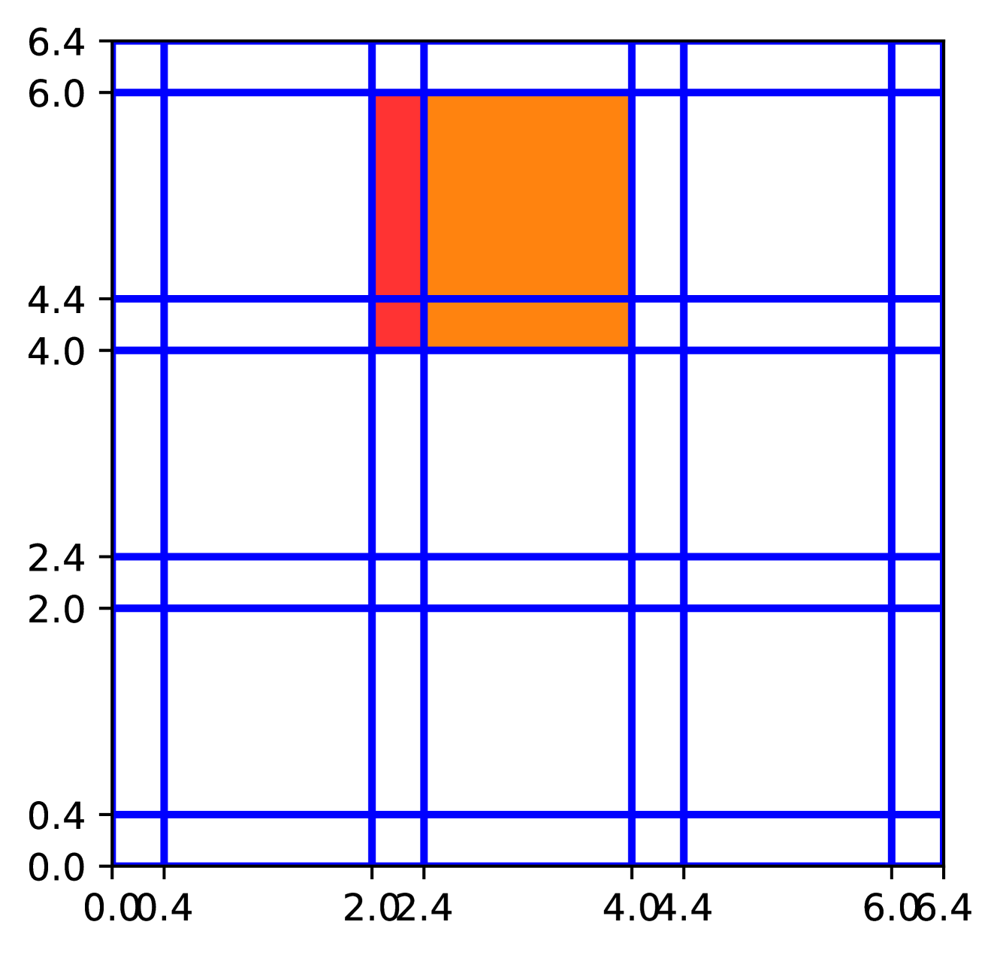

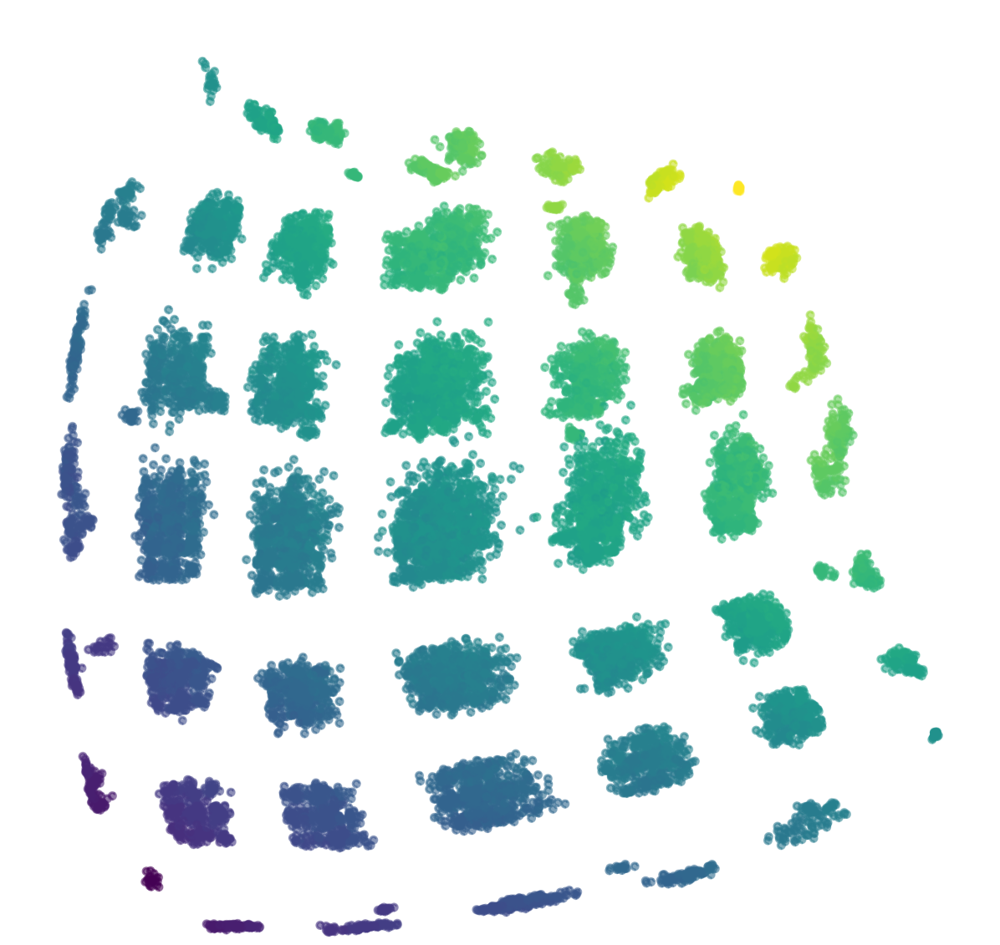

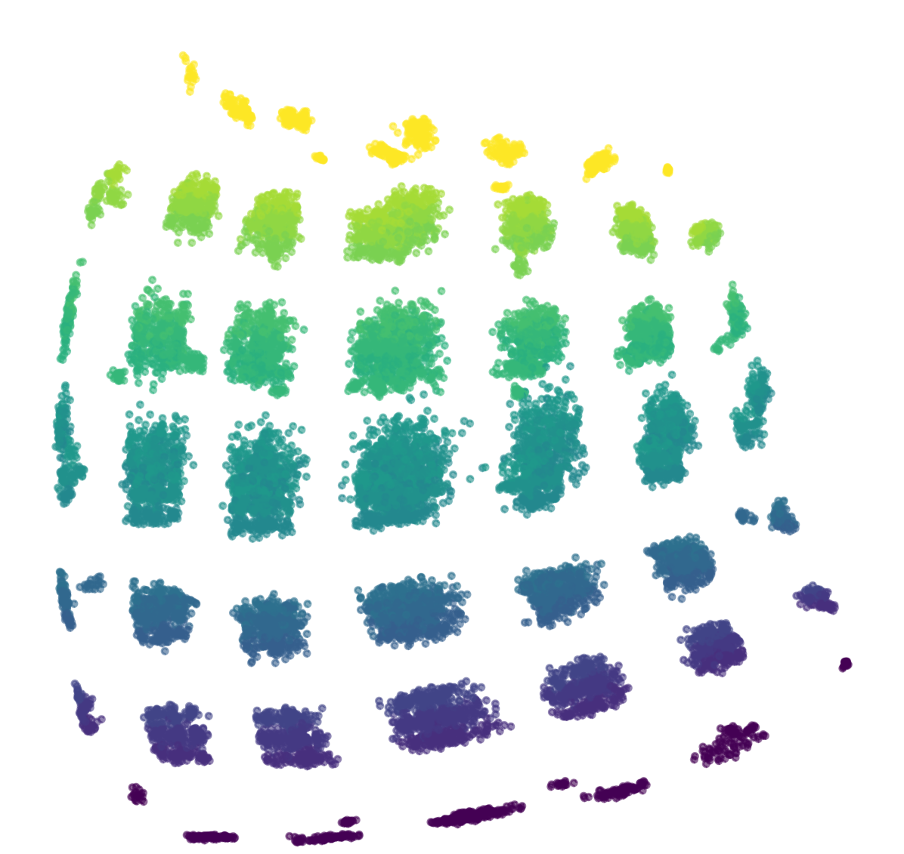

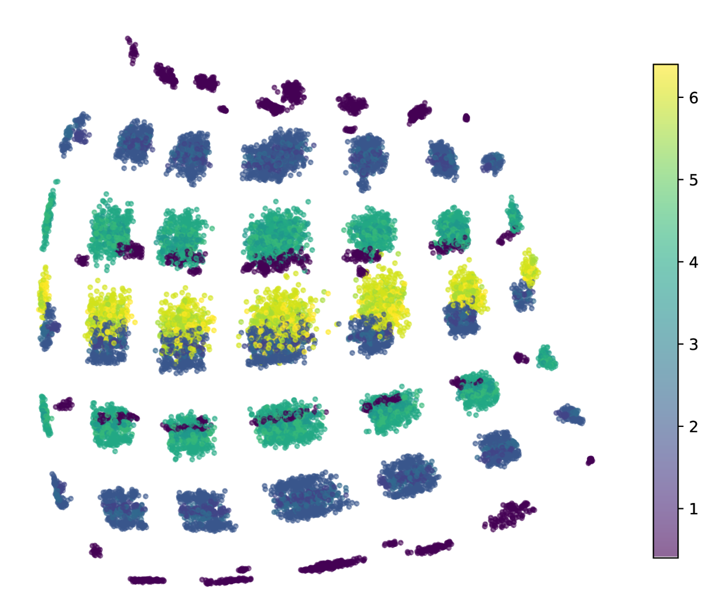

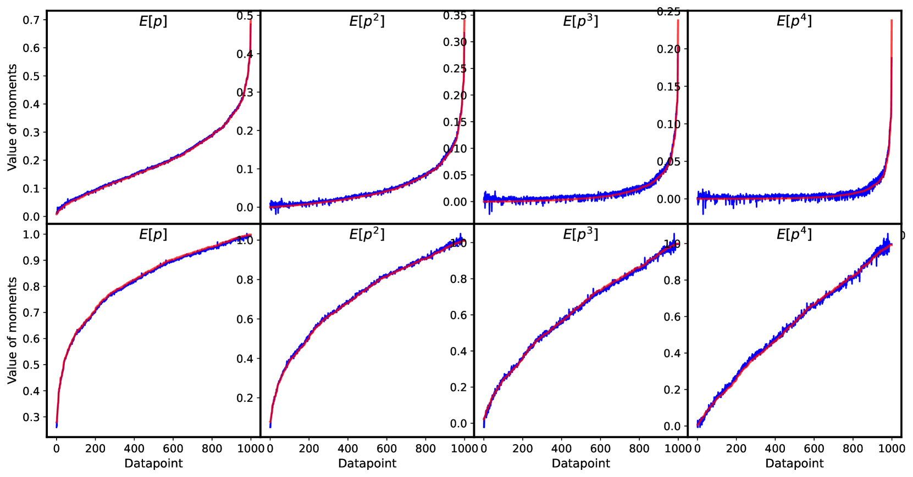

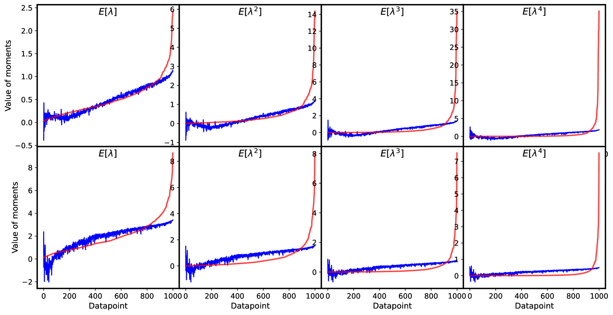

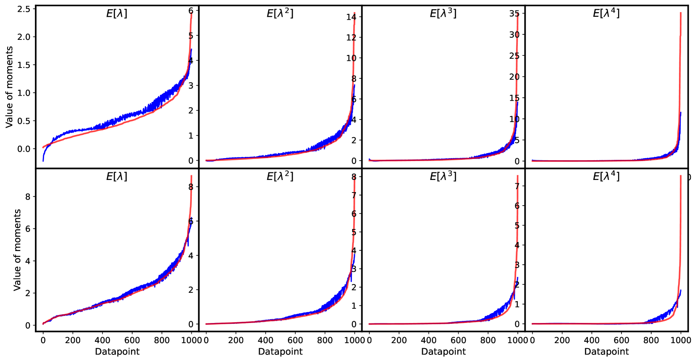

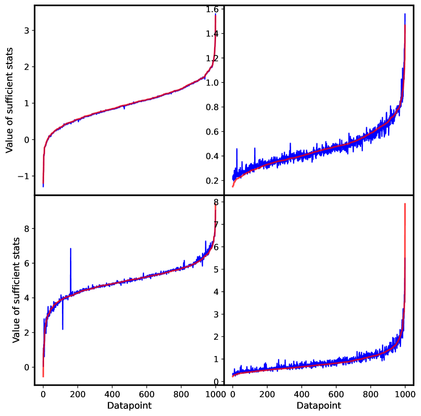

[Arxiv](https://arxiv.org/abs/2406.03707)