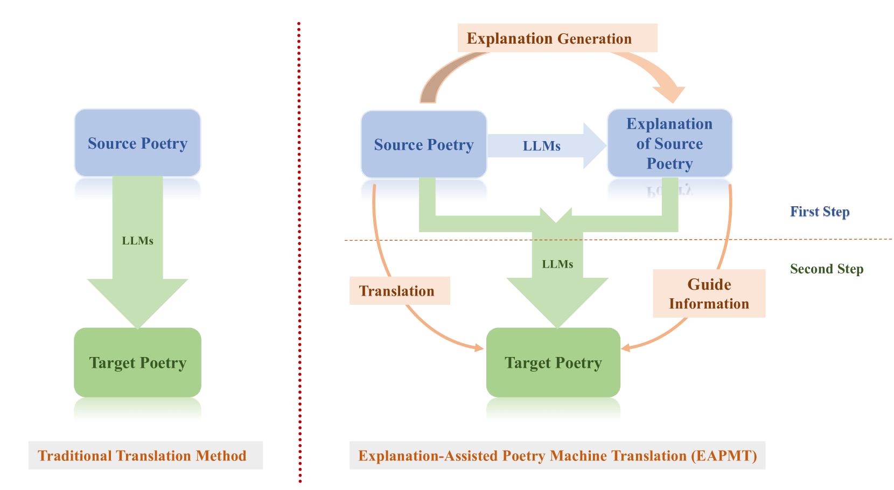

# 如何让 ChatGPT 最优雅地翻译诗歌？

发布时间：2024年06月05日

`LLM应用

理由：这篇论文主要探讨了大型语言模型（如ChatGPT）在机器翻译，特别是在英汉诗歌翻译领域的应用。研究通过设计特定的提示和小样本测试来优化ChatGPT的翻译效果，并提出了一种新的翻译方法（EAPMT），这种方法结合了诗歌解释来指导翻译过程。此外，论文还调整了评估标准，并邀请专业诗人进行评审，以验证新方法的有效性。这些内容主要集中在LLM的实际应用层面，因此归类为LLM应用。` `文学翻译` `机器翻译`

> What is the Best Way for ChatGPT to Translate Poetry?

# 摘要

> 机器翻译（MT）在文学领域，尤其是诗歌翻译方面，历来面临巨大挑战。随着如ChatGPT这样的大型语言模型的兴起，这一领域迎来了创新的曙光。本研究聚焦于ChatGPT在英汉诗歌翻译上的表现，通过精心设计的提示和小样本测试，力求达到最佳效果。尽管初见成效，但ChatGPT的翻译仍暴露出一些问题，亟待解决。为此，我们提出了一种结合诗歌解释的机器翻译新方法（EAPMT），利用单语诗歌解释作为翻译的指南。同时，我们调整了评估标准，以更贴合现代诗歌翻译的复杂性。我们邀请了专业诗人进行评审，并辅以GPT-4的分析。结果显示，EAPMT方法不仅超越了ChatGPT的传统翻译，也优于现有在线系统。本文不仅证实了EAPMT的有效性，也为机器辅助文学翻译提供了新的视角。

> Machine translation (MT) has historically faced significant challenges when applied to literary works, particularly in the domain of poetry translation. The advent of Large Language Models such as ChatGPT holds potential for innovation in this field. This study examines ChatGPT's capabilities in English-Chinese poetry translation tasks, utilizing targeted prompts and small sample scenarios to ascertain optimal performance. Despite promising outcomes, our analysis reveals persistent issues in the translations generated by ChatGPT that warrant attention. To address these shortcomings, we propose an Explanation-Assisted Poetry Machine Translation (EAPMT) method, which leverages monolingual poetry explanation as a guiding information for the translation process. Furthermore, we refine existing evaluation criteria to better suit the nuances of modern poetry translation. We engaged a panel of professional poets for assessments, complemented evaluations by using GPT-4. The results from both human and machine evaluations demonstrate that our EAPMT method outperforms traditional translation methods of ChatGPT and the existing online systems. This paper validates the efficacy of our method and contributes a novel perspective to machine-assisted literary translation.

[Arxiv](https://arxiv.org/abs/2406.03450)