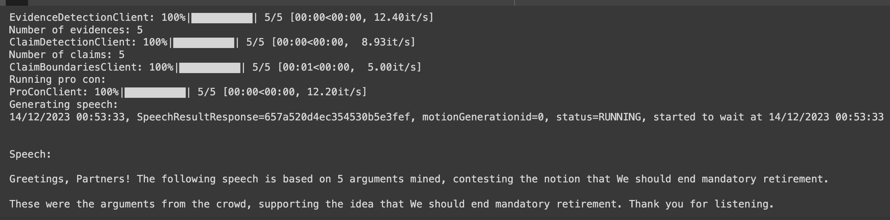

# 你支持哪一方？一款专为端到端论证摘要与评估打造的多任务数据集

发布时间：2024年06月05日

`LLM应用

理由：这篇论文主要关注于利用大型语言模型（LLMs）技术来构建一个自动化辩论系统，并提供了一个全面的数据集来支持这一应用。论文中提到的任务，如主张与证据的识别、证据说服力的排序、议论文的摘要与人类偏好排序，以及基于论据质量的人类反馈的自动化评估指标学习，都是LLM技术在实际应用中的具体体现。此外，论文还评估了多种生成式模型在完成这些任务时的表现，这进一步强调了LLM技术在实际应用中的潜力和挑战。因此，这篇论文应归类为LLM应用。` `辩论系统` `数据集构建`

> Which Side Are You On? A Multi-task Dataset for End-to-End Argument Summarisation and Evaluation

# 摘要

> 随着大型语言模型（LLMs）技术的飞速发展，构建一个能够辅助人们构建有力论点的自动化辩论系统已不再是遥不可及的梦想。以往的研究通过整合多个模块来尝试解决这一挑战。在我们的研究中，我们推出了一套全面的辩论论据挖掘数据集，该数据集详细记录了从准备辩论议论文到最终评估的全过程，包括主张与证据的识别、证据说服力的排序、议论文的摘要与人类偏好排序，以及基于论据质量的人类反馈的自动化评估指标学习。我们的数据集包含了14,000个主张示例，这些示例均已按照支持上述任务的多种属性进行了详尽标注。我们对每个任务进行了多种生成式模型的评估，其中包括代表性的LLMs。尽管这些模型在单个任务上表现出了潜力，但它们在连续完成所有四个任务时的整体表现却显著下滑，这一点在自动化评估和以人为中心的评价中均得到了验证。我们提出的数据集所揭示的这一挑战，为未来的端到端论据挖掘和摘要研究提供了新的动力。该项目仓库地址为：https://github.com/HarrywillDr/ArgSum-Datatset。

> With the recent advances of large language models (LLMs), it is no longer infeasible to build an automated debate system that helps people to synthesise persuasive arguments. Previous work attempted this task by integrating multiple components. In our work, we introduce an argument mining dataset that captures the end-to-end process of preparing an argumentative essay for a debate, which covers the tasks of claim and evidence identification (Task 1 ED), evidence convincingness ranking (Task 2 ECR), argumentative essay summarisation and human preference ranking (Task 3 ASR) and metric learning for automated evaluation of resulting essays, based on human feedback along argument quality dimensions (Task 4 SQE). Our dataset contains 14k examples of claims that are fully annotated with the various properties supporting the aforementioned tasks. We evaluate multiple generative baselines for each of these tasks, including representative LLMs. We find, that while they show promising results on individual tasks in our benchmark, their end-to-end performance on all four tasks in succession deteriorates significantly, both in automated measures as well as in human-centred evaluation. This challenge presented by our proposed dataset motivates future research on end-to-end argument mining and summarisation. The repository of this project is available at https://github.com/HarrywillDr/ArgSum-Datatset

[Arxiv](https://arxiv.org/abs/2406.03151)