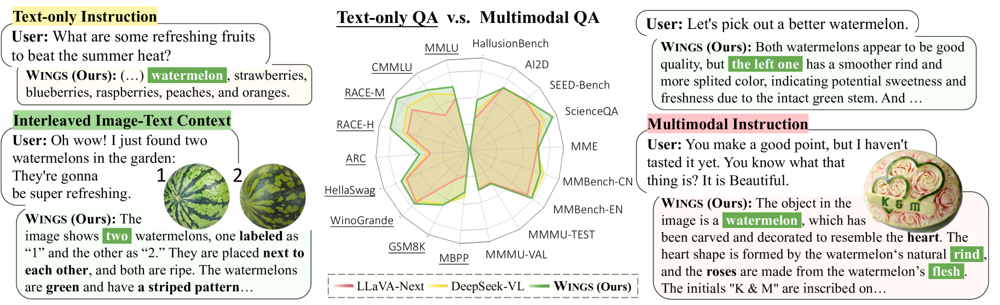
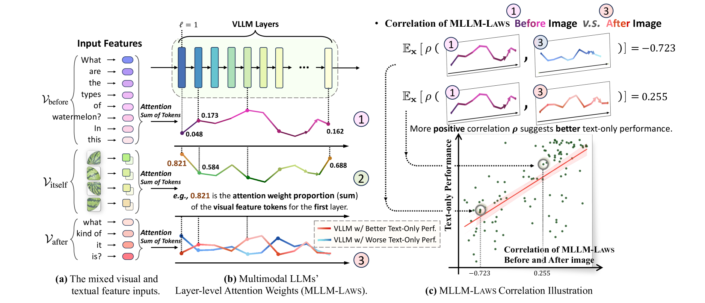
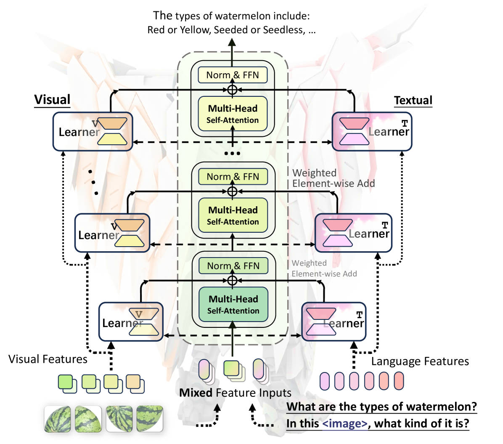
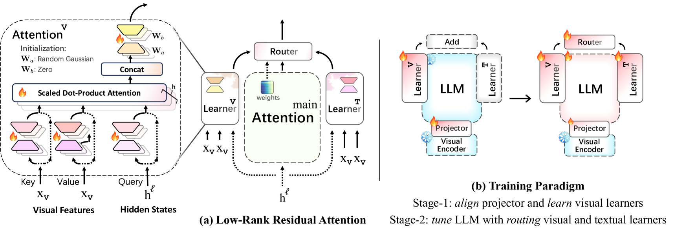
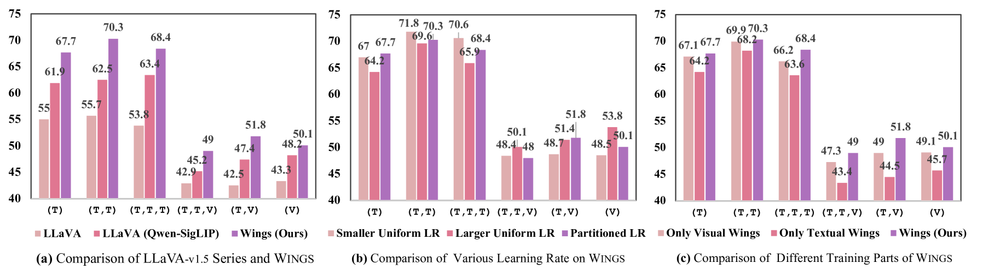
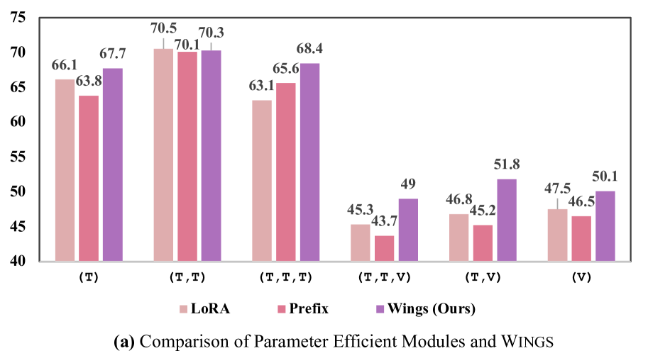
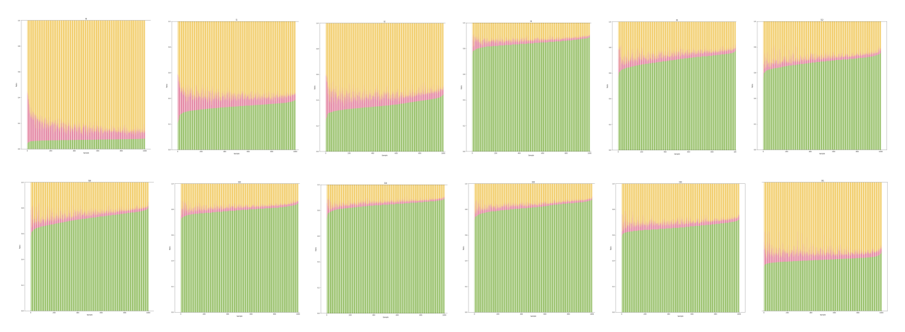
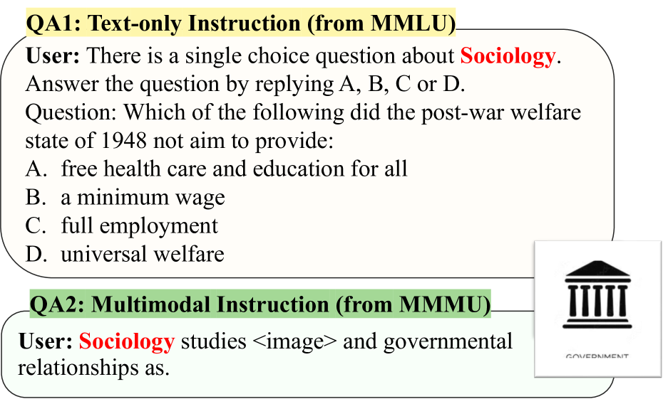

# Wings：无文本遗忘的多模态LLM学习之旅

发布时间：2024年06月05日

`LLM应用

这篇论文介绍了一种名为Wings的多模态大型语言模型（MLLM），它能够在处理纯文本指令和多模态输入时都表现出色。论文中提到了针对MLLM在处理纯文本指令时出现的问题，即记忆丧失的问题，并通过设计增强学习模块来解决这一问题。此外，论文还引入了低秩残差注意力（LoRRA）机制来提高学习效率。这些内容表明，该论文主要关注的是LLM在实际应用中的改进和优化，特别是在多模态环境下的应用，因此将其归类为LLM应用。` `人工智能` `问答系统`

> Wings: Learning Multimodal LLMs without Text-only Forgetting

# 摘要

> 多模态大型语言模型（MLLMs），以训练有素的LLM为起点，首先将图像与文本对齐，随后对多模态输入进行精细调整。但MLLM在处理不含图像的纯文本指令时，会出现记忆丧失的问题，这一问题本可在原始LLM中得到解决。本文介绍了Wings，一种创新的MLLM，它在纯文本对话和多模态理解上均表现卓越。通过分析MLLM在多模态指令中的注意力机制，我们发现纯文本遗忘与从图像前到图像后的文本注意力转移有关。为此，我们设计了额外的增强学习模块，以补偿这种注意力转移。这些视觉和文本学习者，如同两侧的“翅膀”，在每个注意力层中并行连接，确保平衡关注视觉与文本信息。文本学习者通过基于注意力的路由与视觉学习者协同工作，混合两者的输出。我们引入了低秩残差注意力（LoRRA）机制，以确保学习过程的高效性。实验证明，Wings在纯文本和视觉问答任务中均超越了同等规模的MLLMs。在全新设计的交错图像文本（IIT）基准测试中，Wings在从纯文本到多模态丰富的问答任务中均表现出色。

> Multimodal large language models (MLLMs), initiated with a trained LLM, first align images with text and then fine-tune on multimodal mixed inputs. However, the MLLM catastrophically forgets the text-only instructions, which do not include images and can be addressed within the initial LLM. In this paper, we present Wings, a novel MLLM that excels in both text-only dialogues and multimodal comprehension. Analyzing MLLM attention in multimodal instructions reveals that text-only forgetting is related to the attention shifts from pre-image to post-image text. From that, we construct extra modules that act as the boosted learner to compensate for the attention shift. The complementary visual and textual learners, like "wings" on either side, are connected in parallel within each layer's attention block. Initially, image and text inputs are aligned with visual learners operating alongside the main attention, balancing focus on visual elements. Textual learners are later collaboratively integrated with attention-based routing to blend the outputs of the visual and textual learners. We design the Low-Rank Residual Attention (LoRRA) to guarantee high efficiency for learners. Our experimental results demonstrate that Wings outperforms equally-scaled MLLMs in both text-only and visual question-answering tasks. On a newly constructed Interleaved Image-Text (IIT) benchmark, Wings exhibits superior performance from text-only-rich to multimodal-rich question-answering tasks.

[Arxiv](https://arxiv.org/abs/2406.03496)