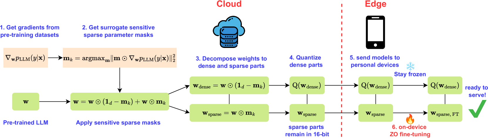

# 极简稀疏下的零阶微调：大型语言模型的精炼之道

发布时间：2024年06月05日

`LLM应用

这篇论文主要探讨了在内存受限的设备上如何高效地进行大型语言模型（LLM）的零阶优化（ZO）微调。通过引入稀疏性和量化技术，研究者们识别并微调了LLM中的“敏感参数”，从而在保持性能的同时大幅减少了计算资源的需求。这种方法特别适用于资源受限的环境，如手机和笔记本电脑。因此，这篇论文属于LLM应用类别，因为它关注的是LLM在实际应用中的优化和效率问题。` `移动设备` `云计算`

> Zeroth-Order Fine-Tuning of LLMs with Extreme Sparsity

# 摘要

> 零阶优化（ZO）是一种高效的内存策略，用于通过前向传播微调大型语言模型。但在内存受限的设备如手机和笔记本电脑上应用ZO微调仍面临挑战，因为全精度计算不可行。本研究通过结合稀疏性和量化技术，解决了这一难题。我们发现，预训练能识别出“敏感参数”，这些参数在ZO微调中至关重要。实验表明，仅微调LLM中0.1%的敏感参数，就能超越全参数微调的效果，并大幅缩短运行时间。此外，结合4位量化技术，我们成功在内存不足8GiB的GPU上，对Llama2-7B模型进行了高效的ZO微调，显著降低了延迟。

> Zeroth-order optimization (ZO) is a memory-efficient strategy for fine-tuning Large Language Models using only forward passes. However, the application of ZO fine-tuning in memory-constrained settings such as mobile phones and laptops is still challenging since full precision forward passes are infeasible. In this study, we address this limitation by integrating sparsity and quantization into ZO fine-tuning of LLMs. Specifically, we investigate the feasibility of fine-tuning an extremely small subset of LLM parameters using ZO. This approach allows the majority of un-tuned parameters to be quantized to accommodate the constraint of limited device memory. Our findings reveal that the pre-training process can identify a set of "sensitive parameters" that can guide the ZO fine-tuning of LLMs on downstream tasks. Our results demonstrate that fine-tuning 0.1% sensitive parameters in the LLM with ZO can outperform the full ZO fine-tuning performance, while offering wall-clock time speedup. Additionally, we show that ZO fine-tuning targeting these 0.1% sensitive parameters, combined with 4 bit quantization, enables efficient ZO fine-tuning of an Llama2-7B model on a GPU device with less than 8 GiB of memory and notably reduced latency.

[Arxiv](https://arxiv.org/abs/2406.02913)