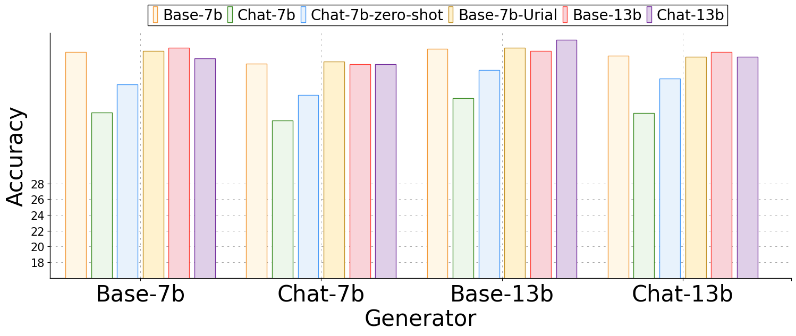
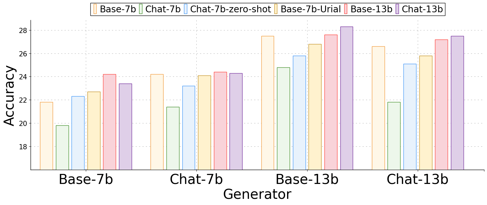

# A + B：释放 LLMs 协同潜力的通用生成器-阅读器框架

发布时间：2024年06月06日

`RAG

这篇论文主要探讨了Retrieval-Augmented Generation (RAG) 框架在大型语言模型 (LLMs) 中的应用，特别是通过提出“A + B”框架来优化检索和生成过程。论文关注的是如何通过组合不同的基础模型来提高LLMs在复杂场景中的表现，并且扩展了这一框架以包含源文档，通过持续学习融合外部知识。这些内容主要集中在RAG框架的改进和应用上，因此归类为RAG。` `知识增强`

> A + B: A General Generator-Reader Framework for Optimizing LLMs to Unleash Synergy Potential

# 摘要

> Retrieval-Augmented Generation (RAG) 为大型语言模型 (LLMs) 提供了补充知识的有效途径。针对检索性能的瓶颈，研究者提出了“先生成后阅读”的流程，用 LLM 自身的生成替代传统的检索步骤。尽管这一方向颇具潜力，但研究尚不充分，且在源知识已知的情况下仍显不足。本文提出了一种灵活的“A + B”框架，通过组合不同的基础模型和类型进行深入研究。我们发现，LLMs 的基础版和聊天版分别适合作为生成器 A 和阅读器 B，它们的组合在复杂场景中表现尤为出色。此外，我们将这一框架扩展至包含源文档的场景，通过持续学习直接融合外部知识，不仅加速了新知识的吸收，还解决了适应后的安全与实用性问题。论文展示了“A + B”框架的广泛适用性，预示着它在提升 LLMs 跨领域应用中的巨大潜力。

> Retrieval-Augmented Generation (RAG) is an effective solution to supplement necessary knowledge to large language models (LLMs). Targeting its bottleneck of retriever performance, "generate-then-read" pipeline is proposed to replace the retrieval stage with generation from the LLM itself. Although promising, this research direction is underexplored and still cannot work in the scenario when source knowledge is given. In this paper, we formalize a general "A + B" framework with varying combinations of foundation models and types for systematic investigation. We explore the efficacy of the base and chat versions of LLMs and found their different functionalities suitable for generator A and reader B, respectively. Their combinations consistently outperform single models, especially in complex scenarios. Furthermore, we extend the application of the "A + B" framework to scenarios involving source documents through continuous learning, enabling the direct integration of external knowledge into LLMs. This approach not only facilitates effective acquisition of new knowledge but also addresses the challenges of safety and helpfulness post-adaptation. The paper underscores the versatility of the "A + B" framework, demonstrating its potential to enhance the practical application of LLMs across various domains.

[Arxiv](https://arxiv.org/abs/2406.03963)