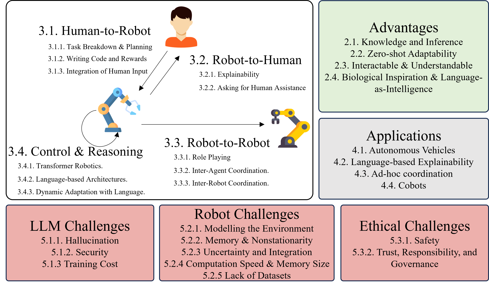

# 机器人领域中基于语言的通信综述

发布时间：2024年06月06日

`Agent

理由：这篇论文主要探讨了大型语言模型在具身机器人（即能够与环境和周围互动的机器人）中的应用，以及语言在机器人控制流程中的整合位置。这些内容涉及到机器人作为智能代理（Agent）的行为和交互，因此归类为Agent。虽然论文中提到了大型语言模型（LLM）的应用，但重点在于机器人的行为和交互，而不是LLM本身的理论或应用，因此不适合归类为LLM应用或LLM理论。此外，论文内容并不涉及检索增强生成（RAG）的相关技术，因此也不归类为RAG。` `机器人学` `人工智能`

> A Survey of Language-Based Communication in Robotics

# 摘要

> 具身机器人，能够与环境和周围互动，正成为开发人工智能的测试平台。这催生了多模态控制器的需求，这些控制器能跨足文本等多种信息类型。大型语言模型不仅处理和生成文本与视听内容，最近更涉足机器人动作。语言模型在机器人系统中的应用日益增多，基于语言的机器人通过多种方式利用这些模型的能力。语言的使用还促进了人类与机器人团队成员间的多样化信息交流。本调查不仅强调了语言模型在机器人学中的应用，还根据语言在控制流程中的整合位置，梳理了相关研究。语言可用于人类向机器人下达任务，机器人向人类报告，机器人间的类人沟通，以及机器人内部的规划与控制。本文探讨了基于语言的机器人的应用，并讨论了面临的诸多限制与挑战，为基于语言的机器人学的未来发展提供了概览。每篇论文的链接及源代码（如有）可在配套网站 https://uos-haris.online/sooratilab/papers/WillSurvey/LangRobotSurvey.php 上获取。

> Embodied robots which can interact with their environment and neighbours are increasingly being used as a test case to develop Artificial Intelligence. This creates a need for multimodal robot controllers which can operate across different types of information including text. Large Language Models are able to process and generate textual as well as audiovisual data and, more recently, robot actions. Language Models are increasingly being applied to robotic systems; these Language-Based robots leverage the power of language models in a variety of ways. Additionally, the use of language opens up multiple forms of information exchange between members of a human-robot team. This survey motivates the use of language models in robotics, and then delineates works based on the part of the overall control flow in which language is incorporated. Language can be used by human to task a robot, by a robot to inform a human, between robots as a human-like communication medium, and internally for a robot's planning and control. Applications of language-based robots are explored, and finally numerous limitations and challenges are discussed to provide a summary of the development needed for language-based robotics moving forward. Links to each paper and, if available, source code are made available in the accompanying site at https://uos-haris.online/sooratilab/papers/WillSurvey/LangRobotSurvey.php

[Arxiv](https://arxiv.org/abs/2406.04086)