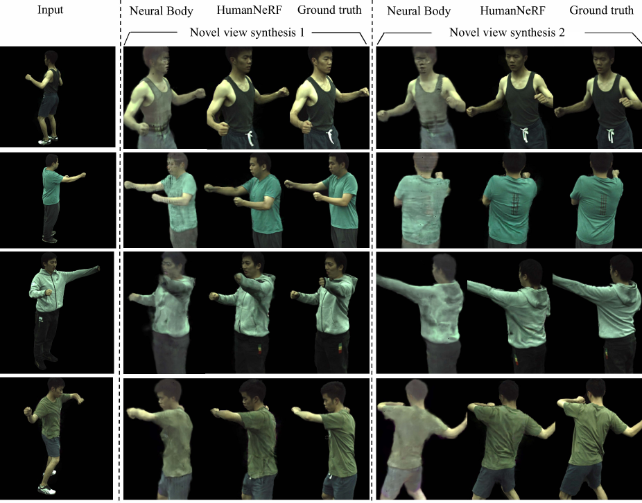
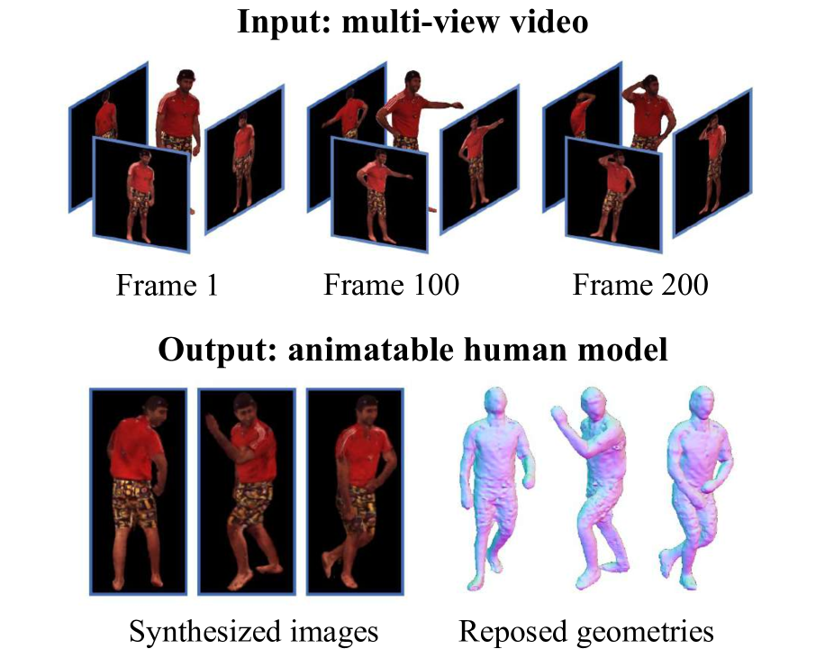

# 3D人体化身建模综述——探索从重建到生成的全过程

发布时间：2024年06月06日

`Agent

理由：这篇论文主要关注的是3D人体建模技术，特别是在计算机视觉和图形学领域中的应用。虽然文中提到了大型语言模型（如CLIP）和扩散模型等技术，但这些技术的使用是为了辅助3D人体化身的生成和重建，而不是直接应用于语言处理或模型理论研究。因此，这篇论文更符合Agent分类，因为它涉及的是具体的技术应用和方法，而不是语言模型的理论研究或特定应用。` `计算机视觉` `游戏开发`

> A Survey on 3D Human Avatar Modeling -- From Reconstruction to Generation

# 摘要

> 3D建模一直是计算机视觉和图形学的核心领域，近年来得益于神经表示和生成模型的突破，其发展迅猛。特别是3D人体建模，作为游戏和动画等众多应用的关键，已备受瞩目。过去几年，关于3D人体化身的研究成果丰硕，构建了一个丰富的知识库。然而，文献的庞大规模使得个人难以全面追踪。本综述旨在从重建与生成两个视角，全面梳理3D人体化身建模的最新技术。我们首先探讨了3D人体重建的代表性技术，如基于像素对齐隐函数、神经辐射场和3D高斯溅射等。接着，我们总结了利用大型语言模型如CLIP、扩散模型及多种3D表示的生成方法，这些方法展现了顶尖性能。最后，我们对现有方法进行了反思，并探讨了3D人体化身建模的未来挑战，为研究者指明了方向。

> 3D modeling has long been an important area in computer vision and computer graphics. Recently, thanks to the breakthroughs in neural representations and generative models, we witnessed a rapid development of 3D modeling. 3D human modeling, lying at the core of many real-world applications, such as gaming and animation, has attracted significant attention. Over the past few years, a large body of work on creating 3D human avatars has been introduced, forming a new and abundant knowledge base for 3D human modeling. The scale of the literature makes it difficult for individuals to keep track of all the works. This survey aims to provide a comprehensive overview of these emerging techniques for 3D human avatar modeling, from both reconstruction and generation perspectives. Firstly, we review representative methods for 3D human reconstruction, including methods based on pixel-aligned implicit function, neural radiance field, and 3D Gaussian Splatting, etc. We then summarize representative methods for 3D human generation, especially those using large language models like CLIP, diffusion models, and various 3D representations, which demonstrate state-of-the-art performance. Finally, we discuss our reflection on existing methods and open challenges for 3D human avatar modeling, shedding light on future research.

[Arxiv](https://arxiv.org/abs/2406.04253)