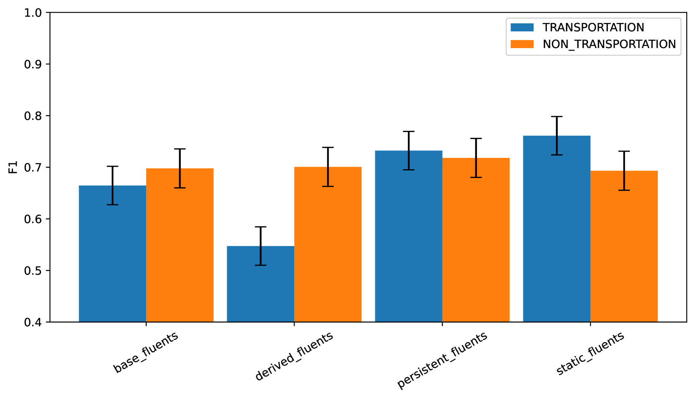
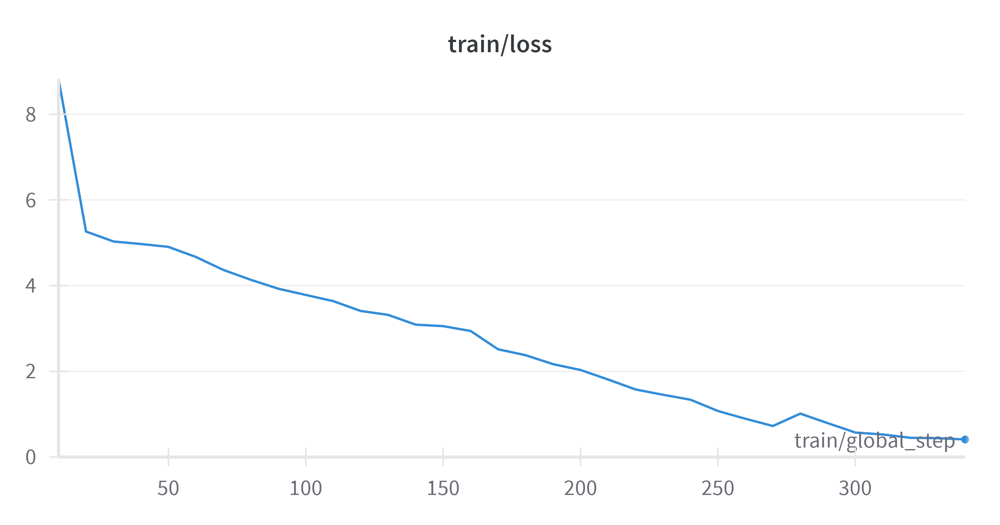

# 动作推理基准：探究在有无后果约束下的动作推理机制

发布时间：2024年06月06日

`RAG

理由：这篇论文主要关注的是推理行动与变化（RAC）在大型语言模型（LLMs）中的应用和评估，特别是通过一个名为ActionReasoningBench的新基准来测试LLMs在RAC上的表现。这个基准涵盖了多个领域和维度，旨在评估LLMs在处理动态环境和交互场景中的能力。虽然论文涉及了LLMs的应用，但其核心在于评估和改进LLMs在特定任务（即RAC）上的性能，这与RAG（Reasoning and Action Guidance）的范畴更为接近，即关注模型在推理和行动指导方面的表现和改进。因此，将其分类为RAG更为合适。` `人工智能` `基准测试`

> ActionReasoningBench: Reasoning about Actions with and without Ramification Constraints

# 摘要

> 推理行动与变化（RAC）一直是推动早期AI挑战如框架问题及众多AI分支如非单调与常识推理发展的关键。即使在今天，RAC在处理动态环境、交互场景及常识推理任务中依然扮演着重要角色。尽管大型语言模型（LLMs）在多个AI领域取得了显著进展，但其在RAC领域的应用仍未被充分挖掘。为此，我们推出了一个名为ActionReasoningBench的新基准，它覆盖了13个领域，并从八个维度严格测试LLMs在RAC上的表现，包括物体追踪、流畅追踪、状态追踪、行动可执行性、行动效果、数值RAC、幻觉检测及复合问题。此外，我们还探讨了因衍生约束导致的行动间接影响。通过使用包括GPT-4o、Gemini-1.0-Pro、Llama2-7b-chat、Llama2-13b-chat、Llama3-8b-instruct、Gemma-2b-instruct和Gemma-7b-instruct在内的开源与商业顶级LLMs进行评估，我们发现这些模型在基准涵盖的所有类别中均面临显著挑战。

> Reasoning about actions and change (RAC) has historically driven the development of many early AI challenges, such as the frame problem, and many AI disciplines, including non-monotonic and commonsense reasoning. The role of RAC remains important even now, particularly for tasks involving dynamic environments, interactive scenarios, and commonsense reasoning. Despite the progress of Large Language Models (LLMs) in various AI domains, their performance on RAC is underexplored. To address this gap, we introduce a new benchmark, ActionReasoningBench, encompassing 13 domains and rigorously evaluating LLMs across eight different areas of RAC. These include - Object Tracking, Fluent Tracking, State Tracking, Action Executability, Effects of Actions, Numerical RAC, Hallucination Detection, and Composite Questions. Furthermore, we also investigate the indirect effect of actions due to ramification constraints for every domain. Finally, we evaluate our benchmark using open-sourced and commercial state-of-the-art LLMs, including GPT-4o, Gemini-1.0-Pro, Llama2-7b-chat, Llama2-13b-chat, Llama3-8b-instruct, Gemma-2b-instruct, and Gemma-7b-instruct. Our findings indicate that these models face significant challenges across all categories included in our benchmark.

[Arxiv](https://arxiv.org/abs/2406.04046)