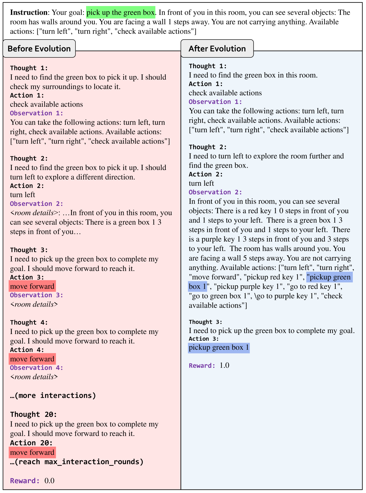

# AgentGym：大型语言模型智能体在多元环境中的进化之旅

发布时间：2024年06月06日

`Agent

这篇论文主要探讨了如何构建一个能够适应多变环境并自我进化的通用AI代理，特别强调了大型语言模型（LLMs）在实现这一目标中的应用。论文提出了AgentGym框架和AgentEvol方法，这些都是为了增强代理的自我进化能力。因此，这篇论文更符合Agent分类，因为它专注于开发和优化AI代理的能力，而不是直接关于LLM的理论研究或应用。` `人工智能` `机器学习`

> AgentGym: Evolving Large Language Model-based Agents across Diverse Environments

# 摘要

> 构建能适应多变环境并自我进化的通用AI代理，一直是AI领域的宏伟目标。大型语言模型（LLMs）因其卓越的通用性，成为实现这一目标的理想基石。目前的方法要么依赖人类专家的指导，使代理逐步模仿预设轨迹，这种方式难以扩展且限制了探索空间；要么在孤立环境中培养代理，结果是专精某一领域的代理，通用性受限。本文首次探索了构建具备自我进化能力的通用LLM基代理。我们识别出三大关键要素：多样化的学习环境、一套基础轨迹以赋予代理先验知识，以及一种高效可扩展的进化机制。我们推出了AgentGym框架，它提供了一个多元、实时、统一且并发的探索平台，并配备了一个包含丰富指令的数据库、一套基准和跨环境的高质量轨迹。此外，我们创新性地提出了AgentEvol方法，旨在挖掘代理在未知环境中的自我进化潜力。实验证明，这些进化后的代理表现可与顶尖模型媲美。我们已将AgentGym套件，包括其平台、数据集、基准、模型检查点和算法实现，开放在https://github.com/WooooDyy/AgentGym，供大家探索与使用。

> Building generalist agents that can handle diverse tasks and evolve themselves across different environments is a long-term goal in the AI community. Large language models (LLMs) are considered a promising foundation to build such agents due to their generalized capabilities. Current approaches either have LLM-based agents imitate expert-provided trajectories step-by-step, requiring human supervision, which is hard to scale and limits environmental exploration; or they let agents explore and learn in isolated environments, resulting in specialist agents with limited generalization. In this paper, we take the first step towards building generally-capable LLM-based agents with self-evolution ability. We identify a trinity of ingredients: 1) diverse environments for agent exploration and learning, 2) a trajectory set to equip agents with basic capabilities and prior knowledge, and 3) an effective and scalable evolution method. We propose AgentGym, a new framework featuring a variety of environments and tasks for broad, real-time, uni-format, and concurrent agent exploration. AgentGym also includes a database with expanded instructions, a benchmark suite, and high-quality trajectories across environments. Next, we propose a novel method, AgentEvol, to investigate the potential of agent self-evolution beyond previously seen data across tasks and environments. Experimental results show that the evolved agents can achieve results comparable to SOTA models. We release the AgentGym suite, including the platform, dataset, benchmark, checkpoints, and algorithm implementations. The AgentGym suite is available on https://github.com/WooooDyy/AgentGym.

[Arxiv](https://arxiv.org/abs/2406.04151)