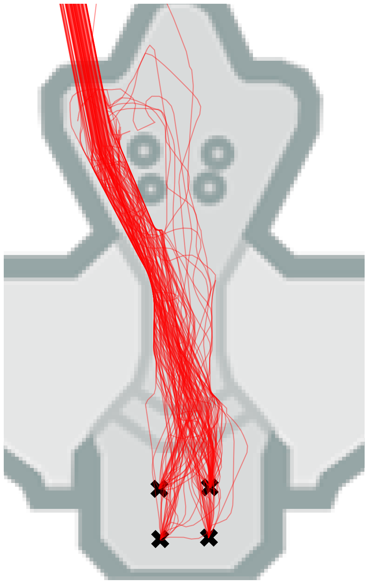

# 使大型语言模型等代理对齐

发布时间：2024年06月06日

`Agent

理由：这篇论文主要探讨了在复杂的3D环境中训练代理执行特定行为的方法，特别是通过模仿学习和对齐大型语言模型的方法来改进代理的行为。虽然涉及到大型语言模型（LLM）的概念，但重点在于将这些方法应用于代理（Agent）的训练和行为调整，而不是专注于LLM的理论研究或应用。因此，这篇论文更适合归类于Agent。` `人工智能`

> Aligning Agents like Large Language Models

# 摘要

> 在复杂的3D环境中，从高维感官信息训练代理执行期望行为颇具挑战。模仿多样化的人类行为虽为训练代理提供了可行的先验，但这些代理在实际应用中未必能执行特定任务。为此，我们将模仿学习代理的不良行为与未对齐的大型语言模型的无效响应相类比，探索如何将对齐语言模型的方法应用于3D环境中的代理训练。我们选取了一款现代游戏中的学术示例，其中人类行为呈现多模式分布，但我们希望代理模仿其中一种模式。实验证明，我们能使代理始终如一地执行所需行为模式，并提供了成功应用此方法的见解与建议。项目详情请访问 https://adamjelley.github.io/aligning-agents-like-llms。

> Training agents to behave as desired in complex 3D environments from high-dimensional sensory information is challenging. Imitation learning from diverse human behavior provides a scalable approach for training an agent with a sensible behavioral prior, but such an agent may not perform the specific behaviors of interest when deployed. To address this issue, we draw an analogy between the undesirable behaviors of imitation learning agents and the unhelpful responses of unaligned large language models (LLMs). We then investigate how the procedure for aligning LLMs can be applied to aligning agents in a 3D environment from pixels. For our analysis, we utilize an academically illustrative part of a modern console game in which the human behavior distribution is multi-modal, but we want our agent to imitate a single mode of this behavior. We demonstrate that we can align our agent to consistently perform the desired mode, while providing insights and advice for successfully applying this approach to training agents. Project webpage at https://adamjelley.github.io/aligning-agents-like-llms .

[Arxiv](https://arxiv.org/abs/2406.04208)