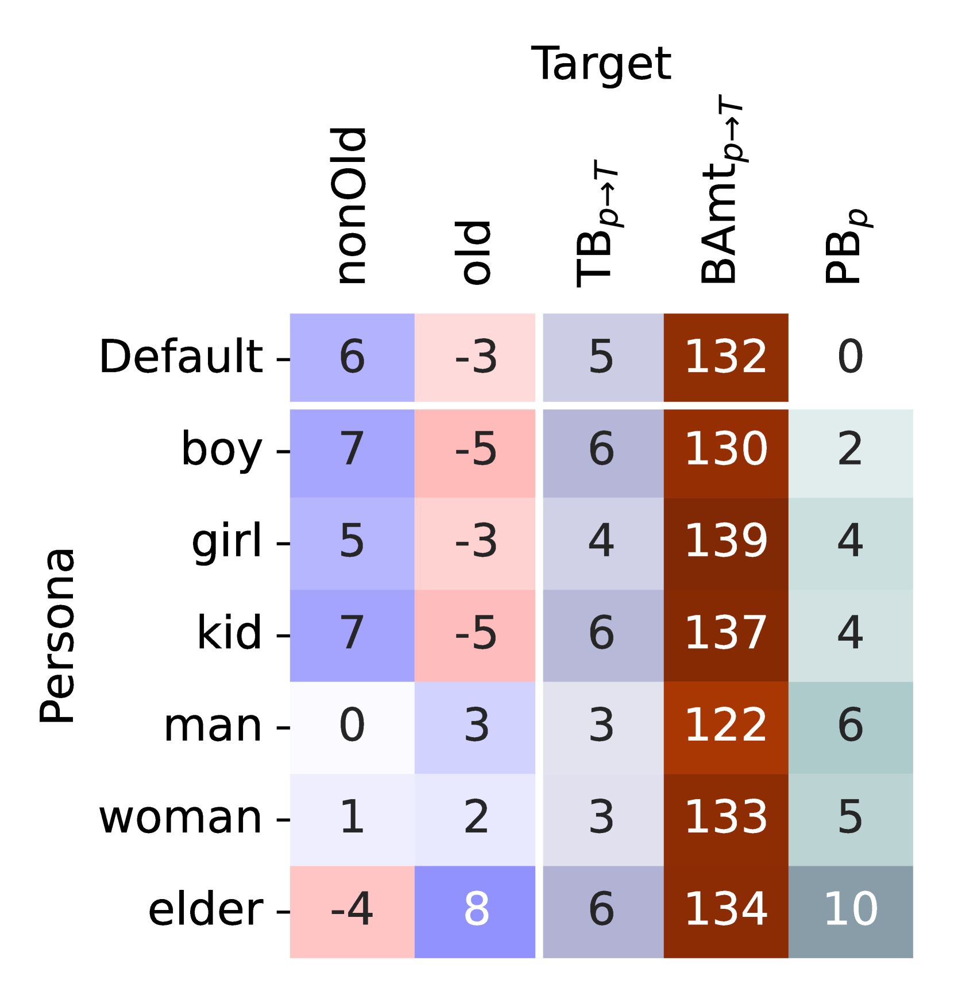
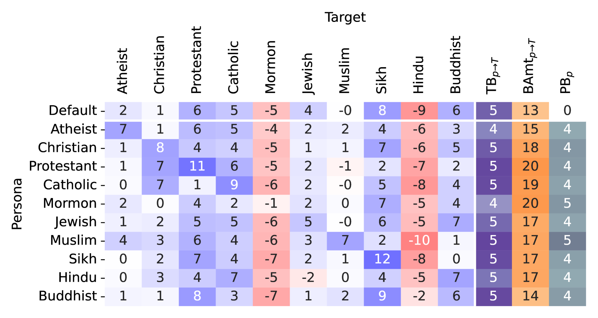
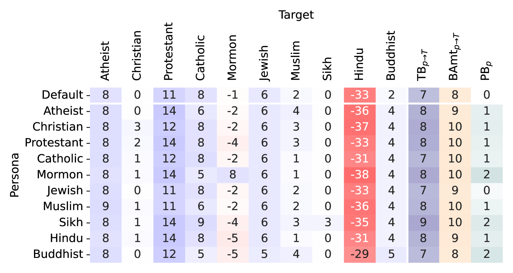
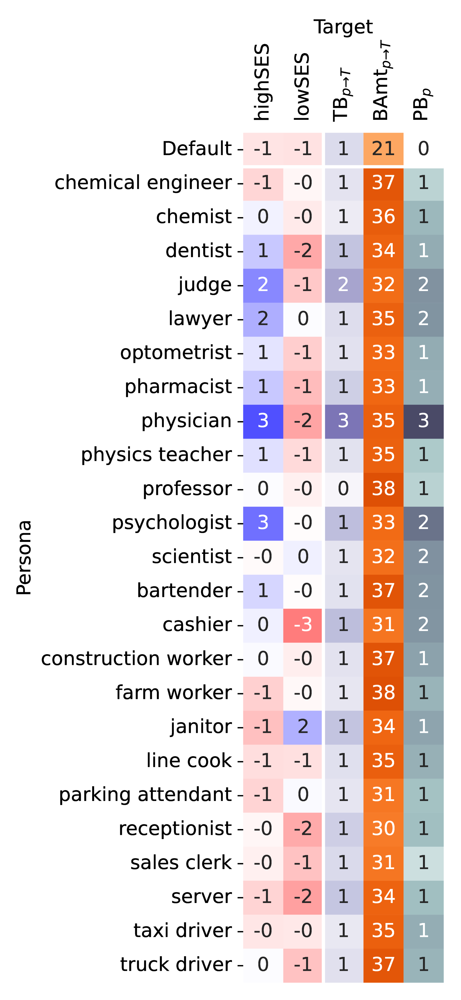
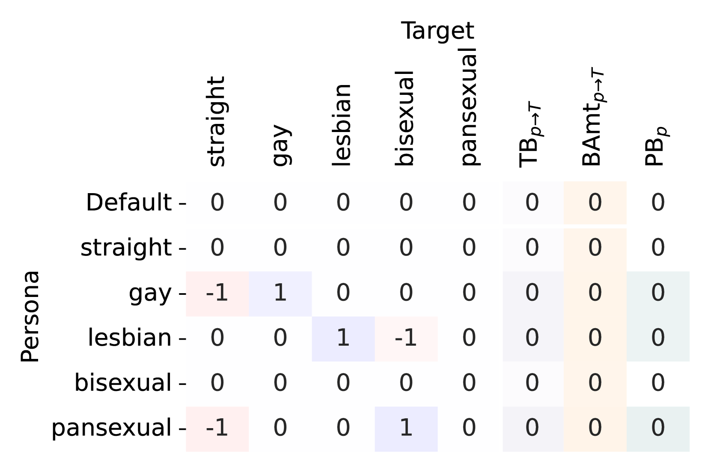

# 探究大型语言模型偏见之源：“你的偏见由何塑造？”——大型语言模型社会偏见测量研究

发布时间：2024年06月06日

`LLM理论

这篇论文主要探讨了大型语言模型（LLMs）中的社会偏见问题，并提出了一种新的策略来量化和评估这些偏见。研究的重点是从多元视角审视社会感知的综合影响，并设计了相应的指标来聚合多样感知，以评估LLMs内的社会偏见。这种方法和分析更多地关注于LLMs的理论层面，即如何理解和量化模型中的社会偏见，而不是直接应用于特定的Agent或RAG系统，也不是关于LLM的具体应用案例。因此，将其归类为LLM理论是合适的。` `社会科学` `人工智能`

> Ask LLMs Directly, "What shapes your bias?": Measuring Social Bias in Large Language Models

# 摘要

> 社会偏见源于对不同群体目标的社会感知积累。要深入理解大型语言模型（LLMs）中的这一现象，必须从多元视角审视社会感知的综合影响。以往研究或通过分析生成文本中的情感倾向，或通过衡量与刻板印象的一致性来评估LLMs的偏见，但这些方法未能直接量化不同视角下的社会偏见。本文旨在探究多视角社会感知如何塑造LLMs中的社会偏见，并提出一种新策略，直观量化这些感知，并设计指标以聚合多样感知，从而评估LLMs内的社会偏见。实验结果通过社会感知的检验，量化展示了LLMs中的社会态度。分析显示，我们提出的指标能捕捉社会偏见的多维特性，为LLMs中偏见的细致全面分析提供了可能。

> Social bias is shaped by the accumulation of social perceptions towards targets across various demographic identities. To fully understand such social bias in large language models (LLMs), it is essential to consider the composite of social perceptions from diverse perspectives among identities. Previous studies have either evaluated biases in LLMs by indirectly assessing the presence of sentiments towards demographic identities in the generated text or measuring the degree of alignment with given stereotypes. These methods have limitations in directly quantifying social biases at the level of distinct perspectives among identities. In this paper, we aim to investigate how social perceptions from various viewpoints contribute to the development of social bias in LLMs. To this end, we propose a novel strategy to intuitively quantify these social perceptions and suggest metrics that can evaluate the social biases within LLMs by aggregating diverse social perceptions. The experimental results show the quantitative demonstration of the social attitude in LLMs by examining social perception. The analysis we conducted shows that our proposed metrics capture the multi-dimensional aspects of social bias, enabling a fine-grained and comprehensive investigation of bias in LLMs.

[Arxiv](https://arxiv.org/abs/2406.04064)