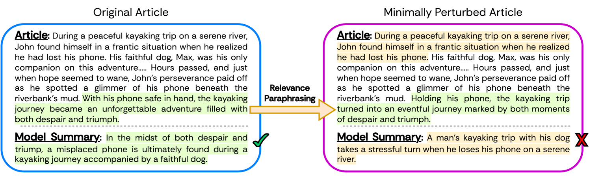
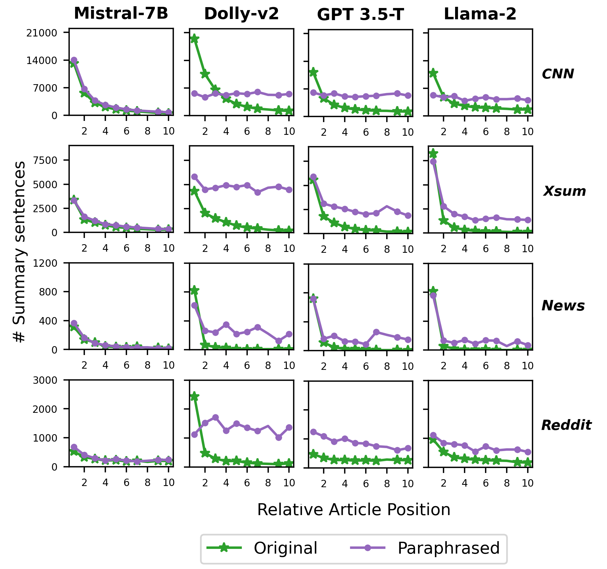
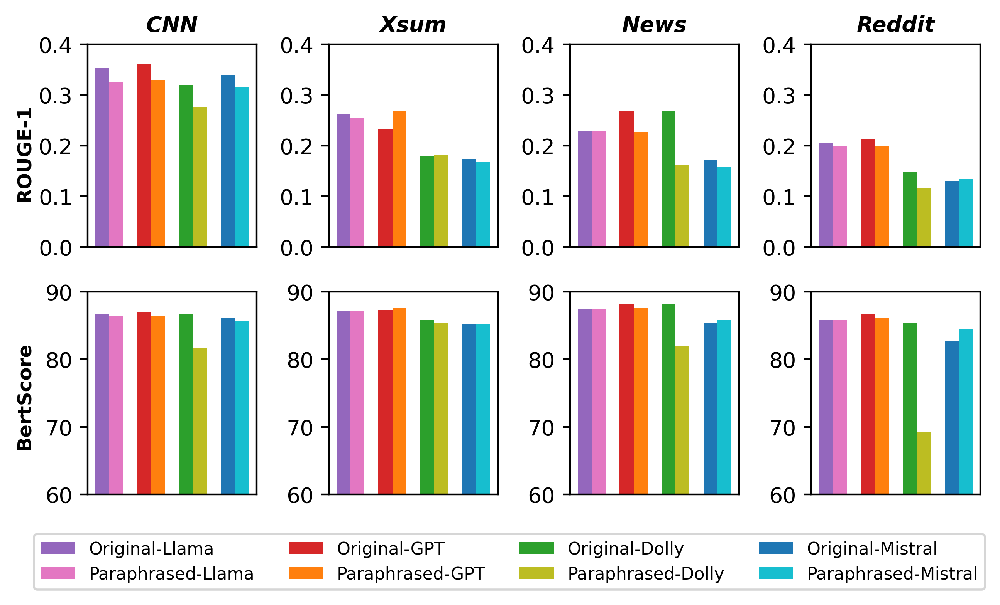
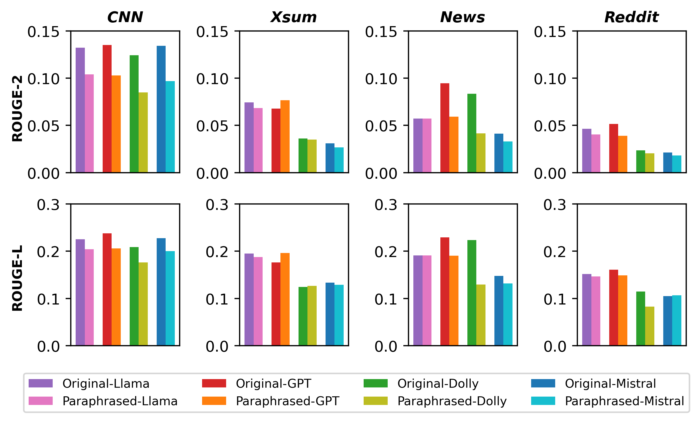
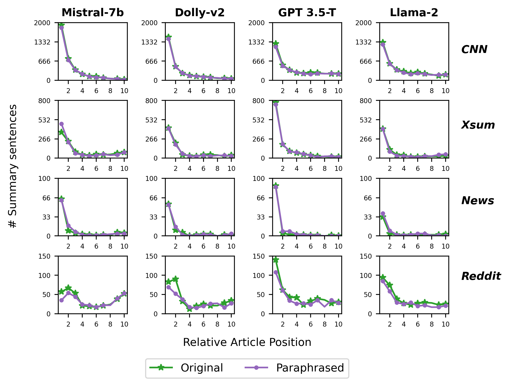
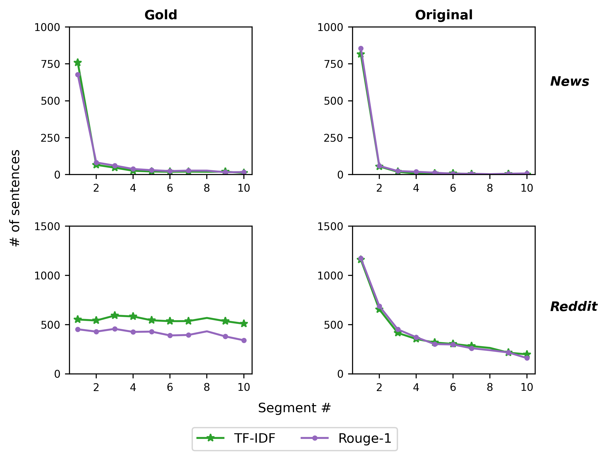
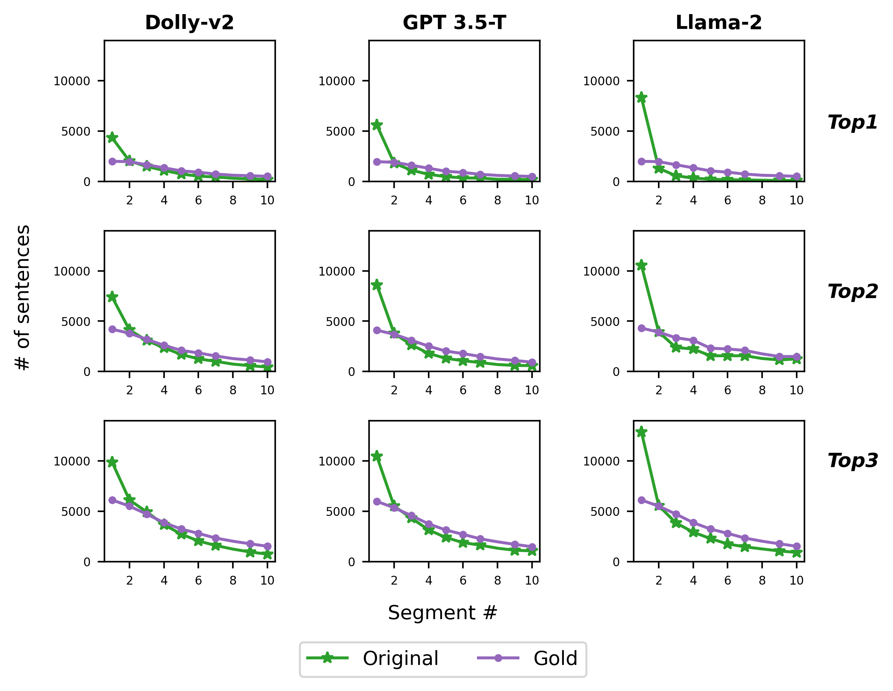

# 从相关性改写角度审视大型语言模型在零-shot抽象摘要上的表现

发布时间：2024年06月06日

`LLM理论

这篇论文主要关注大型语言模型（LLMs）在零-shot生成文章摘要方面的鲁棒性问题，并开发了一种相关性改写策略来评估这些模型的稳定性。研究通过实验比较了不同规模的LLMs在原始数据集和扰动数据集上的表现，以探讨其鲁棒性。这种研究属于对LLMs理论性能的探讨和评估，因此应归类于LLM理论。` `文本摘要`

> Assessing LLMs for Zero-shot Abstractive Summarization Through the Lens of Relevance Paraphrasing

# 摘要

> 大型语言模型（LLMs）在零-shot生成文章摘要方面表现卓越，但其鲁棒性仍是一个谜。为此，我们开发了相关性改写策略，用以评估LLMs作为摘要器的稳定性。该策略首先找出对理想摘要贡献最大的句子，然后对其进行改写，形成一个轻微扰动的数据集。通过比较模型在原始与扰动数据集上的摘要表现，我们能评估LLMs的鲁棒性。我们在四个多样化的数据集上，针对四种不同规模的LLMs（GPT-3.5-Turbo、Llama-2-13B、Mistral-7B和Dolly-v2-7B）进行了深入实验。结果显示，LLMs在处理轻微扰动的文章时摘要表现并不一致，暗示着改进的必要性。

> Large Language Models (LLMs) have achieved state-of-the-art performance at zero-shot generation of abstractive summaries for given articles. However, little is known about the robustness of such a process of zero-shot summarization. To bridge this gap, we propose relevance paraphrasing, a simple strategy that can be used to measure the robustness of LLMs as summarizers. The relevance paraphrasing approach identifies the most relevant sentences that contribute to generating an ideal summary, and then paraphrases these inputs to obtain a minimally perturbed dataset. Then, by evaluating model performance for summarization on both the original and perturbed datasets, we can assess the LLM's one aspect of robustness. We conduct extensive experiments with relevance paraphrasing on 4 diverse datasets, as well as 4 LLMs of different sizes (GPT-3.5-Turbo, Llama-2-13B, Mistral-7B, and Dolly-v2-7B). Our results indicate that LLMs are not consistent summarizers for the minimally perturbed articles, necessitating further improvements.

[Arxiv](https://arxiv.org/abs/2406.03993)