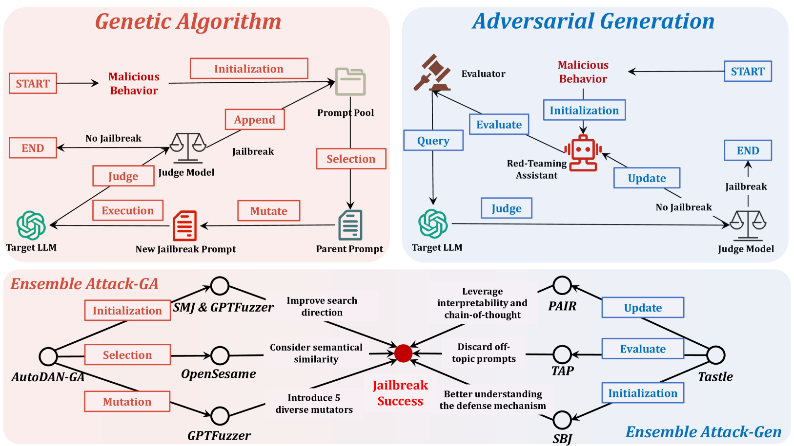
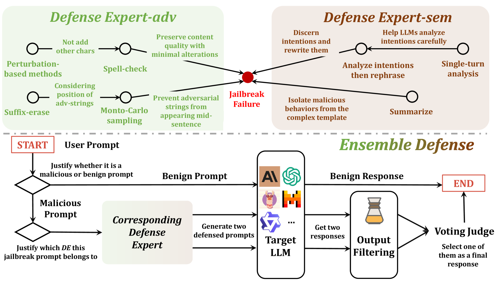

# AutoJailbreak：透过依赖的镜头，深入探讨越狱攻击与防御的奥秘

发布时间：2024年06月06日

`LLM应用

这篇论文主要探讨了大型语言模型（LLMs）中的越狱攻击问题，并提出了一系列的攻击、防御和评估框架。这些框架旨在通过自动化和全面的方法来优化越狱攻击和防御策略，以提高模型的安全性。论文的内容直接关联到LLMs的实际应用中的安全问题，因此属于LLM应用分类。` `人工智能安全` `网络安全`

> AutoJailbreak: Exploring Jailbreak Attacks and Defenses through a Dependency Lens

# 摘要

> 大型语言模型（LLMs）中的越狱攻击，通过恶意提示诱导模型生成违反伦理和法律的内容，严重威胁模型安全。目前，越狱攻击与防御策略多局限于特定算法框架内的局部优化，效果有限且缺乏扩展性。本文深入分析了越狱技术的依赖关系，并将其应用于所有潜在攻击面。我们运用有向无环图（DAGs）来定位和评估现有攻击、防御及评估方法，并提出了三个全面、自动化且逻辑严密的框架。\texttt{AutoAttack}探索了基于遗传算法和对抗生成的两种越狱优化策略的依赖，并开发了一种集成攻击策略。\texttt{AutoDefense}则通过结合预生成与后生成防御策略的依赖，提出了一种混合防御方法。\texttt{AutoEvaluation}创新性地评估了常被忽视的幻觉现象与越狱反应。实验结果表明，我们的集成越狱攻击与防御框架在性能上显著超越了现有研究。

> Jailbreak attacks in large language models (LLMs) entail inducing the models to generate content that breaches ethical and legal norm through the use of malicious prompts, posing a substantial threat to LLM security. Current strategies for jailbreak attack and defense often focus on optimizing locally within specific algorithmic frameworks, resulting in ineffective optimization and limited scalability. In this paper, we present a systematic analysis of the dependency relationships in jailbreak attack and defense techniques, generalizing them to all possible attack surfaces. We employ directed acyclic graphs (DAGs) to position and analyze existing jailbreak attacks, defenses, and evaluation methodologies, and propose three comprehensive, automated, and logical frameworks. \texttt{AutoAttack} investigates dependencies in two lines of jailbreak optimization strategies: genetic algorithm (GA)-based attacks and adversarial-generation-based attacks, respectively. We then introduce an ensemble jailbreak attack to exploit these dependencies. \texttt{AutoDefense} offers a mixture-of-defenders approach by leveraging the dependency relationships in pre-generative and post-generative defense strategies. \texttt{AutoEvaluation} introduces a novel evaluation method that distinguishes hallucinations, which are often overlooked, from jailbreak attack and defense responses. Through extensive experiments, we demonstrate that the proposed ensemble jailbreak attack and defense framework significantly outperforms existing research.

[Arxiv](https://arxiv.org/abs/2406.03805)