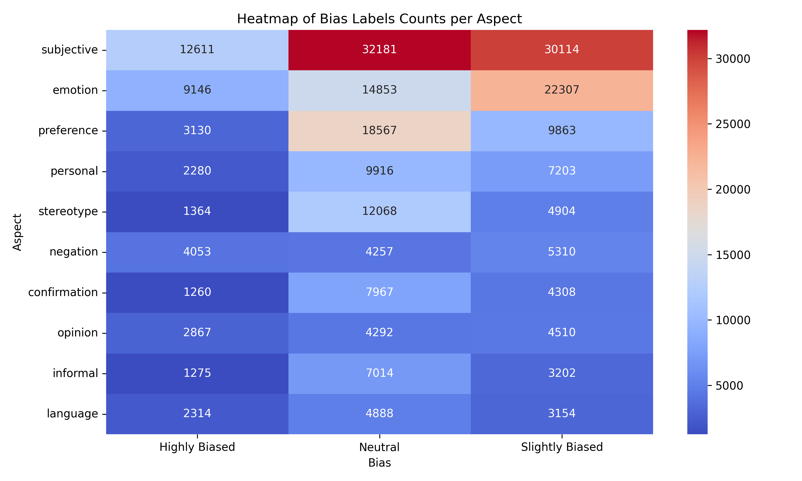

# BEADs：领域间的偏差审视

发布时间：2024年06月06日

`LLM应用

理由：这篇论文主要关注大型语言模型（LLMs）在处理偏见问题上的应用，特别是通过引入跨领域偏见评估（BEADs）数据集来识别和减少模型偏见。论文讨论了如何通过数据集和微调方法来改善LLMs在偏见处理方面的性能，这直接关联到LLMs的实际应用场景，即如何使模型更加公平和无偏见。因此，这篇论文属于LLM应用分类。` `数据集`

> BEADs: Bias Evaluation Across Domains

# 摘要

> 大型语言模型（LLMs）的进步已经极大地推动了自然语言处理（NLP）应用的发展。但这些进步是双刃剑，模型可能无意中传播了训练数据中的偏见。为了解决这一问题，我们推出了跨领域偏见评估（BEADs）数据集，它覆盖了文本分类、偏见实体识别、偏见量化和良性语言生成等多项NLP任务。BEADs通过AI驱动与专家验证相结合的方式，确保了标注的可靠性，有效弥补了现有数据集在偏见评估方面的不足。实证分析显示，BEADs能有效识别并减少模型偏见，即使是微调后的小模型，在偏见分类任务上也常能超越LLMs。尽管如此，模型对特定人群的偏见仍可能存在。通过使用良性语言数据微调LLMs，我们不仅减少了偏见，还保留了模型的知识。这些发现凸显了全面偏见评估的重要性，并展示了针对微调在减少LLMs偏见方面的潜力。我们已将BEADs数据集公开，网址为https://huggingface.co/datasets/shainar/BEAD。请注意，本文包含可能引起不适的内容。

> Recent improvements in large language models (LLMs) have significantly enhanced natural language processing (NLP) applications. However, these models can also inherit and perpetuate biases from their training data. Addressing this issue is crucial, yet many existing datasets do not offer evaluation across diverse NLP tasks. To tackle this, we introduce the Bias Evaluations Across Domains (BEADs) dataset, designed to support a wide range of NLP tasks, including text classification, bias entity recognition, bias quantification, and benign language generation. BEADs uses AI-driven annotation combined with experts' verification to provide reliable labels. This method overcomes the limitations of existing datasets that typically depend on crowd-sourcing, expert-only annotations with limited bias evaluations, or unverified AI labeling. Our empirical analysis shows that BEADs is effective in detecting and reducing biases across different language models, with smaller models fine-tuned on BEADs often outperforming LLMs in bias classification tasks. However, these models may still exhibit biases towards certain demographics. Fine-tuning LLMs with our benign language data also reduces biases while preserving the models' knowledge. Our findings highlight the importance of comprehensive bias evaluation and the potential of targeted fine-tuning for reducing the bias of LLMs. We are making BEADs publicly available at https://huggingface.co/datasets/shainar/BEAD
  Warning: This paper contains examples that may be considered offensive.

[Arxiv](https://arxiv.org/abs/2406.04220)