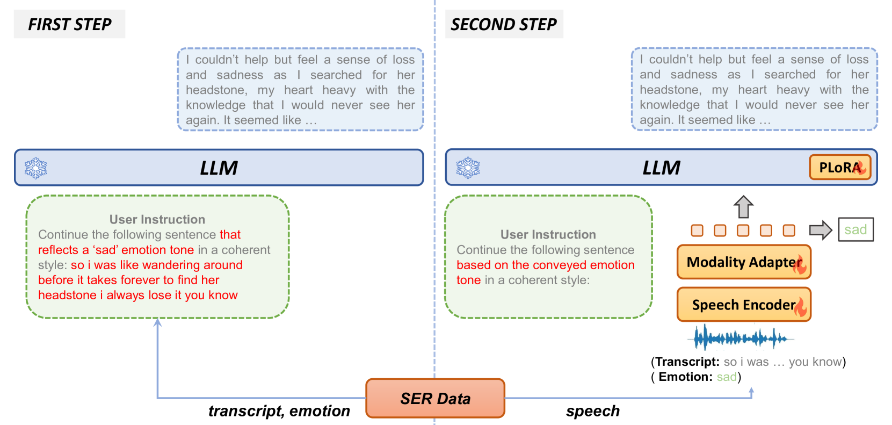

# BLSP-Emo：迈向富有同理心的大型语音-语言模型之旅

发布时间：2024年06月06日

`LLM应用

理由：这篇论文介绍了一种名为BLSP-Emo的创新方法，用于构建能够理解和生成情感丰富语音的端到端语音-语言模型。这种方法特别关注于情感支持，通过两阶段流程来预训练模型，使其能够理解语音中的语义和情感，并产生同理心回应。这表明论文主要关注的是大型语言模型（LLM）在实际应用中的使用，特别是在语音和情感处理方面的应用，因此属于LLM应用分类。` `语音识别` `情感计算`

> BLSP-Emo: Towards Empathetic Large Speech-Language Models

# 摘要

> GPT-4o的最新发布揭示了端到端多模态模型在低延迟和情感丰富语音的理解与生成方面的潜力。尽管细节对公开研究社区尚不透明，但这一成就很可能依赖于大量精心策划的数据和计算资源，这两者均不易获取。本论文中，我们提出了BLSP-Emo（情感支持的自举语言-语音预训练），一种创新方法，旨在构建能理解语音中语义与情感并产生同理心回应的端到端语音-语言模型。BLSP-Emo采用两阶段流程，利用现有语音识别（ASR）和语音情感识别（SER）数据集。首阶段侧重于语义对齐，借鉴了使用ASR数据预训练语音-语言模型的最新研究。次阶段则在基于SER数据构建的情感感知任务上，对预训练模型进行情感对齐。实验结果显示，BLSP-Emo在理解语音和提供同理心回应方面表现卓越，无论是执行指令还是参与对话。

> The recent release of GPT-4o showcased the potential of end-to-end multimodal models, not just in terms of low latency but also in their ability to understand and generate expressive speech with rich emotions. While the details are unknown to the open research community, it likely involves significant amounts of curated data and compute, neither of which is readily accessible. In this paper, we present BLSP-Emo (Bootstrapped Language-Speech Pretraining with Emotion support), a novel approach to developing an end-to-end speech-language model capable of understanding both semantics and emotions in speech and generate empathetic responses. BLSP-Emo utilizes existing speech recognition (ASR) and speech emotion recognition (SER) datasets through a two-stage process. The first stage focuses on semantic alignment, following recent work on pretraining speech-language models using ASR data. The second stage performs emotion alignment with the pretrained speech-language model on an emotion-aware continuation task constructed from SER data. Our experiments demonstrate that the BLSP-Emo model excels in comprehending speech and delivering empathetic responses, both in instruction-following tasks and conversations.

[Arxiv](https://arxiv.org/abs/2406.03872)