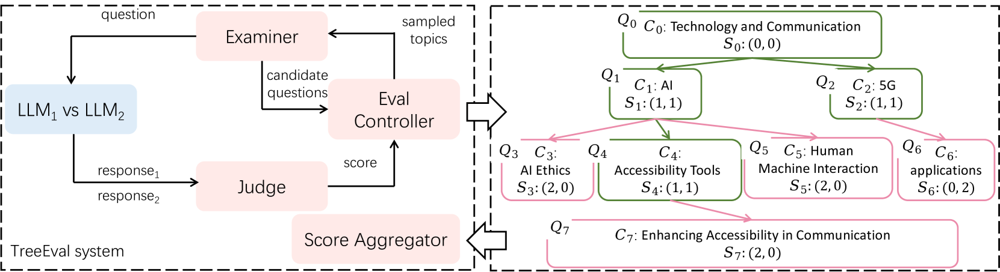
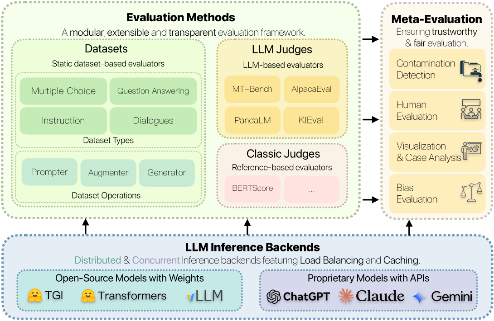

# 大型语言模型基准数据污染问题：深度调查

发布时间：2024年06月06日

`LLM理论

这篇论文主要探讨了大型语言模型（LLM）评估中的基准数据污染（BDC）问题，并提出了替代评估方法以规避这一风险。这属于对LLM评估理论的深入分析，因此应归类于LLM理论。` `人工智能评估`

> Benchmark Data Contamination of Large Language Models: A Survey

# 摘要

> GPT-4、Claude-3和Gemini等大型语言模型的迅猛发展，虽然极大地推动了自然语言处理领域，但也引发了一个棘手问题——基准数据污染（BDC）。当语言模型在训练过程中不慎吸收了评估基准的信息，评估阶段的性能便可能失真。本文深入探讨了LLM评估中BDC的复杂性，并探索了替代评估方法，以规避传统基准带来的风险。同时，文章还展望了未来在减轻BDC风险方面的挑战与方向，强调了创新解决方案的迫切性，以确保LLM在实际应用中的评估准确无误。

> The rapid development of Large Language Models (LLMs) like GPT-4, Claude-3, and Gemini has transformed the field of natural language processing. However, it has also resulted in a significant issue known as Benchmark Data Contamination (BDC). This occurs when language models inadvertently incorporate evaluation benchmark information from their training data, leading to inaccurate or unreliable performance during the evaluation phase of the process. This paper reviews the complex challenge of BDC in LLM evaluation and explores alternative assessment methods to mitigate the risks associated with traditional benchmarks. The paper also examines challenges and future directions in mitigating BDC risks, highlighting the complexity of the issue and the need for innovative solutions to ensure the reliability of LLM evaluation in real-world applications.

[Arxiv](https://arxiv.org/abs/2406.04244)