# 思维的缓冲：大型语言模型中的思维强化推理

发布时间：2024年06月06日

`LLM应用

这篇论文介绍了一种名为Buffer of Thoughts（BoT）的新方法，旨在提升大型语言模型（LLMs）的准确性、效率和鲁棒性。该方法通过使用元缓冲区存储和应用高层次思考模板来增强推理能力，并在多个推理密集型任务中展示了显著的性能提升。这种方法直接应用于LLMs的实际应用中，以改进其性能，因此属于LLM应用分类。` `人工智能`

> Buffer of Thoughts: Thought-Augmented Reasoning with Large Language Models

# 摘要

> 我们创新性地推出了Buffer of Thoughts（BoT），一种旨在提升大型语言模型（LLMs）准确性、效率和鲁棒性的多功能思考增强推理方法。通过元缓冲区，我们存储了从多任务问题解决过程中提炼的高层次思考模板，针对每个问题，我们检索并适应性地应用这些模板，以高效推理。为了保持系统的可扩展性和稳定性，我们引入了缓冲区管理器，动态更新元缓冲区，随着任务的增多，不断提升其能力。在10项推理密集型任务的广泛测试中，BoT显著超越了现有技术，如在24点游戏中提升11%，在几何形状任务中提升20%，在一步将死任务中提升51%。分析显示，BoT不仅泛化能力强，模型鲁棒性高，而且成本仅为多查询提示方法的12%。特别地，我们的Llama3-8B结合BoT展现出超越Llama3-70B的潜力。项目详情请访问：https://github.com/YangLing0818/buffer-of-thought-llm。

> We introduce Buffer of Thoughts (BoT), a novel and versatile thought-augmented reasoning approach for enhancing accuracy, efficiency and robustness of large language models (LLMs). Specifically, we propose meta-buffer to store a series of informative high-level thoughts, namely thought-template, distilled from the problem-solving processes across various tasks. Then for each problem, we retrieve a relevant thought-template and adaptively instantiate it with specific reasoning structures to conduct efficient reasoning. To guarantee the scalability and stability, we further propose buffer-manager to dynamically update the meta-buffer, thus enhancing the capacity of meta-buffer as more tasks are solved. We conduct extensive experiments on 10 challenging reasoning-intensive tasks, and achieve significant performance improvements over previous SOTA methods: 11% on Game of 24, 20% on Geometric Shapes and 51% on Checkmate-in-One. Further analysis demonstrate the superior generalization ability and model robustness of our BoT, while requiring only 12% of the cost of multi-query prompting methods (e.g., tree/graph of thoughts) on average. Notably, we find that our Llama3-8B+BoT has the potential to surpass Llama3-70B model. Our project is available at: https://github.com/YangLing0818/buffer-of-thought-llm

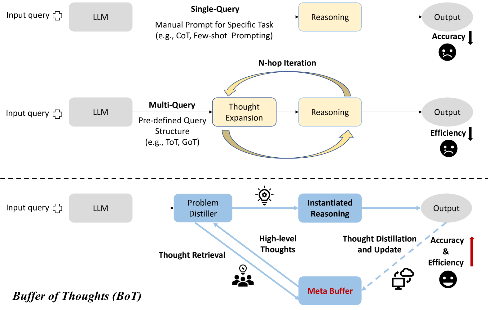

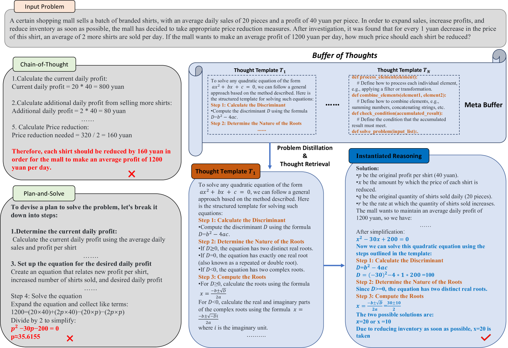

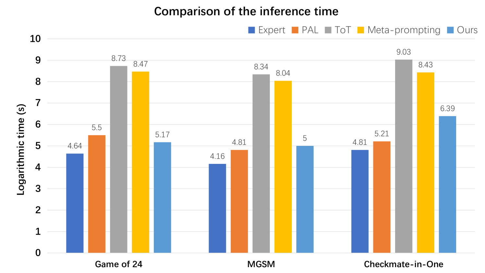

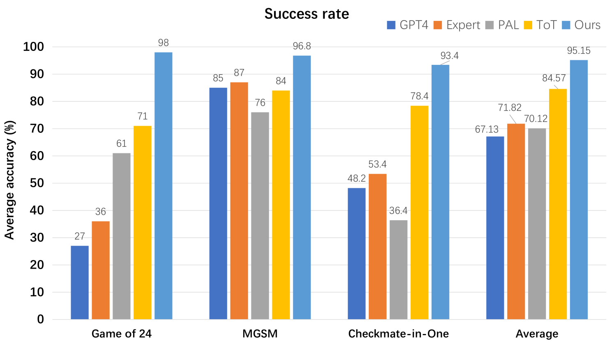

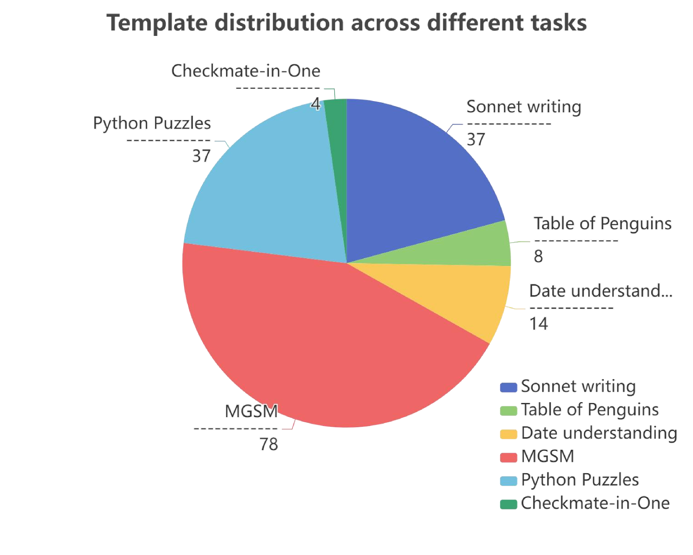

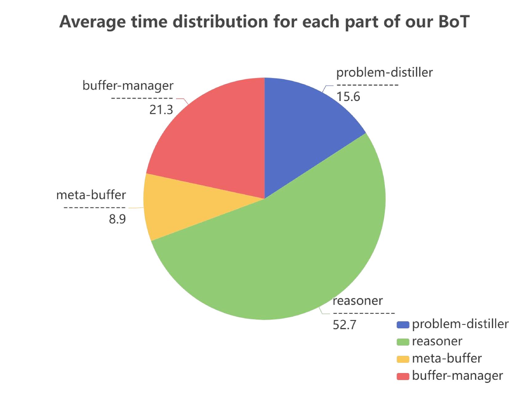

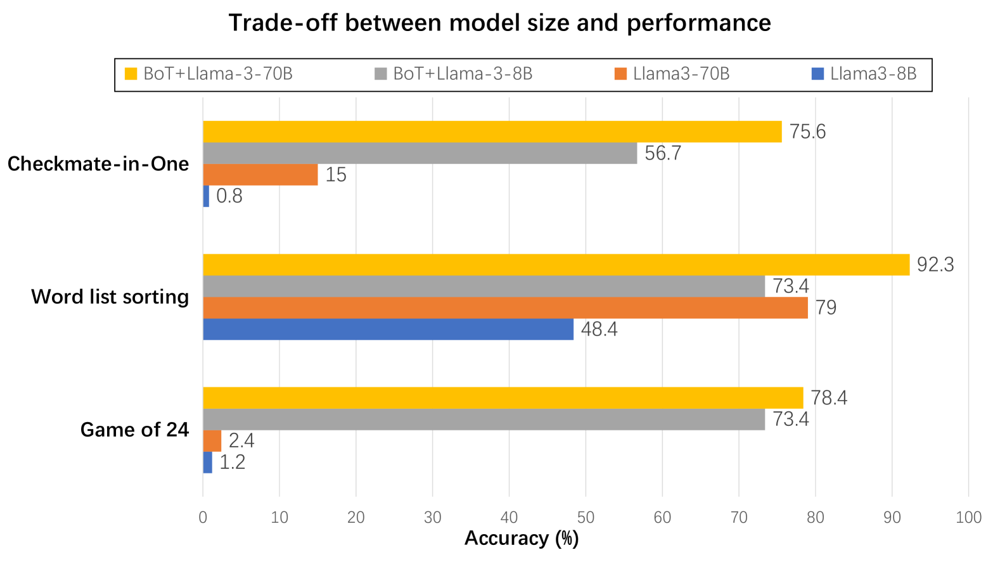

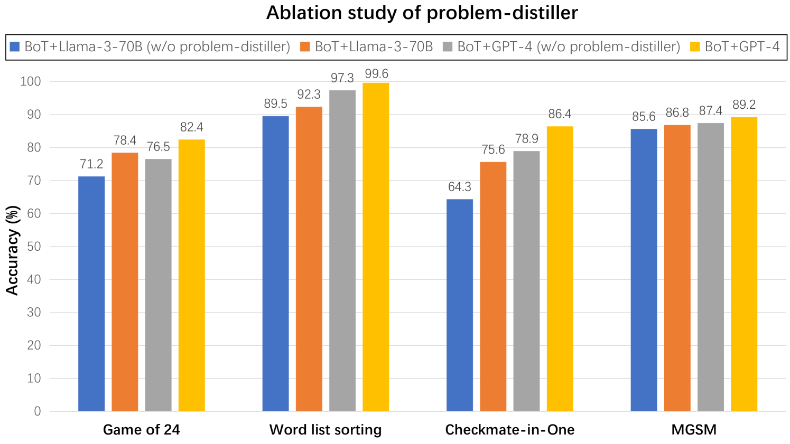

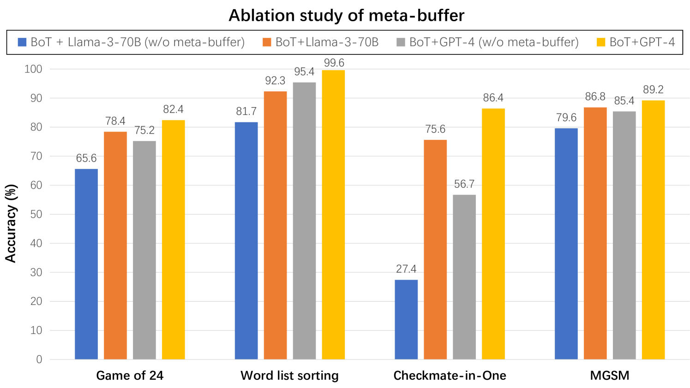

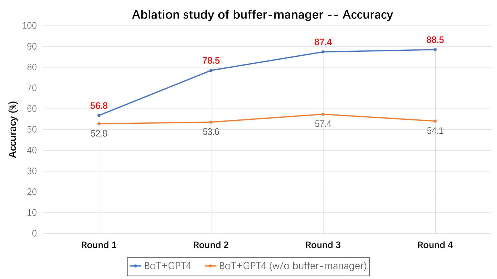

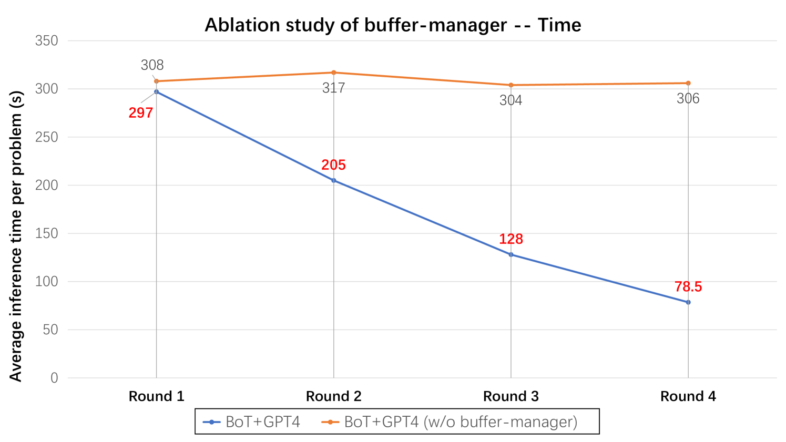

[Arxiv](https://arxiv.org/abs/2406.04271)