# 通过人类样本，探究人类与LLMs在对话语调上的异同。

发布时间：2024年06月06日

`LLM应用

这篇论文主要探讨了大型语言模型（LLMs）在对话语调方面的应用，通过跨学科方法（借鉴认知科学）开发了一种迭代方法来研究人类与GPT-4在对话语调上的差异。研究通过实验构建了一个包含丰富对话语调的句库，并绘制了人类与GPT-4对话语调关系的直观图谱。这表明了LLMs在人机交互领域的应用潜力，因此属于LLM应用分类。` `人机交互` `认知科学`

> Characterizing Similarities and Divergences in Conversational Tones in Humans and LLMs by Sampling with People

# 摘要

> 对话语调，即交流中的态度和方式，对有效沟通至关重要。随着大型语言模型（LLMs）的普及，探讨其与人类对话语调的差异变得尤为重要。然而，现有研究多依赖预设分类或文本库，存在偏差且难以反映真实情况。借鉴认知科学，我们开发了一种迭代方法：参与者轮流识别句子语调并据此创作新句。通过100轮实验，结合人类与GPT-4的参与，我们构建了一个包含丰富对话语调的句库。进一步，我们让参与者与GPT-4共同为句子标注语调，基于1,339名参与者的33,370次判断及29,900次GPT-4查询，我们得以绘制出人类与GPT-4对话语调关系的直观图谱。此研究展示了跨学科方法在人机交互领域的应用潜力。

> Conversational tones -- the manners and attitudes in which speakers communicate -- are essential to effective communication. Amidst the increasing popularization of Large Language Models (LLMs) over recent years, it becomes necessary to characterize the divergences in their conversational tones relative to humans. However, existing investigations of conversational modalities rely on pre-existing taxonomies or text corpora, which suffer from experimenter bias and may not be representative of real-world distributions for the studies' psycholinguistic domains. Inspired by methods from cognitive science, we propose an iterative method for simultaneously eliciting conversational tones and sentences, where participants alternate between two tasks: (1) one participant identifies the tone of a given sentence and (2) a different participant generates a sentence based on that tone. We run 100 iterations of this process with human participants and GPT-4, then obtain a dataset of sentences and frequent conversational tones. In an additional experiment, humans and GPT-4 annotated all sentences with all tones. With data from 1,339 human participants, 33,370 human judgments, and 29,900 GPT-4 queries, we show how our approach can be used to create an interpretable geometric representation of relations between conversational tones in humans and GPT-4. This work demonstrates how combining ideas from machine learning and cognitive science can address challenges in human-computer interactions.

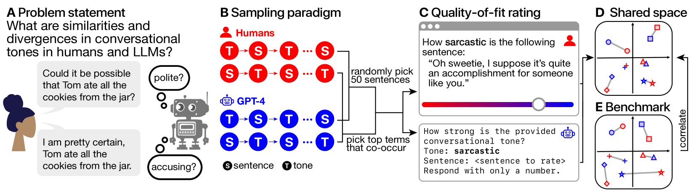

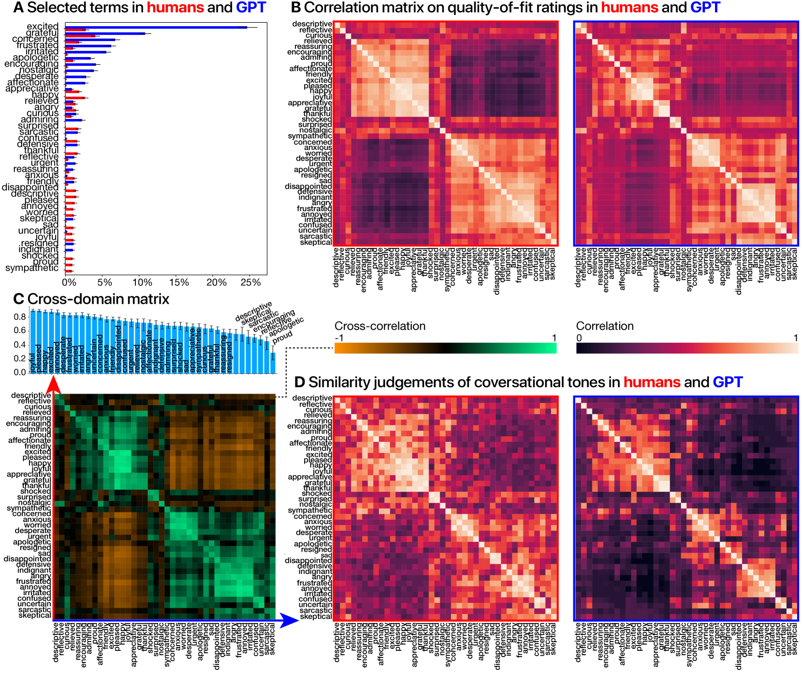

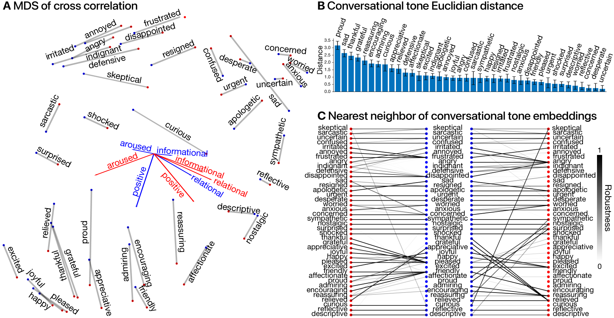

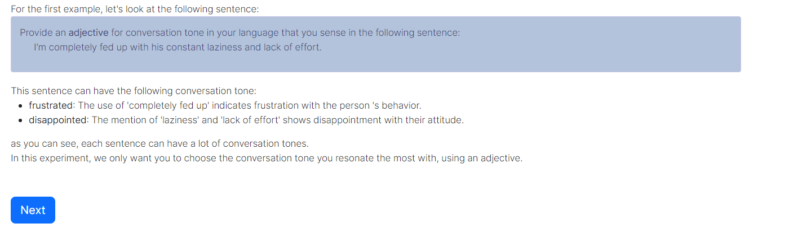

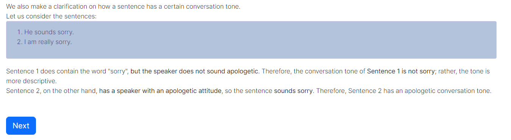

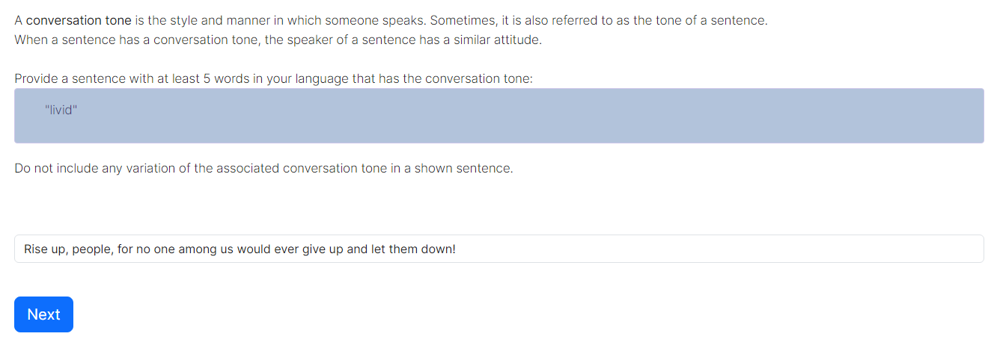

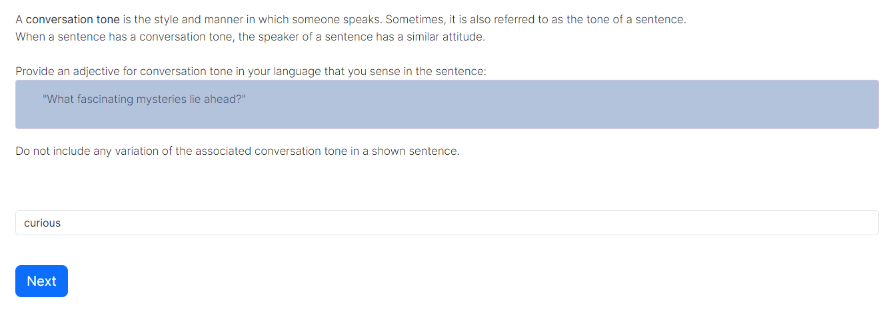

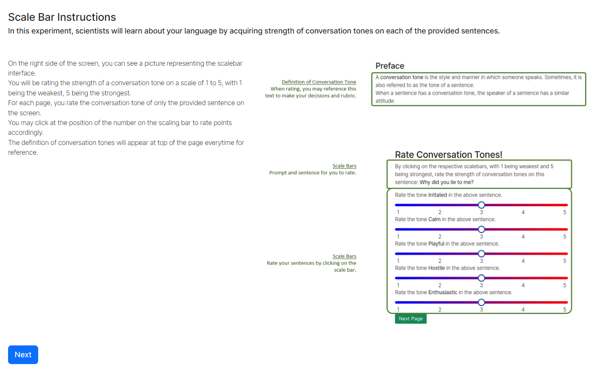

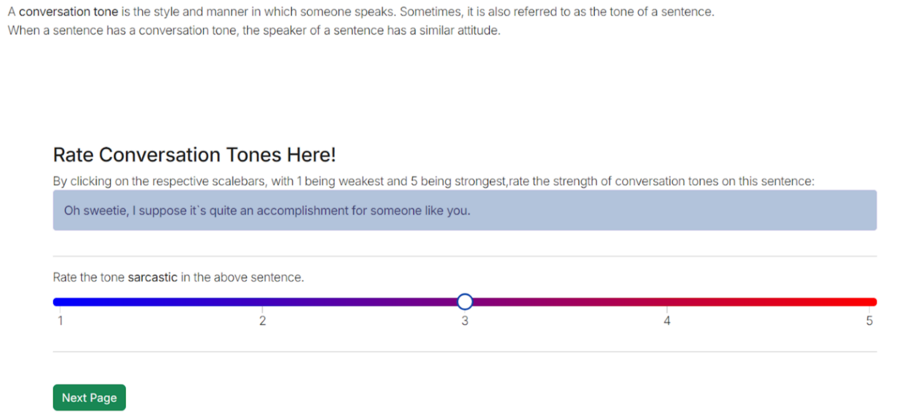

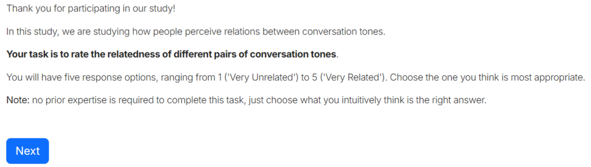

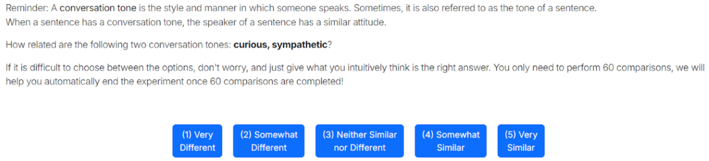

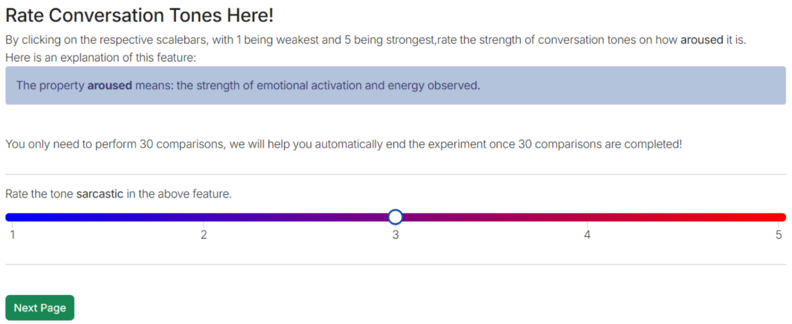

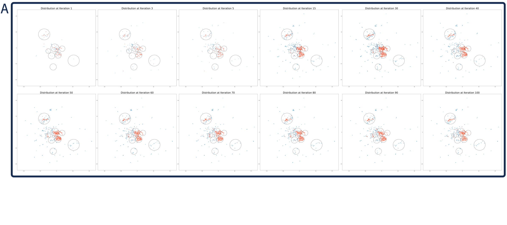

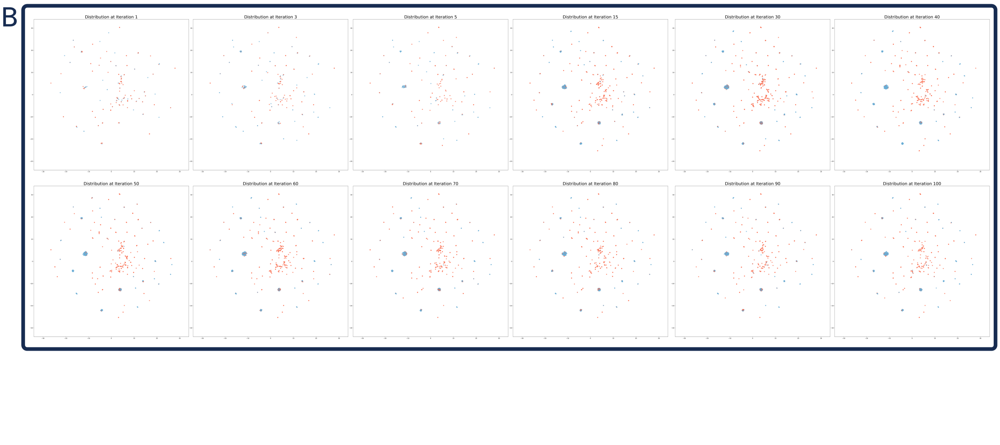

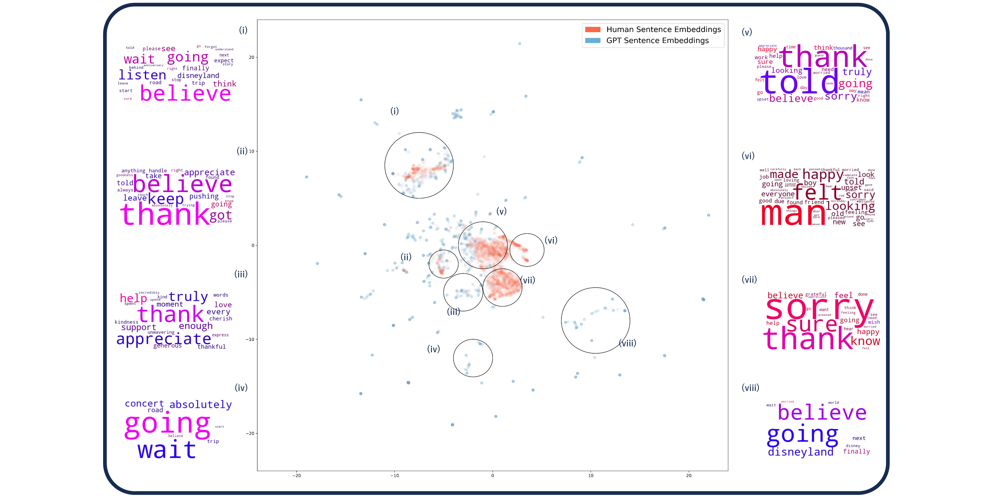

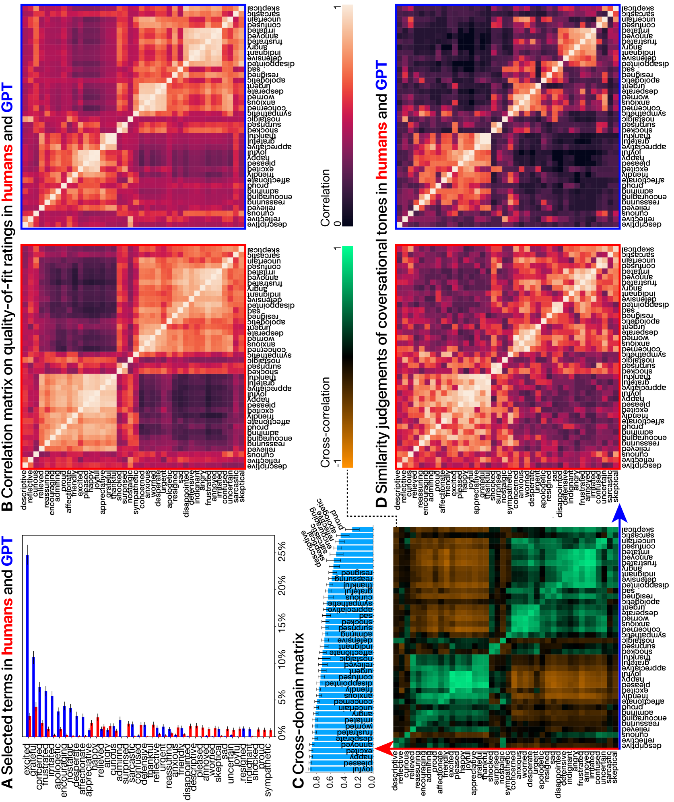

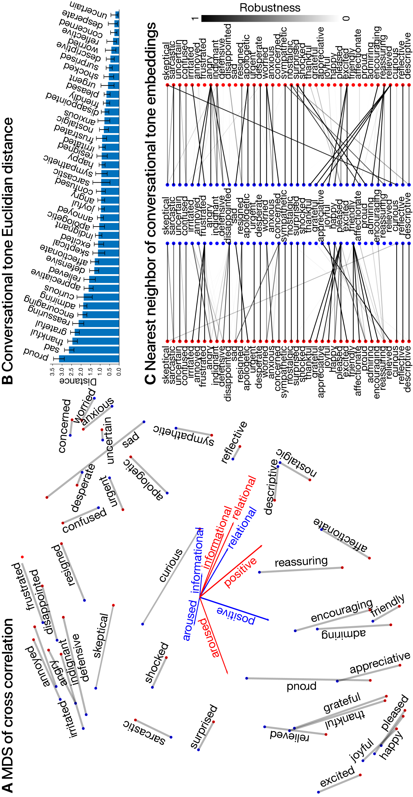

[Arxiv](https://arxiv.org/abs/2406.04278)