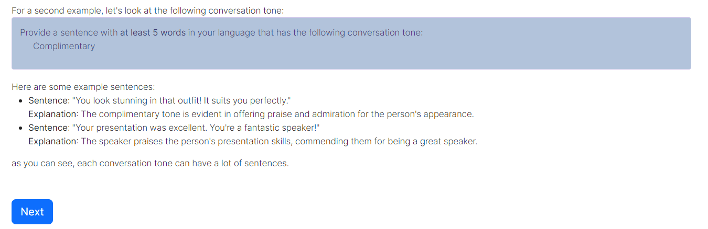

# 通过人类采样，探究人类与LLMs在对话语调上的异同

发布时间：2024年06月06日

`LLM应用

这篇论文主要探讨了大型语言模型（LLMs）在模拟人类对话语调方面的应用，并提出了一种结合认知科学的方法来研究这一问题。通过迭代任务和数据收集，研究者构建了一个包含句子和对话语调的数据集，并展示了如何利用这些数据来理解人类与GPT-4在对话语调上的关系。这一研究不仅关注了LLMs的实际应用，还展示了机器学习与认知科学的结合在人机交互领域的潜力。因此，它属于LLM应用分类。` `人机交互` `认知科学`

> Characterizing Similarities and Divergences in Conversational Tones in Humans and LLMs by Sampling with People

# 摘要

> 对话语调，即交流中的言谈举止，对有效沟通至关重要。随着大型语言模型（LLMs）的普及，探究其与人类对话语调的差异变得尤为重要。然而，现有研究多依赖于预设的分类法或文本库，这些方法易受实验者偏见影响，且可能无法准确反映真实世界的心理语言学分布。借鉴认知科学的方法，我们提出了一种迭代法，通过交替任务同时引出对话语调和句子：一参与者识别句子语调，另一参与者据此生成句子。我们与人类和GPT-4进行了100轮迭代，收集了包含句子和常见对话语调的数据集。此外，我们还进行了另一项实验，让GPT-4和人类对所有句子进行语调标注。基于1,339名人类参与者的33,370次判断和29,900次GPT-4查询，我们展示了如何利用我们的方法构建人类与GPT-4对话语调关系的可解释几何模型。这项研究展示了机器学习与认知科学结合的潜力，以应对人机交互中的挑战。

> Conversational tones -- the manners and attitudes in which speakers communicate -- are essential to effective communication. Amidst the increasing popularization of Large Language Models (LLMs) over recent years, it becomes necessary to characterize the divergences in their conversational tones relative to humans. However, existing investigations of conversational modalities rely on pre-existing taxonomies or text corpora, which suffer from experimenter bias and may not be representative of real-world distributions for the studies' psycholinguistic domains. Inspired by methods from cognitive science, we propose an iterative method for simultaneously eliciting conversational tones and sentences, where participants alternate between two tasks: (1) one participant identifies the tone of a given sentence and (2) a different participant generates a sentence based on that tone. We run 100 iterations of this process with human participants and GPT-4, then obtain a dataset of sentences and frequent conversational tones. In an additional experiment, humans and GPT-4 annotated all sentences with all tones. With data from 1,339 human participants, 33,370 human judgments, and 29,900 GPT-4 queries, we show how our approach can be used to create an interpretable geometric representation of relations between conversational tones in humans and GPT-4. This work demonstrates how combining ideas from machine learning and cognitive science can address challenges in human-computer interactions.

[Arxiv](https://arxiv.org/abs/2406.04278)